## 2025-08-14 Meeting Report

### Q1: 模型调整: 相关性分析中引入城市人口数量进行分析

--

##### AQI

<table>
<caption>Summary of AQI Results</caption>
 <thead>
  <tr>
   <th style="text-align:center;"> model </th>
   <th style="text-align:center;"> term </th>
   <th style="text-align:center;"> estimate </th>
   <th style="text-align:center;"> std.error </th>
   <th style="text-align:center;"> statistic </th>
   <th style="text-align:center;"> p.value </th>
   <th style="text-align:center;"> signif </th>
  </tr>
 </thead>
<tbody>
  <tr>
   <td style="text-align:center;"> AQI_M0 </td>
   <td style="text-align:center;"> (Intercept) </td>
   <td style="text-align:center;"> -7.7923 </td>
   <td style="text-align:center;"> 0.1896 </td>
   <td style="text-align:center;"> -41.1009 </td>
   <td style="text-align:center;"> 0.0000 </td>
   <td style="text-align:center;"> *** </td>
  </tr>
  <tr>
   <td style="text-align:center;"> AQI_M0 </td>
   <td style="text-align:center;"> AQI_M0 </td>
   <td style="text-align:center;"> -0.0153 </td>
   <td style="text-align:center;"> 0.0043 </td>
   <td style="text-align:center;"> -3.5647 </td>
   <td style="text-align:center;"> 0.0004 </td>
   <td style="text-align:center;"> *** </td>
  </tr>
  <tr>
   <td style="text-align:center;"> AQI_M1 </td>
   <td style="text-align:center;"> (Intercept) </td>
   <td style="text-align:center;"> -7.9194 </td>
   <td style="text-align:center;"> 0.1895 </td>
   <td style="text-align:center;"> -41.7897 </td>
   <td style="text-align:center;"> 0.0000 </td>
   <td style="text-align:center;"> *** </td>
  </tr>
  <tr>
   <td style="text-align:center;"> AQI_M1 </td>
   <td style="text-align:center;"> AQI_M1 </td>
   <td style="text-align:center;"> -0.0123 </td>
   <td style="text-align:center;"> 0.0043 </td>
   <td style="text-align:center;"> -2.9037 </td>
   <td style="text-align:center;"> 0.0037 </td>
   <td style="text-align:center;"> ** </td>
  </tr>
  <tr>
   <td style="text-align:center;"> AQI_M2 </td>
   <td style="text-align:center;"> (Intercept) </td>
   <td style="text-align:center;"> -8.1164 </td>
   <td style="text-align:center;"> 0.1896 </td>
   <td style="text-align:center;"> -42.8144 </td>
   <td style="text-align:center;"> 0.0000 </td>
   <td style="text-align:center;"> *** </td>
  </tr>
  <tr>
   <td style="text-align:center;"> AQI_M2 </td>
   <td style="text-align:center;"> AQI_M2 </td>
   <td style="text-align:center;"> -0.0077 </td>
   <td style="text-align:center;"> 0.0042 </td>
   <td style="text-align:center;"> -1.8599 </td>
   <td style="text-align:center;"> 0.0629 </td>
   <td style="text-align:center;"> . </td>
  </tr>
  <tr>
   <td style="text-align:center;"> AQI_M3 </td>
   <td style="text-align:center;"> (Intercept) </td>
   <td style="text-align:center;"> -8.2266 </td>
   <td style="text-align:center;"> 0.1894 </td>
   <td style="text-align:center;"> -43.4330 </td>
   <td style="text-align:center;"> 0.0000 </td>
   <td style="text-align:center;"> *** </td>
  </tr>
  <tr>
   <td style="text-align:center;"> AQI_M3 </td>
   <td style="text-align:center;"> AQI_M3 </td>
   <td style="text-align:center;"> -0.0052 </td>
   <td style="text-align:center;"> 0.0041 </td>
   <td style="text-align:center;"> -1.2691 </td>
   <td style="text-align:center;"> 0.2044 </td>
   <td style="text-align:center;">  </td>
  </tr>
</tbody>
</table>

 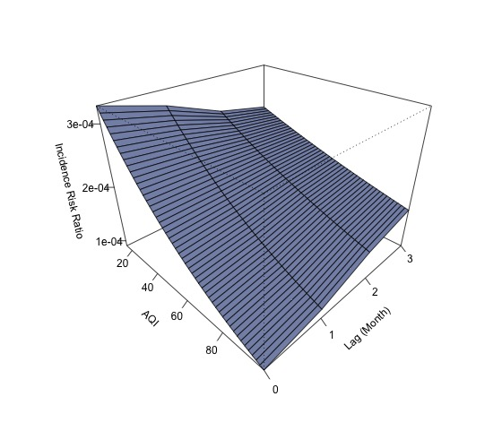

---

##### CO_24h

<table>
<caption>Summary of CO_24h Results</caption>
 <thead>
  <tr>
   <th style="text-align:center;"> model </th>
   <th style="text-align:center;"> term </th>
   <th style="text-align:center;"> estimate </th>
   <th style="text-align:center;"> std.error </th>
   <th style="text-align:center;"> statistic </th>
   <th style="text-align:center;"> p.value </th>
   <th style="text-align:center;"> signif </th>
  </tr>
 </thead>
<tbody>
  <tr>
   <td style="text-align:center;"> CO_24h_M0 </td>
   <td style="text-align:center;"> (Intercept) </td>
   <td style="text-align:center;"> -7.5981 </td>
   <td style="text-align:center;"> 0.2503 </td>
   <td style="text-align:center;"> -30.3601 </td>
   <td style="text-align:center;"> 0.0000 </td>
   <td style="text-align:center;"> *** </td>
  </tr>
  <tr>
   <td style="text-align:center;"> CO_24h_M0 </td>
   <td style="text-align:center;"> CO_24h_M0 </td>
   <td style="text-align:center;"> -1.1887 </td>
   <td style="text-align:center;"> 0.3448 </td>
   <td style="text-align:center;"> -3.4470 </td>
   <td style="text-align:center;"> 0.0006 </td>
   <td style="text-align:center;"> *** </td>
  </tr>
  <tr>
   <td style="text-align:center;"> CO_24h_M1 </td>
   <td style="text-align:center;"> (Intercept) </td>
   <td style="text-align:center;"> -7.7672 </td>
   <td style="text-align:center;"> 0.2468 </td>
   <td style="text-align:center;"> -31.4718 </td>
   <td style="text-align:center;"> 0.0000 </td>
   <td style="text-align:center;"> *** </td>
  </tr>
  <tr>
   <td style="text-align:center;"> CO_24h_M1 </td>
   <td style="text-align:center;"> CO_24h_M1 </td>
   <td style="text-align:center;"> -0.9489 </td>
   <td style="text-align:center;"> 0.3362 </td>
   <td style="text-align:center;"> -2.8227 </td>
   <td style="text-align:center;"> 0.0048 </td>
   <td style="text-align:center;"> ** </td>
  </tr>
  <tr>
   <td style="text-align:center;"> CO_24h_M2 </td>
   <td style="text-align:center;"> (Intercept) </td>
   <td style="text-align:center;"> -7.8275 </td>
   <td style="text-align:center;"> 0.2454 </td>
   <td style="text-align:center;"> -31.9006 </td>
   <td style="text-align:center;"> 0.0000 </td>
   <td style="text-align:center;"> *** </td>
  </tr>
  <tr>
   <td style="text-align:center;"> CO_24h_M2 </td>
   <td style="text-align:center;"> CO_24h_M2 </td>
   <td style="text-align:center;"> -0.8617 </td>
   <td style="text-align:center;"> 0.3319 </td>
   <td style="text-align:center;"> -2.5962 </td>
   <td style="text-align:center;"> 0.0094 </td>
   <td style="text-align:center;"> ** </td>
  </tr>
  <tr>
   <td style="text-align:center;"> CO_24h_M3 </td>
   <td style="text-align:center;"> (Intercept) </td>
   <td style="text-align:center;"> -7.8992 </td>
   <td style="text-align:center;"> 0.2436 </td>
   <td style="text-align:center;"> -32.4259 </td>
   <td style="text-align:center;"> 0.0000 </td>
   <td style="text-align:center;"> *** </td>
  </tr>
  <tr>
   <td style="text-align:center;"> CO_24h_M3 </td>
   <td style="text-align:center;"> CO_24h_M3 </td>
   <td style="text-align:center;"> -0.7597 </td>
   <td style="text-align:center;"> 0.3270 </td>
   <td style="text-align:center;"> -2.3231 </td>
   <td style="text-align:center;"> 0.0202 </td>
   <td style="text-align:center;"> * </td>
  </tr>
</tbody>
</table>

 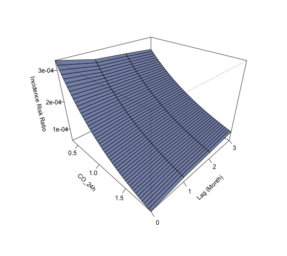

---

##### CO

<table>
<caption>Summary of CO Results</caption>
 <thead>
  <tr>
   <th style="text-align:center;"> model </th>
   <th style="text-align:center;"> term </th>
   <th style="text-align:center;"> estimate </th>
   <th style="text-align:center;"> std.error </th>
   <th style="text-align:center;"> statistic </th>
   <th style="text-align:center;"> p.value </th>
   <th style="text-align:center;"> signif </th>
  </tr>
 </thead>
<tbody>
  <tr>
   <td style="text-align:center;"> CO_M0 </td>
   <td style="text-align:center;"> (Intercept) </td>
   <td style="text-align:center;"> -7.5825 </td>
   <td style="text-align:center;"> 0.2509 </td>
   <td style="text-align:center;"> -30.2212 </td>
   <td style="text-align:center;"> 0.0000 </td>
   <td style="text-align:center;"> *** </td>
  </tr>
  <tr>
   <td style="text-align:center;"> CO_M0 </td>
   <td style="text-align:center;"> CO_M0 </td>
   <td style="text-align:center;"> -1.2097 </td>
   <td style="text-align:center;"> 0.3457 </td>
   <td style="text-align:center;"> -3.4991 </td>
   <td style="text-align:center;"> 0.0005 </td>
   <td style="text-align:center;"> *** </td>
  </tr>
  <tr>
   <td style="text-align:center;"> CO_M1 </td>
   <td style="text-align:center;"> (Intercept) </td>
   <td style="text-align:center;"> -7.7667 </td>
   <td style="text-align:center;"> 0.2471 </td>
   <td style="text-align:center;"> -31.4317 </td>
   <td style="text-align:center;"> 0.0000 </td>
   <td style="text-align:center;"> *** </td>
  </tr>
  <tr>
   <td style="text-align:center;"> CO_M1 </td>
   <td style="text-align:center;"> CO_M1 </td>
   <td style="text-align:center;"> -0.9488 </td>
   <td style="text-align:center;"> 0.3363 </td>
   <td style="text-align:center;"> -2.8211 </td>
   <td style="text-align:center;"> 0.0048 </td>
   <td style="text-align:center;"> ** </td>
  </tr>
  <tr>
   <td style="text-align:center;"> CO_M2 </td>
   <td style="text-align:center;"> (Intercept) </td>
   <td style="text-align:center;"> -7.8156 </td>
   <td style="text-align:center;"> 0.2458 </td>
   <td style="text-align:center;"> -31.8008 </td>
   <td style="text-align:center;"> 0.0000 </td>
   <td style="text-align:center;"> *** </td>
  </tr>
  <tr>
   <td style="text-align:center;"> CO_M2 </td>
   <td style="text-align:center;"> CO_M2 </td>
   <td style="text-align:center;"> -0.8775 </td>
   <td style="text-align:center;"> 0.3324 </td>
   <td style="text-align:center;"> -2.6398 </td>
   <td style="text-align:center;"> 0.0083 </td>
   <td style="text-align:center;"> ** </td>
  </tr>
  <tr>
   <td style="text-align:center;"> CO_M3 </td>
   <td style="text-align:center;"> (Intercept) </td>
   <td style="text-align:center;"> -7.9058 </td>
   <td style="text-align:center;"> 0.2438 </td>
   <td style="text-align:center;"> -32.4258 </td>
   <td style="text-align:center;"> 0.0000 </td>
   <td style="text-align:center;"> *** </td>
  </tr>
  <tr>
   <td style="text-align:center;"> CO_M3 </td>
   <td style="text-align:center;"> CO_M3 </td>
   <td style="text-align:center;"> -0.7501 </td>
   <td style="text-align:center;"> 0.3269 </td>
   <td style="text-align:center;"> -2.2944 </td>
   <td style="text-align:center;"> 0.0218 </td>
   <td style="text-align:center;"> * </td>
  </tr>
</tbody>
</table>

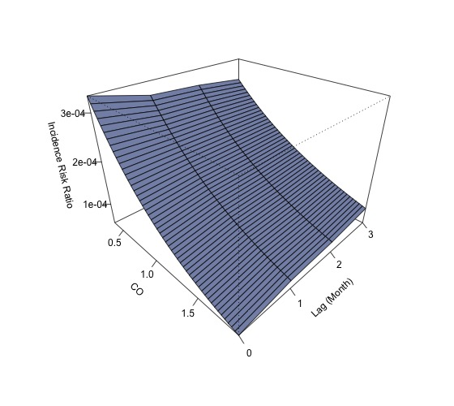

---

##### N02_24h

<table>
<caption>Summary of NO2_24h Results</caption>
 <thead>
  <tr>
   <th style="text-align:center;"> model </th>
   <th style="text-align:center;"> term </th>
   <th style="text-align:center;"> estimate </th>
   <th style="text-align:center;"> std.error </th>
   <th style="text-align:center;"> statistic </th>
   <th style="text-align:center;"> p.value </th>
   <th style="text-align:center;"> signif </th>
  </tr>
 </thead>
<tbody>
  <tr>
   <td style="text-align:center;"> NO2_24h_M0 </td>
   <td style="text-align:center;"> (Intercept) </td>
   <td style="text-align:center;"> -8.1410 </td>
   <td style="text-align:center;"> 0.1308 </td>
   <td style="text-align:center;"> -62.2575 </td>
   <td style="text-align:center;"> 0.0000 </td>
   <td style="text-align:center;"> *** </td>
  </tr>
  <tr>
   <td style="text-align:center;"> NO2_24h_M0 </td>
   <td style="text-align:center;"> NO2_24h_M0 </td>
   <td style="text-align:center;"> -0.0130 </td>
   <td style="text-align:center;"> 0.0050 </td>
   <td style="text-align:center;"> -2.5955 </td>
   <td style="text-align:center;"> 0.0094 </td>
   <td style="text-align:center;"> ** </td>
  </tr>
  <tr>
   <td style="text-align:center;"> NO2_24h_M1 </td>
   <td style="text-align:center;"> (Intercept) </td>
   <td style="text-align:center;"> -8.1559 </td>
   <td style="text-align:center;"> 0.1304 </td>
   <td style="text-align:center;"> -62.5536 </td>
   <td style="text-align:center;"> 0.0000 </td>
   <td style="text-align:center;"> *** </td>
  </tr>
  <tr>
   <td style="text-align:center;"> NO2_24h_M1 </td>
   <td style="text-align:center;"> NO2_24h_M1 </td>
   <td style="text-align:center;"> -0.0124 </td>
   <td style="text-align:center;"> 0.0050 </td>
   <td style="text-align:center;"> -2.4861 </td>
   <td style="text-align:center;"> 0.0129 </td>
   <td style="text-align:center;"> * </td>
  </tr>
  <tr>
   <td style="text-align:center;"> NO2_24h_M2 </td>
   <td style="text-align:center;"> (Intercept) </td>
   <td style="text-align:center;"> -8.2589 </td>
   <td style="text-align:center;"> 0.1302 </td>
   <td style="text-align:center;"> -63.4392 </td>
   <td style="text-align:center;"> 0.0000 </td>
   <td style="text-align:center;"> *** </td>
  </tr>
  <tr>
   <td style="text-align:center;"> NO2_24h_M2 </td>
   <td style="text-align:center;"> NO2_24h_M2 </td>
   <td style="text-align:center;"> -0.0081 </td>
   <td style="text-align:center;"> 0.0049 </td>
   <td style="text-align:center;"> -1.6623 </td>
   <td style="text-align:center;"> 0.0964 </td>
   <td style="text-align:center;"> . </td>
  </tr>
  <tr>
   <td style="text-align:center;"> NO2_24h_M3 </td>
   <td style="text-align:center;"> (Intercept) </td>
   <td style="text-align:center;"> -8.3118 </td>
   <td style="text-align:center;"> 0.1304 </td>
   <td style="text-align:center;"> -63.7319 </td>
   <td style="text-align:center;"> 0.0000 </td>
   <td style="text-align:center;"> *** </td>
  </tr>
  <tr>
   <td style="text-align:center;"> NO2_24h_M3 </td>
   <td style="text-align:center;"> NO2_24h_M3 </td>
   <td style="text-align:center;"> -0.0059 </td>
   <td style="text-align:center;"> 0.0048 </td>
   <td style="text-align:center;"> -1.2276 </td>
   <td style="text-align:center;"> 0.2196 </td>
   <td style="text-align:center;">  </td>
  </tr>
</tbody>
</table>

---

##### N02

<table>
<caption>Summary of NO2 Results</caption>
 <thead>
  <tr>
   <th style="text-align:center;"> model </th>
   <th style="text-align:center;"> term </th>
   <th style="text-align:center;"> estimate </th>
   <th style="text-align:center;"> std.error </th>
   <th style="text-align:center;"> statistic </th>
   <th style="text-align:center;"> p.value </th>
   <th style="text-align:center;"> signif </th>
  </tr>
 </thead>
<tbody>
  <tr>
   <td style="text-align:center;"> NO2_M0 </td>
   <td style="text-align:center;"> (Intercept) </td>
   <td style="text-align:center;"> -8.1415 </td>
   <td style="text-align:center;"> 0.1307 </td>
   <td style="text-align:center;"> -62.2832 </td>
   <td style="text-align:center;"> 0.0000 </td>
   <td style="text-align:center;"> *** </td>
  </tr>
  <tr>
   <td style="text-align:center;"> NO2_M0 </td>
   <td style="text-align:center;"> NO2_M0 </td>
   <td style="text-align:center;"> -0.0130 </td>
   <td style="text-align:center;"> 0.0050 </td>
   <td style="text-align:center;"> -2.5924 </td>
   <td style="text-align:center;"> 0.0095 </td>
   <td style="text-align:center;"> ** </td>
  </tr>
  <tr>
   <td style="text-align:center;"> NO2_M1 </td>
   <td style="text-align:center;"> (Intercept) </td>
   <td style="text-align:center;"> -8.1550 </td>
   <td style="text-align:center;"> 0.1304 </td>
   <td style="text-align:center;"> -62.5620 </td>
   <td style="text-align:center;"> 0.0000 </td>
   <td style="text-align:center;"> *** </td>
  </tr>
  <tr>
   <td style="text-align:center;"> NO2_M1 </td>
   <td style="text-align:center;"> NO2_M1 </td>
   <td style="text-align:center;"> -0.0124 </td>
   <td style="text-align:center;"> 0.0050 </td>
   <td style="text-align:center;"> -2.4936 </td>
   <td style="text-align:center;"> 0.0126 </td>
   <td style="text-align:center;"> * </td>
  </tr>
  <tr>
   <td style="text-align:center;"> NO2_M2 </td>
   <td style="text-align:center;"> (Intercept) </td>
   <td style="text-align:center;"> -8.2526 </td>
   <td style="text-align:center;"> 0.1301 </td>
   <td style="text-align:center;"> -63.4100 </td>
   <td style="text-align:center;"> 0.0000 </td>
   <td style="text-align:center;"> *** </td>
  </tr>
  <tr>
   <td style="text-align:center;"> NO2_M2 </td>
   <td style="text-align:center;"> NO2_M2 </td>
   <td style="text-align:center;"> -0.0083 </td>
   <td style="text-align:center;"> 0.0049 </td>
   <td style="text-align:center;"> -1.7143 </td>
   <td style="text-align:center;"> 0.0865 </td>
   <td style="text-align:center;"> . </td>
  </tr>
  <tr>
   <td style="text-align:center;"> NO2_M3 </td>
   <td style="text-align:center;"> (Intercept) </td>
   <td style="text-align:center;"> -8.3129 </td>
   <td style="text-align:center;"> 0.1304 </td>
   <td style="text-align:center;"> -63.7557 </td>
   <td style="text-align:center;"> 0.0000 </td>
   <td style="text-align:center;"> *** </td>
  </tr>
  <tr>
   <td style="text-align:center;"> NO2_M3 </td>
   <td style="text-align:center;"> NO2_M3 </td>
   <td style="text-align:center;"> -0.0058 </td>
   <td style="text-align:center;"> 0.0048 </td>
   <td style="text-align:center;"> -1.2188 </td>
   <td style="text-align:center;"> 0.2229 </td>
   <td style="text-align:center;">  </td>
  </tr>
</tbody>
</table>

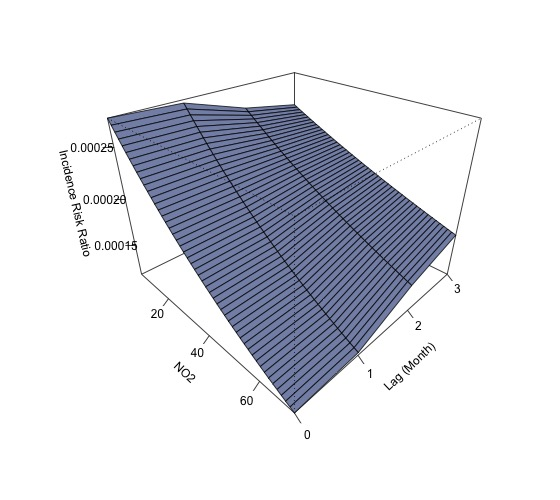

---

##### O3

<table>
<caption>Summary of O3 Results</caption>
 <thead>
  <tr>
   <th style="text-align:center;"> model </th>
   <th style="text-align:center;"> term </th>
   <th style="text-align:center;"> estimate </th>
   <th style="text-align:center;"> std.error </th>
   <th style="text-align:center;"> statistic </th>
   <th style="text-align:center;"> p.value </th>
   <th style="text-align:center;"> signif </th>
  </tr>
 </thead>
<tbody>
  <tr>
   <td style="text-align:center;"> O3_M0 </td>
   <td style="text-align:center;"> (Intercept) </td>
   <td style="text-align:center;"> -8.1499 </td>
   <td style="text-align:center;"> 0.2213 </td>
   <td style="text-align:center;"> -36.8245 </td>
   <td style="text-align:center;"> 0.0000 </td>
   <td style="text-align:center;"> *** </td>
  </tr>
  <tr>
   <td style="text-align:center;"> O3_M0 </td>
   <td style="text-align:center;"> O3_M0 </td>
   <td style="text-align:center;"> -0.0053 </td>
   <td style="text-align:center;"> 0.0037 </td>
   <td style="text-align:center;"> -1.4273 </td>
   <td style="text-align:center;"> 0.1535 </td>
   <td style="text-align:center;">  </td>
  </tr>
  <tr>
   <td style="text-align:center;"> O3_M1 </td>
   <td style="text-align:center;"> (Intercept) </td>
   <td style="text-align:center;"> -8.1161 </td>
   <td style="text-align:center;"> 0.2213 </td>
   <td style="text-align:center;"> -36.6677 </td>
   <td style="text-align:center;"> 0.0000 </td>
   <td style="text-align:center;"> *** </td>
  </tr>
  <tr>
   <td style="text-align:center;"> O3_M1 </td>
   <td style="text-align:center;"> O3_M1 </td>
   <td style="text-align:center;"> -0.0059 </td>
   <td style="text-align:center;"> 0.0037 </td>
   <td style="text-align:center;"> -1.5816 </td>
   <td style="text-align:center;"> 0.1138 </td>
   <td style="text-align:center;">  </td>
  </tr>
  <tr>
   <td style="text-align:center;"> O3_M2 </td>
   <td style="text-align:center;"> (Intercept) </td>
   <td style="text-align:center;"> -8.4015 </td>
   <td style="text-align:center;"> 0.2214 </td>
   <td style="text-align:center;"> -37.9544 </td>
   <td style="text-align:center;"> 0.0000 </td>
   <td style="text-align:center;"> *** </td>
  </tr>
  <tr>
   <td style="text-align:center;"> O3_M2 </td>
   <td style="text-align:center;"> O3_M2 </td>
   <td style="text-align:center;"> -0.0010 </td>
   <td style="text-align:center;"> 0.0037 </td>
   <td style="text-align:center;"> -0.2673 </td>
   <td style="text-align:center;"> 0.7892 </td>
   <td style="text-align:center;">  </td>
  </tr>
  <tr>
   <td style="text-align:center;"> O3_M3 </td>
   <td style="text-align:center;"> (Intercept) </td>
   <td style="text-align:center;"> -8.0568 </td>
   <td style="text-align:center;"> 0.2214 </td>
   <td style="text-align:center;"> -36.3875 </td>
   <td style="text-align:center;"> 0.0000 </td>
   <td style="text-align:center;"> *** </td>
  </tr>
  <tr>
   <td style="text-align:center;"> O3_M3 </td>
   <td style="text-align:center;"> O3_M3 </td>
   <td style="text-align:center;"> -0.0070 </td>
   <td style="text-align:center;"> 0.0038 </td>
   <td style="text-align:center;"> -1.8508 </td>
   <td style="text-align:center;"> 0.0642 </td>
   <td style="text-align:center;"> . </td>
  </tr>
</tbody>
</table>

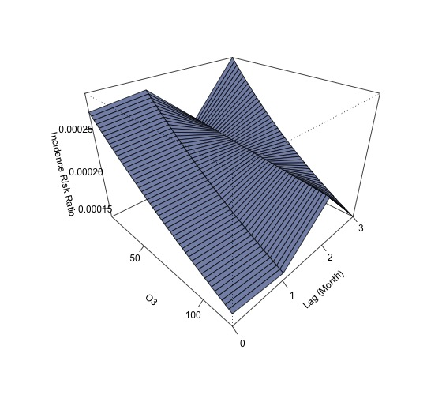

---

##### PM2.5_24h

<table>
<caption>Summary of PM2.5_24h Results</caption>
 <thead>
  <tr>
   <th style="text-align:center;"> model </th>
   <th style="text-align:center;"> term </th>
   <th style="text-align:center;"> estimate </th>
   <th style="text-align:center;"> std.error </th>
   <th style="text-align:center;"> statistic </th>
   <th style="text-align:center;"> p.value </th>
   <th style="text-align:center;"> signif </th>
  </tr>
 </thead>
<tbody>
  <tr>
   <td style="text-align:center;"> PM2.5_24h_M0 </td>
   <td style="text-align:center;"> (Intercept) </td>
   <td style="text-align:center;"> -7.9666 </td>
   <td style="text-align:center;"> 0.1384 </td>
   <td style="text-align:center;"> -57.5695 </td>
   <td style="text-align:center;"> 0.0000 </td>
   <td style="text-align:center;"> *** </td>
  </tr>
  <tr>
   <td style="text-align:center;"> PM2.5_24h_M0 </td>
   <td style="text-align:center;"> PM2.5_24h_M0 </td>
   <td style="text-align:center;"> -0.0196 </td>
   <td style="text-align:center;"> 0.0053 </td>
   <td style="text-align:center;"> -3.7082 </td>
   <td style="text-align:center;"> 0.0002 </td>
   <td style="text-align:center;"> *** </td>
  </tr>
  <tr>
   <td style="text-align:center;"> PM2.5_24h_M1 </td>
   <td style="text-align:center;"> (Intercept) </td>
   <td style="text-align:center;"> -8.0914 </td>
   <td style="text-align:center;"> 0.1384 </td>
   <td style="text-align:center;"> -58.4685 </td>
   <td style="text-align:center;"> 0.0000 </td>
   <td style="text-align:center;"> *** </td>
  </tr>
  <tr>
   <td style="text-align:center;"> PM2.5_24h_M1 </td>
   <td style="text-align:center;"> PM2.5_24h_M1 </td>
   <td style="text-align:center;"> -0.0145 </td>
   <td style="text-align:center;"> 0.0052 </td>
   <td style="text-align:center;"> -2.8007 </td>
   <td style="text-align:center;"> 0.0051 </td>
   <td style="text-align:center;"> ** </td>
  </tr>
  <tr>
   <td style="text-align:center;"> PM2.5_24h_M2 </td>
   <td style="text-align:center;"> (Intercept) </td>
   <td style="text-align:center;"> -8.2141 </td>
   <td style="text-align:center;"> 0.1386 </td>
   <td style="text-align:center;"> -59.2556 </td>
   <td style="text-align:center;"> 0.0000 </td>
   <td style="text-align:center;"> *** </td>
  </tr>
  <tr>
   <td style="text-align:center;"> PM2.5_24h_M2 </td>
   <td style="text-align:center;"> PM2.5_24h_M2 </td>
   <td style="text-align:center;"> -0.0095 </td>
   <td style="text-align:center;"> 0.0050 </td>
   <td style="text-align:center;"> -1.8842 </td>
   <td style="text-align:center;"> 0.0595 </td>
   <td style="text-align:center;"> . </td>
  </tr>
  <tr>
   <td style="text-align:center;"> PM2.5_24h_M3 </td>
   <td style="text-align:center;"> (Intercept) </td>
   <td style="text-align:center;"> -8.2961 </td>
   <td style="text-align:center;"> 0.1387 </td>
   <td style="text-align:center;"> -59.7965 </td>
   <td style="text-align:center;"> 0.0000 </td>
   <td style="text-align:center;"> *** </td>
  </tr>
  <tr>
   <td style="text-align:center;"> PM2.5_24h_M3 </td>
   <td style="text-align:center;"> PM2.5_24h_M3 </td>
   <td style="text-align:center;"> -0.0063 </td>
   <td style="text-align:center;"> 0.0050 </td>
   <td style="text-align:center;"> -1.2619 </td>
   <td style="text-align:center;"> 0.2070 </td>
   <td style="text-align:center;">  </td>
  </tr>
</tbody>
</table>

---

##### PM2.5

<table>
<caption>Summary of PM2.5 Results</caption>
 <thead>
  <tr>
   <th style="text-align:center;"> model </th>
   <th style="text-align:center;"> term </th>
   <th style="text-align:center;"> estimate </th>
   <th style="text-align:center;"> std.error </th>
   <th style="text-align:center;"> statistic </th>
   <th style="text-align:center;"> p.value </th>
   <th style="text-align:center;"> signif </th>
  </tr>
 </thead>
<tbody>
  <tr>
   <td style="text-align:center;"> PM2.5_M0 </td>
   <td style="text-align:center;"> (Intercept) </td>
   <td style="text-align:center;"> -7.9618 </td>
   <td style="text-align:center;"> 0.1385 </td>
   <td style="text-align:center;"> -57.4849 </td>
   <td style="text-align:center;"> 0.0000 </td>
   <td style="text-align:center;"> *** </td>
  </tr>
  <tr>
   <td style="text-align:center;"> PM2.5_M0 </td>
   <td style="text-align:center;"> PM2.5_M0 </td>
   <td style="text-align:center;"> -0.0197 </td>
   <td style="text-align:center;"> 0.0053 </td>
   <td style="text-align:center;"> -3.7389 </td>
   <td style="text-align:center;"> 0.0002 </td>
   <td style="text-align:center;"> *** </td>
  </tr>
  <tr>
   <td style="text-align:center;"> PM2.5_M1 </td>
   <td style="text-align:center;"> (Intercept) </td>
   <td style="text-align:center;"> -8.0888 </td>
   <td style="text-align:center;"> 0.1385 </td>
   <td style="text-align:center;"> -58.3916 </td>
   <td style="text-align:center;"> 0.0000 </td>
   <td style="text-align:center;"> *** </td>
  </tr>
  <tr>
   <td style="text-align:center;"> PM2.5_M1 </td>
   <td style="text-align:center;"> PM2.5_M1 </td>
   <td style="text-align:center;"> -0.0145 </td>
   <td style="text-align:center;"> 0.0052 </td>
   <td style="text-align:center;"> -2.8169 </td>
   <td style="text-align:center;"> 0.0048 </td>
   <td style="text-align:center;"> ** </td>
  </tr>
  <tr>
   <td style="text-align:center;"> PM2.5_M2 </td>
   <td style="text-align:center;"> (Intercept) </td>
   <td style="text-align:center;"> -8.2095 </td>
   <td style="text-align:center;"> 0.1387 </td>
   <td style="text-align:center;"> -59.1737 </td>
   <td style="text-align:center;"> 0.0000 </td>
   <td style="text-align:center;"> *** </td>
  </tr>
  <tr>
   <td style="text-align:center;"> PM2.5_M2 </td>
   <td style="text-align:center;"> PM2.5_M2 </td>
   <td style="text-align:center;"> -0.0097 </td>
   <td style="text-align:center;"> 0.0050 </td>
   <td style="text-align:center;"> -1.9166 </td>
   <td style="text-align:center;"> 0.0553 </td>
   <td style="text-align:center;"> . </td>
  </tr>
  <tr>
   <td style="text-align:center;"> PM2.5_M3 </td>
   <td style="text-align:center;"> (Intercept) </td>
   <td style="text-align:center;"> -8.2995 </td>
   <td style="text-align:center;"> 0.1388 </td>
   <td style="text-align:center;"> -59.7797 </td>
   <td style="text-align:center;"> 0.0000 </td>
   <td style="text-align:center;"> *** </td>
  </tr>
  <tr>
   <td style="text-align:center;"> PM2.5_M3 </td>
   <td style="text-align:center;"> PM2.5_M3 </td>
   <td style="text-align:center;"> -0.0061 </td>
   <td style="text-align:center;"> 0.0049 </td>
   <td style="text-align:center;"> -1.2348 </td>
   <td style="text-align:center;"> 0.2169 </td>
   <td style="text-align:center;">  </td>
  </tr>
</tbody>
</table>

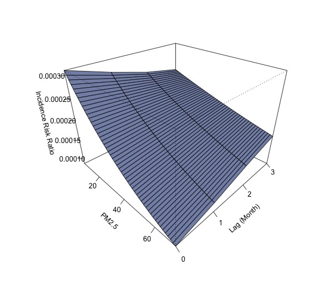

---

##### PM10_24h

<table>
<caption>Summary of PM10_24h Results</caption>
 <thead>
  <tr>
   <th style="text-align:center;"> model </th>
   <th style="text-align:center;"> term </th>
   <th style="text-align:center;"> estimate </th>
   <th style="text-align:center;"> std.error </th>
   <th style="text-align:center;"> statistic </th>
   <th style="text-align:center;"> p.value </th>
   <th style="text-align:center;"> signif </th>
  </tr>
 </thead>
<tbody>
  <tr>
   <td style="text-align:center;"> PM10_24h_M0 </td>
   <td style="text-align:center;"> (Intercept) </td>
   <td style="text-align:center;"> -7.9217 </td>
   <td style="text-align:center;"> 0.1632 </td>
   <td style="text-align:center;"> -48.5268 </td>
   <td style="text-align:center;"> 0.0000 </td>
   <td style="text-align:center;"> *** </td>
  </tr>
  <tr>
   <td style="text-align:center;"> PM10_24h_M0 </td>
   <td style="text-align:center;"> PM10_24h_M0 </td>
   <td style="text-align:center;"> -0.0126 </td>
   <td style="text-align:center;"> 0.0037 </td>
   <td style="text-align:center;"> -3.3802 </td>
   <td style="text-align:center;"> 0.0007 </td>
   <td style="text-align:center;"> *** </td>
  </tr>
  <tr>
   <td style="text-align:center;"> PM10_24h_M1 </td>
   <td style="text-align:center;"> (Intercept) </td>
   <td style="text-align:center;"> -8.0059 </td>
   <td style="text-align:center;"> 0.1633 </td>
   <td style="text-align:center;"> -49.0166 </td>
   <td style="text-align:center;"> 0.0000 </td>
   <td style="text-align:center;"> *** </td>
  </tr>
  <tr>
   <td style="text-align:center;"> PM10_24h_M1 </td>
   <td style="text-align:center;"> PM10_24h_M1 </td>
   <td style="text-align:center;"> -0.0106 </td>
   <td style="text-align:center;"> 0.0037 </td>
   <td style="text-align:center;"> -2.8646 </td>
   <td style="text-align:center;"> 0.0042 </td>
   <td style="text-align:center;"> ** </td>
  </tr>
  <tr>
   <td style="text-align:center;"> PM10_24h_M2 </td>
   <td style="text-align:center;"> (Intercept) </td>
   <td style="text-align:center;"> -8.1391 </td>
   <td style="text-align:center;"> 0.1636 </td>
   <td style="text-align:center;"> -49.7482 </td>
   <td style="text-align:center;"> 0.0000 </td>
   <td style="text-align:center;"> *** </td>
  </tr>
  <tr>
   <td style="text-align:center;"> PM10_24h_M2 </td>
   <td style="text-align:center;"> PM10_24h_M2 </td>
   <td style="text-align:center;"> -0.0074 </td>
   <td style="text-align:center;"> 0.0036 </td>
   <td style="text-align:center;"> -2.0360 </td>
   <td style="text-align:center;"> 0.0418 </td>
   <td style="text-align:center;"> * </td>
  </tr>
  <tr>
   <td style="text-align:center;"> PM10_24h_M3 </td>
   <td style="text-align:center;"> (Intercept) </td>
   <td style="text-align:center;"> -8.2784 </td>
   <td style="text-align:center;"> 0.1638 </td>
   <td style="text-align:center;"> -50.5248 </td>
   <td style="text-align:center;"> 0.0000 </td>
   <td style="text-align:center;"> *** </td>
  </tr>
  <tr>
   <td style="text-align:center;"> PM10_24h_M3 </td>
   <td style="text-align:center;"> PM10_24h_M3 </td>
   <td style="text-align:center;"> -0.0041 </td>
   <td style="text-align:center;"> 0.0036 </td>
   <td style="text-align:center;"> -1.1579 </td>
   <td style="text-align:center;"> 0.2469 </td>
   <td style="text-align:center;">  </td>
  </tr>
</tbody>
</table>

---

##### PM10

<table>
<caption>Summary of PM10 Results</caption>
 <thead>
  <tr>
   <th style="text-align:center;"> model </th>
   <th style="text-align:center;"> term </th>
   <th style="text-align:center;"> estimate </th>
   <th style="text-align:center;"> std.error </th>
   <th style="text-align:center;"> statistic </th>
   <th style="text-align:center;"> p.value </th>
   <th style="text-align:center;"> signif </th>
  </tr>
 </thead>
<tbody>
  <tr>
   <td style="text-align:center;"> PM10_M0 </td>
   <td style="text-align:center;"> (Intercept) </td>
   <td style="text-align:center;"> -7.9253 </td>
   <td style="text-align:center;"> 0.1640 </td>
   <td style="text-align:center;"> -48.3383 </td>
   <td style="text-align:center;"> 0.0000 </td>
   <td style="text-align:center;"> *** </td>
  </tr>
  <tr>
   <td style="text-align:center;"> PM10_M0 </td>
   <td style="text-align:center;"> PM10_M0 </td>
   <td style="text-align:center;"> -0.0125 </td>
   <td style="text-align:center;"> 0.0037 </td>
   <td style="text-align:center;"> -3.3430 </td>
   <td style="text-align:center;"> 0.0008 </td>
   <td style="text-align:center;"> *** </td>
  </tr>
  <tr>
   <td style="text-align:center;"> PM10_M1 </td>
   <td style="text-align:center;"> (Intercept) </td>
   <td style="text-align:center;"> -8.0151 </td>
   <td style="text-align:center;"> 0.1641 </td>
   <td style="text-align:center;"> -48.8528 </td>
   <td style="text-align:center;"> 0.0000 </td>
   <td style="text-align:center;"> *** </td>
  </tr>
  <tr>
   <td style="text-align:center;"> PM10_M1 </td>
   <td style="text-align:center;"> PM10_M1 </td>
   <td style="text-align:center;"> -0.0104 </td>
   <td style="text-align:center;"> 0.0037 </td>
   <td style="text-align:center;"> -2.7944 </td>
   <td style="text-align:center;"> 0.0052 </td>
   <td style="text-align:center;"> ** </td>
  </tr>
  <tr>
   <td style="text-align:center;"> PM10_M2 </td>
   <td style="text-align:center;"> (Intercept) </td>
   <td style="text-align:center;"> -8.1391 </td>
   <td style="text-align:center;"> 0.1643 </td>
   <td style="text-align:center;"> -49.5422 </td>
   <td style="text-align:center;"> 0.0000 </td>
   <td style="text-align:center;"> *** </td>
  </tr>
  <tr>
   <td style="text-align:center;"> PM10_M2 </td>
   <td style="text-align:center;"> PM10_M2 </td>
   <td style="text-align:center;"> -0.0074 </td>
   <td style="text-align:center;"> 0.0036 </td>
   <td style="text-align:center;"> -2.0269 </td>
   <td style="text-align:center;"> 0.0427 </td>
   <td style="text-align:center;"> * </td>
  </tr>
  <tr>
   <td style="text-align:center;"> PM10_M3 </td>
   <td style="text-align:center;"> (Intercept) </td>
   <td style="text-align:center;"> -8.2916 </td>
   <td style="text-align:center;"> 0.1645 </td>
   <td style="text-align:center;"> -50.4100 </td>
   <td style="text-align:center;"> 0.0000 </td>
   <td style="text-align:center;"> *** </td>
  </tr>
  <tr>
   <td style="text-align:center;"> PM10_M3 </td>
   <td style="text-align:center;"> PM10_M3 </td>
   <td style="text-align:center;"> -0.0038 </td>
   <td style="text-align:center;"> 0.0036 </td>
   <td style="text-align:center;"> -1.0695 </td>
   <td style="text-align:center;"> 0.2848 </td>
   <td style="text-align:center;">  </td>
  </tr>
</tbody>
</table>

---

##### SO2_24h

<table>
<caption>Summary of SO2_24h Results</caption>
 <thead>
  <tr>
   <th style="text-align:center;"> model </th>
   <th style="text-align:center;"> term </th>
   <th style="text-align:center;"> estimate </th>
   <th style="text-align:center;"> std.error </th>
   <th style="text-align:center;"> statistic </th>
   <th style="text-align:center;"> p.value </th>
   <th style="text-align:center;"> signif </th>
  </tr>
 </thead>
<tbody>
  <tr>
   <td style="text-align:center;"> SO2_24h_M0 </td>
   <td style="text-align:center;"> (Intercept) </td>
   <td style="text-align:center;"> -8.0064 </td>
   <td style="text-align:center;"> 0.1470 </td>
   <td style="text-align:center;"> -54.4659 </td>
   <td style="text-align:center;"> 0.0000 </td>
   <td style="text-align:center;"> *** </td>
  </tr>
  <tr>
   <td style="text-align:center;"> SO2_24h_M0 </td>
   <td style="text-align:center;"> SO2_24h_M0 </td>
   <td style="text-align:center;"> -0.0515 </td>
   <td style="text-align:center;"> 0.0161 </td>
   <td style="text-align:center;"> -3.1957 </td>
   <td style="text-align:center;"> 0.0014 </td>
   <td style="text-align:center;"> ** </td>
  </tr>
  <tr>
   <td style="text-align:center;"> SO2_24h_M1 </td>
   <td style="text-align:center;"> (Intercept) </td>
   <td style="text-align:center;"> -7.9960 </td>
   <td style="text-align:center;"> 0.1462 </td>
   <td style="text-align:center;"> -54.6764 </td>
   <td style="text-align:center;"> 0.0000 </td>
   <td style="text-align:center;"> *** </td>
  </tr>
  <tr>
   <td style="text-align:center;"> SO2_24h_M1 </td>
   <td style="text-align:center;"> SO2_24h_M1 </td>
   <td style="text-align:center;"> -0.0525 </td>
   <td style="text-align:center;"> 0.0160 </td>
   <td style="text-align:center;"> -3.2846 </td>
   <td style="text-align:center;"> 0.0010 </td>
   <td style="text-align:center;"> ** </td>
  </tr>
  <tr>
   <td style="text-align:center;"> SO2_24h_M2 </td>
   <td style="text-align:center;"> (Intercept) </td>
   <td style="text-align:center;"> -8.0431 </td>
   <td style="text-align:center;"> 0.1444 </td>
   <td style="text-align:center;"> -55.6875 </td>
   <td style="text-align:center;"> 0.0000 </td>
   <td style="text-align:center;"> *** </td>
  </tr>
  <tr>
   <td style="text-align:center;"> SO2_24h_M2 </td>
   <td style="text-align:center;"> SO2_24h_M2 </td>
   <td style="text-align:center;"> -0.0468 </td>
   <td style="text-align:center;"> 0.0156 </td>
   <td style="text-align:center;"> -3.0039 </td>
   <td style="text-align:center;"> 0.0027 </td>
   <td style="text-align:center;"> ** </td>
  </tr>
  <tr>
   <td style="text-align:center;"> SO2_24h_M3 </td>
   <td style="text-align:center;"> (Intercept) </td>
   <td style="text-align:center;"> -8.0970 </td>
   <td style="text-align:center;"> 0.1421 </td>
   <td style="text-align:center;"> -56.9801 </td>
   <td style="text-align:center;"> 0.0000 </td>
   <td style="text-align:center;"> *** </td>
  </tr>
  <tr>
   <td style="text-align:center;"> SO2_24h_M3 </td>
   <td style="text-align:center;"> SO2_24h_M3 </td>
   <td style="text-align:center;"> -0.0403 </td>
   <td style="text-align:center;"> 0.0151 </td>
   <td style="text-align:center;"> -2.6754 </td>
   <td style="text-align:center;"> 0.0075 </td>
   <td style="text-align:center;"> ** </td>
  </tr>
</tbody>
</table>

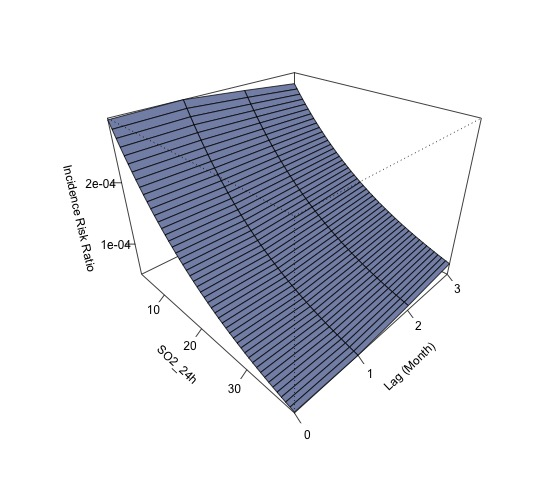

---

##### SO2

<table>
<caption>Summary of SO2 Results</caption>
 <thead>
  <tr>
   <th style="text-align:center;"> model </th>
   <th style="text-align:center;"> term </th>
   <th style="text-align:center;"> estimate </th>
   <th style="text-align:center;"> std.error </th>
   <th style="text-align:center;"> statistic </th>
   <th style="text-align:center;"> p.value </th>
   <th style="text-align:center;"> signif </th>
  </tr>
 </thead>
<tbody>
  <tr>
   <td style="text-align:center;"> SO2_M0 </td>
   <td style="text-align:center;"> (Intercept) </td>
   <td style="text-align:center;"> -7.9217 </td>
   <td style="text-align:center;"> 0.1632 </td>
   <td style="text-align:center;"> -48.5268 </td>
   <td style="text-align:center;"> 0.0000 </td>
   <td style="text-align:center;"> *** </td>
  </tr>
  <tr>
   <td style="text-align:center;"> SO2_M0 </td>
   <td style="text-align:center;"> SO2_M0 </td>
   <td style="text-align:center;"> -0.0126 </td>
   <td style="text-align:center;"> 0.0037 </td>
   <td style="text-align:center;"> -3.3802 </td>
   <td style="text-align:center;"> 0.0007 </td>
   <td style="text-align:center;"> *** </td>
  </tr>
  <tr>
   <td style="text-align:center;"> SO2_M1 </td>
   <td style="text-align:center;"> (Intercept) </td>
   <td style="text-align:center;"> -8.0059 </td>
   <td style="text-align:center;"> 0.1633 </td>
   <td style="text-align:center;"> -49.0166 </td>
   <td style="text-align:center;"> 0.0000 </td>
   <td style="text-align:center;"> *** </td>
  </tr>
  <tr>
   <td style="text-align:center;"> SO2_M1 </td>
   <td style="text-align:center;"> SO2_M1 </td>
   <td style="text-align:center;"> -0.0106 </td>
   <td style="text-align:center;"> 0.0037 </td>
   <td style="text-align:center;"> -2.8646 </td>
   <td style="text-align:center;"> 0.0042 </td>
   <td style="text-align:center;"> ** </td>
  </tr>
  <tr>
   <td style="text-align:center;"> SO2_M2 </td>
   <td style="text-align:center;"> (Intercept) </td>
   <td style="text-align:center;"> -8.1391 </td>
   <td style="text-align:center;"> 0.1636 </td>
   <td style="text-align:center;"> -49.7482 </td>
   <td style="text-align:center;"> 0.0000 </td>
   <td style="text-align:center;"> *** </td>
  </tr>
  <tr>
   <td style="text-align:center;"> SO2_M2 </td>
   <td style="text-align:center;"> SO2_M2 </td>
   <td style="text-align:center;"> -0.0074 </td>
   <td style="text-align:center;"> 0.0036 </td>
   <td style="text-align:center;"> -2.0360 </td>
   <td style="text-align:center;"> 0.0418 </td>
   <td style="text-align:center;"> * </td>
  </tr>
  <tr>
   <td style="text-align:center;"> SO2_M3 </td>
   <td style="text-align:center;"> (Intercept) </td>
   <td style="text-align:center;"> -8.2784 </td>
   <td style="text-align:center;"> 0.1638 </td>
   <td style="text-align:center;"> -50.5248 </td>
   <td style="text-align:center;"> 0.0000 </td>
   <td style="text-align:center;"> *** </td>
  </tr>
  <tr>
   <td style="text-align:center;"> SO2_M3 </td>
   <td style="text-align:center;"> SO2_M3 </td>
   <td style="text-align:center;"> -0.0041 </td>
   <td style="text-align:center;"> 0.0036 </td>
   <td style="text-align:center;"> -1.1579 </td>
   <td style="text-align:center;"> 0.2469 </td>
   <td style="text-align:center;">  </td>
  </tr>
</tbody>
</table>

---

### Q1: 模型调整: 相关性分析中引入城市人口数量进行分析 (Only top 9 cities)

--

##### AQI top 9 cities

| model  |    term     | estimate | std.error | statistic | p.value | signif |
|:------:|:-----------:|:--------:|:---------:|:---------:|:-------:|:------:|
| AQI_M0 | (Intercept) | -7.7888  |  0.2334   | -33.3704  | 0.0000  |  ***   |
| AQI_M0 |   AQI_M0    | -0.0139  |  0.0052   |  -2.6623  | 0.0078  |   **   |
| AQI_M1 | (Intercept) | -7.9605  |  0.2333   | -34.1191  | 0.0000  |  ***   |
| AQI_M1 |   AQI_M1    | -0.0099  |  0.0051   |  -1.9306  | 0.0535  |   .    |
| AQI_M2 | (Intercept) | -8.2433  |  0.2341   | -35.2184  | 0.0000  |  ***   |
| AQI_M2 |   AQI_M2    | -0.0035  |  0.0050   |  -0.6959  | 0.4865  |        |
| AQI_M3 | (Intercept) | -8.4405  |  0.2345   | -35.9876  | 0.0000  |  ***   |
| AQI_M3 |   AQI_M3    |  0.0009  |  0.0049   |  0.1794   | 0.8576  |        | 

 

---

##### CO top 9 cities

| model |    term     | estimate | std.error | statistic | p.value | signif |
|:-----:|:-----------:|:--------:|:---------:|:---------:|:-------:|:------:|
| CO_M0 | (Intercept) | -7.5284  |  0.3262   | -23.0785  | 0.0000  |  ***   |
| CO_M0 |    CO_M0    | -1.1956  |  0.4465   |  -2.6774  | 0.0074  |   **   |
| CO_M1 | (Intercept) | -7.7671  |  0.3199   | -24.2811  | 0.0000  |  ***   |
| CO_M1 |    CO_M1    | -0.8620  |  0.4321   |  -1.9950  | 0.0460  |   *    |
| CO_M2 | (Intercept) | -8.0221  |  0.3149   | -25.4786  | 0.0000  |  ***   |
| CO_M2 |    CO_M2    | -0.5100  |  0.4185   |  -1.2186  | 0.2230  |        |
| CO_M3 | (Intercept) | -8.1513  |  0.3120   | -26.1276  | 0.0000  |  ***   |
| CO_M3 |    CO_M3    | -0.3337  |  0.4108   |  -0.8124  | 0.4166  |        | 

 

---

##### CO_24h top 9 cities 

|   model   |    term     | estimate | std.error | statistic | p.value | signif |
|:---------:|:-----------:|:--------:|:---------:|:---------:|:-------:|:------:|
| CO_24h_M0 | (Intercept) | -7.5405  |  0.3254   | -23.1721  | 0.0000  |  ***   |
| CO_24h_M0 |  CO_24h_M0  | -1.1796  |  0.4456   |  -2.6474  | 0.0081  |   **   |
| CO_24h_M1 | (Intercept) | -7.7773  |  0.3193   | -24.3543  | 0.0000  |  ***   |
| CO_24h_M1 |  CO_24h_M1  | -0.8485  |  0.4314   |  -1.9667  | 0.0492  |   *    |
| CO_24h_M2 | (Intercept) | -8.0396  |  0.3144   | -25.5726  | 0.0000  |  ***   |
| CO_24h_M2 |  CO_24h_M2  | -0.4865  |  0.4178   |  -1.1644  | 0.2443  |        |
| CO_24h_M3 | (Intercept) | -8.1345  |  0.3120   | -26.0720  | 0.0000  |  ***   |
| CO_24h_M3 |  CO_24h_M3  | -0.3567  |  0.4114   |  -0.8671  | 0.3859  |        | 

 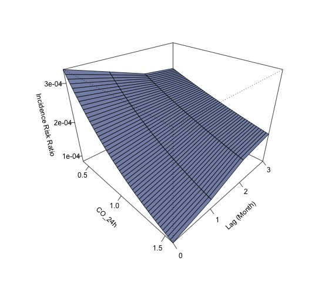

---

##### NO2 top 9 cities

| model  |    term     | estimate | std.error | statistic | p.value | signif |
|:------:|:-----------:|:--------:|:---------:|:---------:|:-------:|:------:|
| NO2_M0 | (Intercept) | -7.9808  |  0.1731   | -46.1028  | 0.0000  |  ***   |
| NO2_M0 |   NO2_M0    | -0.0155  |  0.0061   |  -2.5367  | 0.0112  |   *    |
| NO2_M1 | (Intercept) | -7.9955  |  0.1727   | -46.2943  | 0.0000  |  ***   |
| NO2_M1 |   NO2_M1    | -0.0150  |  0.0061   |  -2.4575  | 0.0140  |   *    |
| NO2_M2 | (Intercept) | -8.1507  |  0.1728   | -47.1568  | 0.0000  |  ***   |
| NO2_M2 |   NO2_M2    | -0.0091  |  0.0059   |  -1.5353  | 0.1247  |        |
| NO2_M3 | (Intercept) | -8.2098  |  0.1736   | -47.2952  | 0.0000  |  ***   |
| NO2_M3 |   NO2_M3    | -0.0069  |  0.0058   |  -1.1726  | 0.2410  |        | 

 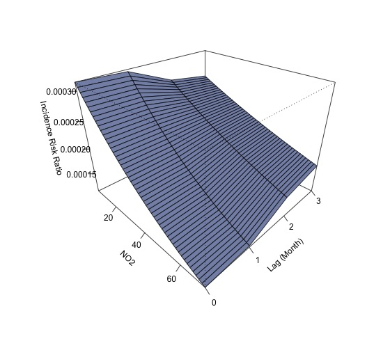

---

##### NO2_24h top 9 cities

|   model    |    term     | estimate | std.error | statistic | p.value | signif |
|:----------:|:-----------:|:--------:|:---------:|:---------:|:-------:|:------:|
| NO2_24h_M0 | (Intercept) | -7.9791  |  0.1732   | -46.0605  | 0.0000  |  ***   |
| NO2_24h_M0 | NO2_24h_M0  | -0.0156  |  0.0061   |  -2.5447  | 0.0109  |   *    |
| NO2_24h_M1 | (Intercept) | -7.9991  |  0.1728   | -46.2853  | 0.0000  |  ***   |
| NO2_24h_M1 | NO2_24h_M1  | -0.0148  |  0.0061   |  -2.4343  | 0.0149  |   *    |
| NO2_24h_M2 | (Intercept) | -8.1594  |  0.1730   | -47.1680  | 0.0000  |  ***   |
| NO2_24h_M2 | NO2_24h_M2  | -0.0088  |  0.0059   |  -1.4817  | 0.1384  |        |
| NO2_24h_M3 | (Intercept) | -8.2071  |  0.1737   | -47.2522  | 0.0000  |  ***   |
| NO2_24h_M3 | NO2_24h_M3  | -0.0070  |  0.0059   |  -1.1880  | 0.2348  |        | 

 

---

##### O3 top 9 cities

| model |    term     | estimate | std.error | statistic | p.value | signif |
|:-----:|:-----------:|:--------:|:---------:|:---------:|:-------:|:------:|
| O3_M0 | (Intercept) | -8.0600  |  0.2784   | -28.9533  | 0.0000  |  ***   |
| O3_M0 |    O3_M0    | -0.0060  |  0.0048   |  -1.2472  | 0.2123  |        |
| O3_M1 | (Intercept) | -8.1988  |  0.2788   | -29.4091  | 0.0000  |  ***   |
| O3_M1 |    O3_M1    | -0.0035  |  0.0048   |  -0.7403  | 0.4591  |        |
| O3_M2 | (Intercept) | -8.5510  |  0.2786   | -30.6942  | 0.0000  |  ***   |
| O3_M2 |    O3_M2    |  0.0026  |  0.0047   |  0.5608   | 0.5749  |        |
| O3_M3 | (Intercept) | -8.2573  |  0.2791   | -29.5832  | 0.0000  |  ***   |
| O3_M3 |    O3_M3    | -0.0025  |  0.0048   |  -0.5256  | 0.5991  |        | 

 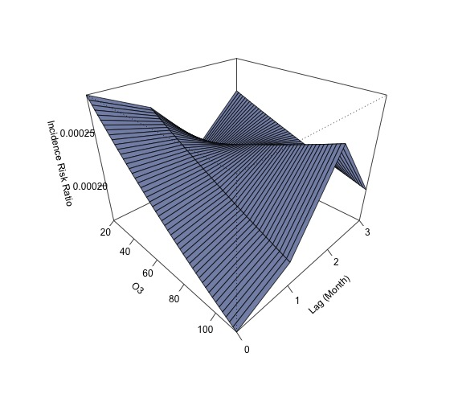

---

##### PM10 top 9 cities

|  model  |    term     | estimate | std.error | statistic | p.value | signif |
|:-------:|:-----------:|:--------:|:---------:|:---------:|:-------:|:------:|
| PM10_M0 | (Intercept) | -7.9287  |  0.2004   | -39.5705  | 0.0000  |  ***   |
| PM10_M0 |   PM10_M0   | -0.0108  |  0.0045   |  -2.4268  | 0.0152  |   *    |
| PM10_M1 | (Intercept) | -8.0374  |  0.2006   | -40.0583  | 0.0000  |  ***   |
| PM10_M1 |   PM10_M1   | -0.0083  |  0.0044   |  -1.8778  | 0.0604  |   .    |
| PM10_M2 | (Intercept) | -8.2100  |  0.2015   | -40.7463  | 0.0000  |  ***   |
| PM10_M2 |   PM10_M2   | -0.0043  |  0.0043   |  -0.9911  | 0.3216  |        |
| PM10_M3 | (Intercept) | -8.4262  |  0.2026   | -41.5992  | 0.0000  |  ***   |
| PM10_M3 |   PM10_M3   |  0.0006  |  0.0042   |  0.1363   | 0.8916  |        | 

 

---

##### PM10_24h top 9 cities

|    model    |    term     | estimate | std.error | statistic | p.value | signif |
|:-----------:|:-----------:|:--------:|:---------:|:---------:|:-------:|:------:|
| PM10_24h_M0 | (Intercept) | -7.9245  |  0.1998   | -39.6552  | 0.0000  |  ***   |
| PM10_24h_M0 | PM10_24h_M0 | -0.0109  |  0.0045   |  -2.4552  | 0.0141  |   *    |
| PM10_24h_M1 | (Intercept) | -8.0407  |  0.2001   | -40.1837  | 0.0000  |  ***   |
| PM10_24h_M1 | PM10_24h_M1 | -0.0082  |  0.0044   |  -1.8667  | 0.0619  |   .    |
| PM10_24h_M2 | (Intercept) | -8.2084  |  0.2010   | -40.8387  | 0.0000  |  ***   |
| PM10_24h_M2 | PM10_24h_M2 | -0.0043  |  0.0043   |  -1.0017  | 0.3165  |        |
| PM10_24h_M3 | (Intercept) | -8.4077  |  0.2020   | -41.6144  | 0.0000  |  ***   |
| PM10_24h_M3 | PM10_24h_M3 |  0.0002  |  0.0042   |  0.0392   | 0.9687  |        | 

 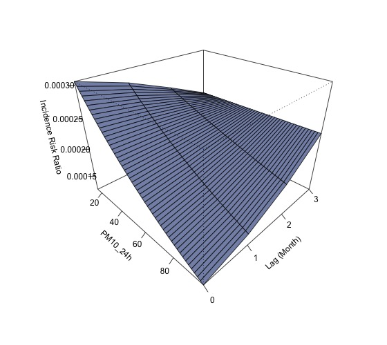

---

##### PM2.5 top 9 cities

|  model   |    term     | estimate | std.error | statistic | p.value | signif |
|:--------:|:-----------:|:--------:|:---------:|:---------:|:-------:|:------:|
| PM2.5_M0 | (Intercept) | -7.9352  |  0.1700   | -46.6797  | 0.0000  |  ***   |
| PM2.5_M0 |  PM2.5_M0   | -0.0183  |  0.0064   |  -2.8573  | 0.0043  |   **   |
| PM2.5_M1 | (Intercept) | -8.1010  |  0.1700   | -47.6394  | 0.0000  |  ***   |
| PM2.5_M1 |  PM2.5_M1   | -0.0116  |  0.0062   |  -1.8669  | 0.0619  |   .    |
| PM2.5_M2 | (Intercept) | -8.2904  |  0.1708   | -48.5484  | 0.0000  |  ***   |
| PM2.5_M2 |  PM2.5_M2   | -0.0042  |  0.0060   |  -0.6942  | 0.4876  |        |
| PM2.5_M3 | (Intercept) | -8.4305  |  0.1715   | -49.1717  | 0.0000  |  ***   |
| PM2.5_M3 |  PM2.5_M3   |  0.0011  |  0.0059   |  0.1929   | 0.8470  |        | 

 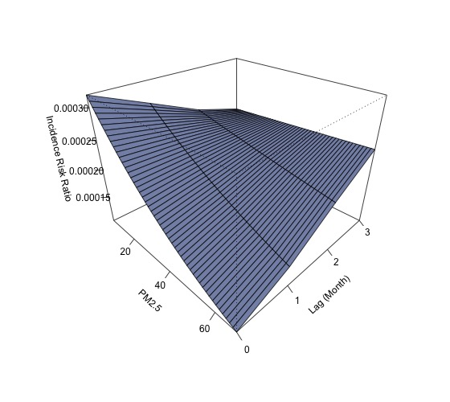

---

##### PM2.5_24h top 9 cities 

|    model     |     term     | estimate | std.error | statistic | p.value | signif |
|:------------:|:------------:|:--------:|:---------:|:---------:|:-------:|:------:|
| PM2.5_24h_M0 | (Intercept)  | -7.9375  |  0.1697   | -46.7817  | 0.0000  |  ***   |
| PM2.5_24h_M0 | PM2.5_24h_M0 | -0.0182  |  0.0064   |  -2.8499  | 0.0044  |   **   |
| PM2.5_24h_M1 | (Intercept)  | -8.1101  |  0.1698   | -47.7754  | 0.0000  |  ***   |
| PM2.5_24h_M1 | PM2.5_24h_M1 | -0.0112  |  0.0062   |  -1.8151  | 0.0695  |   .    |
| PM2.5_24h_M2 | (Intercept)  | -8.2956  |  0.1705   | -48.6468  | 0.0000  |  ***   |
| PM2.5_24h_M2 | PM2.5_24h_M2 | -0.0040  |  0.0060   |  -0.6627  | 0.5075  |        |
| PM2.5_24h_M3 | (Intercept)  | -8.4235  |  0.1712   | -49.1977  | 0.0000  |  ***   |
| PM2.5_24h_M3 | PM2.5_24h_M3 |  0.0009  |  0.0059   |  0.1480   | 0.8824  |        | 

---

##### SO2 top 9 cities

| model  |    term     | estimate | std.error | statistic | p.value | signif |
|:------:|:-----------:|:--------:|:---------:|:---------:|:-------:|:------:|
| SO2_M0 | (Intercept) | -7.9245  |  0.1998   | -39.6552  | 0.0000  |  ***   |
| SO2_M0 |   SO2_M0    | -0.0109  |  0.0045   |  -2.4552  | 0.0141  |   *    |
| SO2_M1 | (Intercept) | -8.0407  |  0.2001   | -40.1837  | 0.0000  |  ***   |
| SO2_M1 |   SO2_M1    | -0.0082  |  0.0044   |  -1.8667  | 0.0619  |   .    |
| SO2_M2 | (Intercept) | -8.2084  |  0.2010   | -40.8387  | 0.0000  |  ***   |
| SO2_M2 |   SO2_M2    | -0.0043  |  0.0043   |  -1.0017  | 0.3165  |        |
| SO2_M3 | (Intercept) | -8.4077  |  0.2020   | -41.6144  | 0.0000  |  ***   |
| SO2_M3 |   SO2_M3    |  0.0002  |  0.0042   |  0.0392   | 0.9687  |        | 

---

##### SO2_24h top 9 cities

|   model    |    term     | estimate | std.error | statistic | p.value | signif |
|:----------:|:-----------:|:--------:|:---------:|:---------:|:-------:|:------:|
| SO2_24h_M0 | (Intercept) | -7.9784  |  0.1802   | -44.2762  | 0.0000  |  ***   |
| SO2_24h_M0 | SO2_24h_M0  | -0.0494  |  0.0203   |  -2.4359  | 0.0149  |   *    |
| SO2_24h_M1 | (Intercept) | -8.0411  |  0.1765   | -45.5479  | 0.0000  |  ***   |
| SO2_24h_M1 | SO2_24h_M1  | -0.0416  |  0.0195   |  -2.1331  | 0.0329  |   *    |
| SO2_24h_M2 | (Intercept) | -8.0743  |  0.1745   | -46.2741  | 0.0000  |  ***   |
| SO2_24h_M2 | SO2_24h_M2  | -0.0375  |  0.0190   |  -1.9678  | 0.0491  |   *    |
| SO2_24h_M3 | (Intercept) | -8.1679  |  0.1697   | -48.1314  | 0.0000  |  ***   |
| SO2_24h_M3 | SO2_24h_M3  | -0.0263  |  0.0180   |  -1.4604  | 0.1442  |        | 

 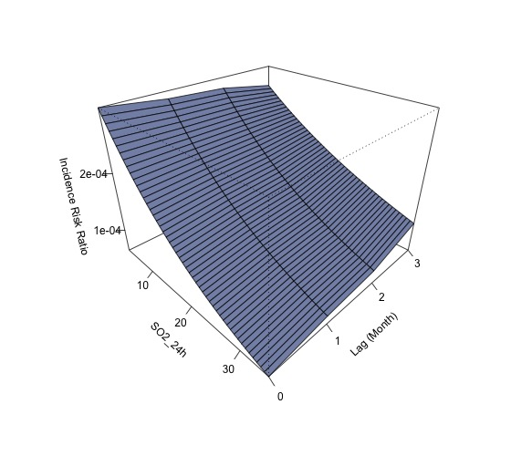

# Top 9 城市 VGLM 分析报告 

## VGLM 分析报告: AQI 

#### 模型汇总表
 Table: 模型汇总: AQI

|model  |term        | Estimate| Std. Error| z value| Pr(>&#124;z&#124;)|signif |
|:------|:-----------|--------:|----------:|-------:|------------------:|:------|
|AQI_M0 |(Intercept) |  -1.1169|     0.5825| -1.9175|             0.0552|.      |
|AQI_M0 |AQI_M0      |   0.0018|     0.0129|  0.1355|             0.8922|       |
|AQI_M1 |(Intercept) |  -1.0369|     0.5638| -1.8391|             0.0659|.      |
|AQI_M1 |AQI_M1      |  -0.0001|     0.0124| -0.0087|             0.9931|       |
|AQI_M2 |(Intercept) |  -1.2521|     0.5700| -2.1967|             0.0280|*      |
|AQI_M2 |AQI_M2      |   0.0047|     0.0119|  0.3906|             0.6961|       |
|AQI_M3 |(Intercept) |  -0.8425|     0.5504| -1.5306|             0.1259|       |
|AQI_M3 |AQI_M3      |  -0.0044|     0.0117| -0.3753|             0.7074|       | 

#### 3D 预测病例数图
 

---

## VGLM 分析报告: CO 
#### 模型汇总表
 Table: 模型汇总: CO

|model |term        | Estimate| Std. Error| z value| Pr(>&#124;z&#124;)|signif |
|:-----|:-----------|--------:|----------:|-------:|------------------:|:------|
|CO_M0 |(Intercept) |  -0.7705|     0.8417| -0.9154|             0.3600|       |
|CO_M0 |CO_M0       |  -0.3810|     1.1670| -0.3265|             0.7440|       |
|CO_M1 |(Intercept) |  -1.1387|     0.7980| -1.4269|             0.1536|       |
|CO_M1 |CO_M1       |   0.1341|     1.0743|  0.1249|             0.9006|       |
|CO_M2 |(Intercept) |  -1.7341|     0.7634| -2.2717|             0.0231|*      |
|CO_M2 |CO_M2       |   0.9311|     0.9826|  0.9476|             0.3434|       |
|CO_M3 |(Intercept) |  -0.8831|     0.7851| -1.1248|             0.2607|       |
|CO_M3 |CO_M3       |  -0.2144|     1.0423| -0.2057|             0.8370|       | 

#### 3D 预测病例数图
 

---

## VGLM 分析报告: CO_24h 
#### 模型汇总表
 Table: 模型汇总: CO_24h

|model     |term        | Estimate| Std. Error| z value| Pr(>&#124;z&#124;)|signif |
|:---------|:-----------|--------:|----------:|-------:|------------------:|:------|
|CO_24h_M0 |(Intercept) |  -0.8128|     0.8366| -0.9716|             0.3313|       |
|CO_24h_M0 |CO_24h_M0   |  -0.3214|     1.1582| -0.2775|             0.7814|       |
|CO_24h_M1 |(Intercept) |  -1.1159|     0.7965| -1.4011|             0.1612|       |
|CO_24h_M1 |CO_24h_M1   |   0.1028|     1.0734|  0.0957|             0.9237|       |
|CO_24h_M2 |(Intercept) |  -1.7265|     0.7639| -2.2601|             0.0238|*      |
|CO_24h_M2 |CO_24h_M2   |   0.9209|     0.9836|  0.9363|             0.3491|       |
|CO_24h_M3 |(Intercept) |  -0.8304|     0.7878| -1.0541|             0.2918|       |
|CO_24h_M3 |CO_24h_M3   |  -0.2863|     1.0500| -0.2727|             0.7851|       | 

#### 3D 预测病例数图
 

---

## VGLM 分析报告: NO2 
#### 模型汇总表
 Table: 模型汇总: NO2

|model  |term        | Estimate| Std. Error| z value| Pr(>&#124;z&#124;)|signif |
|:------|:-----------|--------:|----------:|-------:|------------------:|:------|
|NO2_M0 |(Intercept) |  -1.3418|     0.4065| -3.3008|             0.0010|***    |
|NO2_M0 |NO2_M0      |   0.0113|     0.0134|  0.8386|             0.4017|       |
|NO2_M1 |(Intercept) |  -1.3814|     0.4018| -3.4379|             0.0006|***    |
|NO2_M1 |NO2_M1      |   0.0127|     0.0131|  0.9683|             0.3329|       |
|NO2_M2 |(Intercept) |  -1.5546|     0.3963| -3.9227|             0.0001|***    |
|NO2_M2 |NO2_M2      |   0.0183|     0.0120|  1.5212|             0.1282|       |
|NO2_M3 |(Intercept) |  -1.0843|     0.3820| -2.8387|             0.0045|**     |
|NO2_M3 |NO2_M3      |   0.0016|     0.0125|  0.1251|             0.9005|       | 

#### 3D 预测病例数图
 

---

## VGLM 分析报告: NO2_24h 
#### 模型汇总表
 Table: 模型汇总: NO2_24h

|model      |term        | Estimate| Std. Error| z value| Pr(>&#124;z&#124;)|signif |
|:----------|:-----------|--------:|----------:|-------:|------------------:|:------|
|NO2_24h_M0 |(Intercept) |  -1.3546|     0.4075| -3.3245|             0.0009|***    |
|NO2_24h_M0 |NO2_24h_M0  |   0.0117|     0.0135|  0.8730|             0.3827|       |
|NO2_24h_M1 |(Intercept) |  -1.3849|     0.4026| -3.4402|             0.0006|***    |
|NO2_24h_M1 |NO2_24h_M1  |   0.0128|     0.0131|  0.9763|             0.3289|       |
|NO2_24h_M2 |(Intercept) |  -1.5667|     0.3973| -3.9432|             0.0001|***    |
|NO2_24h_M2 |NO2_24h_M2  |   0.0187|     0.0120|  1.5540|             0.1202|       |
|NO2_24h_M3 |(Intercept) |  -1.0734|     0.3816| -2.8129|             0.0049|**     |
|NO2_24h_M3 |NO2_24h_M3  |   0.0012|     0.0125|  0.0931|             0.9258|       | 

#### 3D 预测病例数图
 

---

## VGLM 分析报告: O3 
#### 模型汇总表
 Table: 模型汇总: O3

|model |term        | Estimate| Std. Error| z value| Pr(>&#124;z&#124;)|signif |
|:-----|:-----------|--------:|----------:|-------:|------------------:|:------|
|O3_M0 |(Intercept) |  -1.2626|     0.6786| -1.8606|             0.0628|.      |
|O3_M0 |O3_M0       |   0.0039|     0.0115|  0.3387|             0.7348|       |
|O3_M1 |(Intercept) |   0.0971|     0.7057|  0.1376|             0.8906|       |
|O3_M1 |O3_M1       |  -0.0206|     0.0129| -1.6012|             0.1093|       |
|O3_M2 |(Intercept) |   0.6164|     0.6851|  0.8997|             0.3683|       |
|O3_M2 |O3_M2       |  -0.0298|     0.0126| -2.3590|             0.0183|*      |
|O3_M3 |(Intercept) |   0.3578|     0.6579|  0.5439|             0.5865|       |
|O3_M3 |O3_M3       |  -0.0257|     0.0123| -2.0882|             0.0368|*      | 

#### 3D 预测病例数图
 

---

## VGLM 分析报告: PM10 
#### 模型汇总表
 Table: 模型汇总: PM10

|model   |term        | Estimate| Std. Error| z value| Pr(>&#124;z&#124;)|signif |
|:-------|:-----------|--------:|----------:|-------:|------------------:|:------|
|PM10_M0 |(Intercept) |  -1.0267|     0.4868| -2.1092|             0.0349|*      |
|PM10_M0 |PM10_M0     |  -0.0004|     0.0108| -0.0324|             0.9742|       |
|PM10_M1 |(Intercept) |  -1.1778|     0.4845| -2.4312|             0.0150|*      |
|PM10_M1 |PM10_M1     |   0.0032|     0.0104|  0.3027|             0.7621|       |
|PM10_M2 |(Intercept) |  -1.1892|     0.4850| -2.4521|             0.0142|*      |
|PM10_M2 |PM10_M2     |   0.0033|     0.0102|  0.3279|             0.7430|       |
|PM10_M3 |(Intercept) |  -0.8271|     0.4752| -1.7405|             0.0818|.      |
|PM10_M3 |PM10_M3     |  -0.0048|     0.0101| -0.4740|             0.6355|       | 

#### 3D 预测病例数图
 

---

## VGLM 分析报告: PM10_24h 
#### 模型汇总表
 Table: 模型汇总: PM10_24h

|model       |term        | Estimate| Std. Error| z value| Pr(>&#124;z&#124;)|signif |
|:-----------|:-----------|--------:|----------:|-------:|------------------:|:------|
|PM10_24h_M0 |(Intercept) |  -1.0145|     0.4837| -2.0972|             0.0360|*      |
|PM10_24h_M0 |PM10_24h_M0 |  -0.0006|     0.0108| -0.0594|             0.9526|       |
|PM10_24h_M1 |(Intercept) |  -1.1769|     0.4831| -2.4361|             0.0148|*      |
|PM10_24h_M1 |PM10_24h_M1 |   0.0031|     0.0104|  0.3016|             0.7630|       |
|PM10_24h_M2 |(Intercept) |  -1.1909|     0.4831| -2.4650|             0.0137|*      |
|PM10_24h_M2 |PM10_24h_M2 |   0.0034|     0.0101|  0.3331|             0.7391|       |
|PM10_24h_M3 |(Intercept) |  -0.7961|     0.4734| -1.6814|             0.0927|.      |
|PM10_24h_M3 |PM10_24h_M3 |  -0.0055|     0.0101| -0.5436|             0.5867|       | 

#### 3D 预测病例数图
 

---

## VGLM 分析报告: PM2.5 
#### 模型汇总表
 Table: 模型汇总: PM2.5

|model    |term        | Estimate| Std. Error| z value| Pr(>&#124;z&#124;)|signif |
|:--------|:-----------|--------:|----------:|-------:|------------------:|:------|
|PM2.5_M0 |(Intercept) |  -1.0378|     0.4290| -2.4190|             0.0156|*      |
|PM2.5_M0 |PM2.5_M0    |  -0.0002|     0.0162| -0.0095|             0.9925|       |
|PM2.5_M1 |(Intercept) |  -1.0731|     0.4157| -2.5814|             0.0098|**     |
|PM2.5_M1 |PM2.5_M1    |   0.0013|     0.0151|  0.0831|             0.9338|       |
|PM2.5_M2 |(Intercept) |  -1.3743|     0.4183| -3.2852|             0.0010|**     |
|PM2.5_M2 |PM2.5_M2    |   0.0124|     0.0138|  0.8989|             0.3687|       |
|PM2.5_M3 |(Intercept) |  -1.1258|     0.4087| -2.7546|             0.0059|**     |
|PM2.5_M3 |PM2.5_M3    |   0.0031|     0.0137|  0.2280|             0.8196|       | 

#### 3D 预测病例数图
 

---

## VGLM 分析报告: PM2.5_24h 
#### 模型汇总表
 Table: 模型汇总: PM2.5_24h

|model        |term         | Estimate| Std. Error| z value| Pr(>&#124;z&#124;)|signif |
|:------------|:------------|--------:|----------:|-------:|------------------:|:------|
|PM2.5_24h_M0 |(Intercept)  |  -1.0256|     0.4270| -2.4017|             0.0163|*      |
|PM2.5_24h_M0 |PM2.5_24h_M0 |  -0.0007|     0.0162| -0.0404|             0.9678|       |
|PM2.5_24h_M1 |(Intercept)  |  -1.0852|     0.4159| -2.6089|             0.0091|**     |
|PM2.5_24h_M1 |PM2.5_24h_M1 |   0.0017|     0.0151|  0.1150|             0.9084|       |
|PM2.5_24h_M2 |(Intercept)  |  -1.3736|     0.4168| -3.2957|             0.0010|***    |
|PM2.5_24h_M2 |PM2.5_24h_M2 |   0.0124|     0.0138|  0.9010|             0.3676|       |
|PM2.5_24h_M3 |(Intercept)  |  -1.1014|     0.4077| -2.7013|             0.0069|**     |
|PM2.5_24h_M3 |PM2.5_24h_M3 |   0.0022|     0.0137|  0.1620|             0.8713|       | 

#### 3D 预测病例数图
 

---

## VGLM 分析报告: SO2 
#### 模型汇总表
 Table: 模型汇总: SO2

|model  |term        | Estimate| Std. Error| z value| Pr(>&#124;z&#124;)|signif |
|:------|:-----------|--------:|----------:|-------:|------------------:|:------|
|SO2_M0 |(Intercept) |  -1.0145|     0.4837| -2.0972|             0.0360|*      |
|SO2_M0 |SO2_M0      |  -0.0006|     0.0108| -0.0594|             0.9526|       |
|SO2_M1 |(Intercept) |  -1.1769|     0.4831| -2.4361|             0.0148|*      |
|SO2_M1 |SO2_M1      |   0.0031|     0.0104|  0.3016|             0.7630|       |
|SO2_M2 |(Intercept) |  -1.1909|     0.4831| -2.4650|             0.0137|*      |
|SO2_M2 |SO2_M2      |   0.0034|     0.0101|  0.3331|             0.7391|       |
|SO2_M3 |(Intercept) |  -0.7961|     0.4734| -1.6814|             0.0927|.      |
|SO2_M3 |SO2_M3      |  -0.0055|     0.0101| -0.5436|             0.5867|       | 

#### 3D 预测病例数图
 

---

## VGLM 分析报告: SO2_24h 
#### 模型汇总表
 Table: 模型汇总: SO2_24h

|model      |term        | Estimate| Std. Error| z value| Pr(>&#124;z&#124;)|signif |
|:----------|:-----------|--------:|----------:|-------:|------------------:|:------|
|SO2_24h_M0 |(Intercept) |  -1.1279|     0.4906| -2.2990|             0.0215|*      |
|SO2_24h_M0 |SO2_24h_M0  |   0.0105|     0.0555|  0.1885|             0.8505|       |
|SO2_24h_M1 |(Intercept) |  -1.3345|     0.4858| -2.7468|             0.0060|**     |
|SO2_24h_M1 |SO2_24h_M1  |   0.0346|     0.0527|  0.6561|             0.5118|       |
|SO2_24h_M2 |(Intercept) |  -0.9185|     0.4680| -1.9625|             0.0497|*      |
|SO2_24h_M2 |SO2_24h_M2  |  -0.0147|     0.0527| -0.2787|             0.7805|       |
|SO2_24h_M3 |(Intercept) |  -0.7784|     0.4497| -1.7310|             0.0835|.      |
|SO2_24h_M3 |SO2_24h_M3  |  -0.0310|     0.0504| -0.6155|             0.5382|       | 

#### 3D 预测病例数图
 
