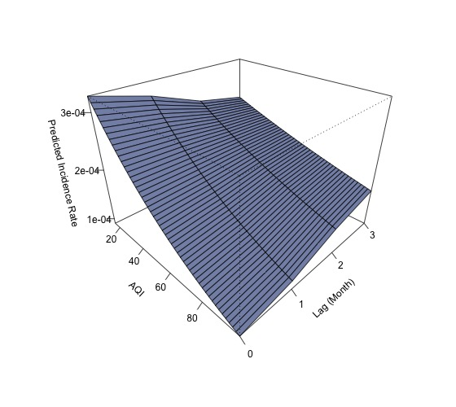
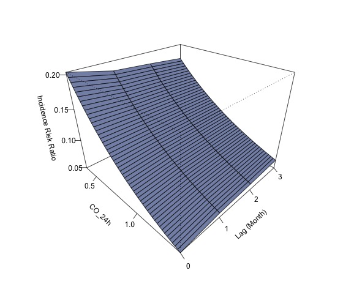
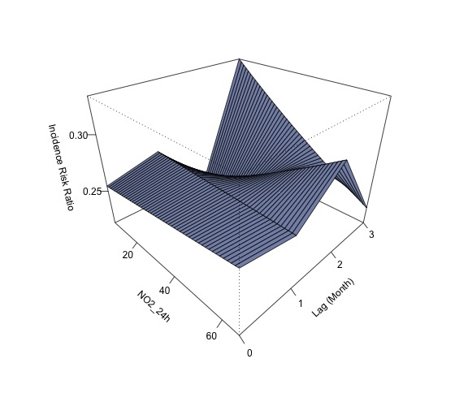
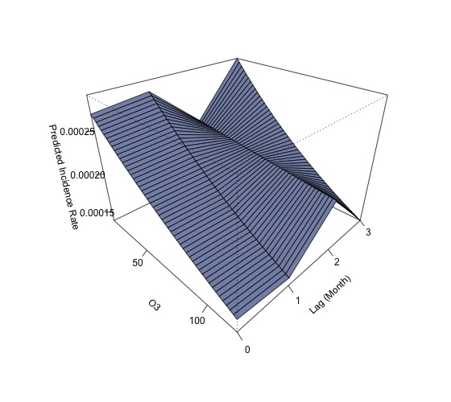
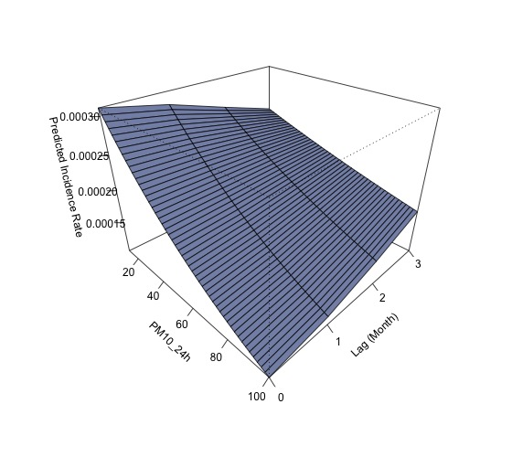
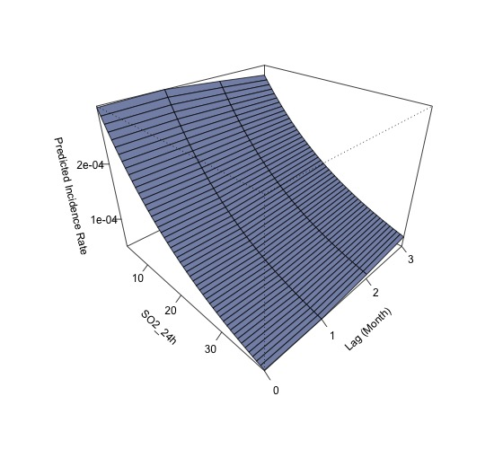

抗NMDA受体脑炎发病与空气污染物的相关性

- 抗NMDAR受体脑炎的发病是否与患者暴露于环境污染物相关？
   - poisson-regression:
    
       outcome Y: T月份感染人数
       
       covariates X: X_1=T月份污染物水平；X_2=T-1月份污染物水平；X_3=T-2月份污染物水平；X_3=T-3月份污染物水平
       
       Y~Poisson( exp ( X_i \beta_i +  \alpha_i ) ), i=1,2,3,4
       
       从而对于i=1,2,3,4，分别得到了一组（截距，斜率）=（\alpha_i, \beta_i），并由此绘制抗NMDAR受体脑炎的发病与患者暴露于环境污染物的关系。
       
       ** 暂时使用2014-08及之后感染的人群，共281例，由于更早时间之前的污染物数据缺失。（总共320例数据，最早为2014-05感染）
       
    - 显著的污染物（单个污染物分析）：AQI, CO_24h (类似地，CO)，NO2_24h(类似地，NO2)，O3, PM2.5_24h (类似地，PM2.5), PM10_24h (类似地，PM10)，SO2_24h（SO2的情况略有不同，虽然依然显著）    

      - AQI， 当月及前一个月的significant，前两个月的10%-significant，前三个月不significant
    
    
    
     - CO_24h， 当月至前三个月的水平均significant
    
    
    
     - NO2_24H， 当月及前一个月的不significant，前两个月的10%-significant，前三个月significant
    
    

     - O3， 当月及前一个月的10%-significant，前两个月的不significant，前三个月significant
    
    
    
     - PM2.5_24h， 当月至前两个月的significant，前三个月不significant
    
    
    
     - PM10_24h， 当月及前一个月的significant，前两个月的10%-significant，前三个月不significant
    
    
    
     - SO2_24h， 当月至前三个月的水平均significant
    
    
    
   - 当使用zero-truncated poisson model时，仅NO2_24h及O3是significant的
    
     - NO2_24H， 当月及前一个月的10%-significant，前两个月的significant，前三个月不significant
    
    
    
    - O3_24H， 当月及前一个月的不significant，前两个月和前三个月的significant
    
    
    
******************************************
    
- 高污染物浓度的暴露是否影响患者发病的严重程度？

Table: Summary of AQI Severity Results: 并无significant结果

|              |   term   | estimate | std.error | statistic | p.value | model  | signif |
|:-------------|:--------:|:--------:|:---------:|:---------:|:-------:|:------:|:------:|
|AQI_M0...1    |  AQI_M0  | -0.0039  |  0.0081   |  -0.4833  | 0.6289  | Model1 |        |
|1&#124;2...2  | 1&#124;2 | -1.8751  |  0.3752   |  -4.9983  | 0.0000  | Model1 |  ***   |
|2&#124;3...3  | 2&#124;3 | -0.9525  |  0.3604   |  -2.6428  | 0.0082  | Model1 |   **   |
|3&#124;4...4  | 3&#124;4 |  0.2546  |  0.3575   |  0.7123   | 0.4763  | Model1 |        |
|4&#124;5...5  | 4&#124;5 |  1.2619  |  0.3669   |  3.4392   | 0.0006  | Model1 |  ***   |
|AQI_M1...6    |  AQI_M1  | -0.0029  |  0.0077   |  -0.3721  | 0.7099  | Model2 |        |
|1&#124;2...7  | 1&#124;2 | -1.8316  |  0.3615   |  -5.0667  | 0.0000  | Model2 |  ***   |
|2&#124;3...8  | 2&#124;3 | -0.9092  |  0.3463   |  -2.6256  | 0.0086  | Model2 |   **   |
|3&#124;4...9  | 3&#124;4 |  0.2980  |  0.3431   |  0.8686   | 0.3851  | Model2 |        |
|4&#124;5...10 | 4&#124;5 |  1.3052  |  0.3533   |  3.6945   | 0.0002  | Model2 |  ***   |
|AQI_M2...11   |  AQI_M2  | -0.0054  |  0.0070   |  -0.7716  | 0.4403  | Model3 |        |
|1&#124;2...12 | 1&#124;2 | -1.9490  |  0.3467   |  -5.6208  | 0.0000  | Model3 |  ***   |
|2&#124;3...13 | 2&#124;3 | -1.0264  |  0.3315   |  -3.0964  | 0.0020  | Model3 |   **   |
|3&#124;4...14 | 3&#124;4 |  0.1824  |  0.3261   |  0.5593   | 0.5759  | Model3 |        |
|4&#124;5...15 | 4&#124;5 |  1.1912  |  0.3344   |  3.5626   | 0.0004  | Model3 |  ***   |
|AQI_M3...16   |  AQI_M3  | -0.0019  |  0.0067   |  -0.2859  | 0.7749  | Model4 |        |
|1&#124;2...17 | 1&#124;2 | -1.7951  |  0.3351   |  -5.3570  | 0.0000  | Model4 |  ***   |
|2&#124;3...18 | 2&#124;3 | -0.8732  |  0.3202   |  -2.7274  | 0.0064  | Model4 |   **   |
|3&#124;4...19 | 3&#124;4 |  0.3343  |  0.3156   |  1.0594   | 0.2894  | Model4 |        |
|4&#124;5...20 | 4&#124;5 |  1.3420  |  0.3252   |  4.1262   | 0.0000  | Model4 |  ***   |
|AQI_M0...21   |  AQI_M0  | -0.0036  |  0.0114   |  -0.3122  | 0.7549  | Model5 |        |
|AQI_M1...22   |  AQI_M1  | -0.0005  |  0.0108   |  -0.0464  | 0.9630  | Model5 |        |
|1&#124;2...23 | 1&#124;2 | -1.8808  |  0.3944   |  -4.7685  | 0.0000  | Model5 |  ***   |
|2&#124;3...24 | 2&#124;3 | -0.9581  |  0.3802   |  -2.5201  | 0.0117  | Model5 |   *    |
|3&#124;4...25 | 3&#124;4 |  0.2490  |  0.3772   |  0.6602   | 0.5091  | Model5 |        |
|4&#124;5...26 | 4&#124;5 |  1.2563  |  0.3863   |  3.2520   | 0.0011  | Model5 |   **   |
|AQI_M0...27   |  AQI_M0  | -0.0041  |  0.0114   |  -0.3642  | 0.7157  | Model6 |        |
|AQI_M1...28   |  AQI_M1  |  0.0078  |  0.0149   |  0.5211   | 0.6023  | Model6 |        |
|AQI_M2...29   |  AQI_M2  | -0.0092  |  0.0114   |  -0.7998  | 0.4238  | Model6 |        |
|1&#124;2...30 | 1&#124;2 | -1.9571  |  0.4059   |  -4.8211  | 0.0000  | Model6 |  ***   |
|2&#124;3...31 | 2&#124;3 | -1.0349  |  0.3922   |  -2.6388  | 0.0083  | Model6 |   **   |
|3&#124;4...32 | 3&#124;4 |  0.1749  |  0.3883   |  0.4503   | 0.6525  | Model6 |        |
|4&#124;5...33 | 4&#124;5 |  1.1851  |  0.3962   |  2.9912   | 0.0028  | Model6 |   **   |
|AQI_M0...34   |  AQI_M0  | -0.0029  |  0.0120   |  -0.2415  | 0.8092  | Model7 |        |
|AQI_M1...35   |  AQI_M1  |  0.0068  |  0.0152   |  0.4451   | 0.6562  | Model7 |        |
|AQI_M2...36   |  AQI_M2  | -0.0119  |  0.0139   |  -0.8522  | 0.3941  | Model7 |        |
|AQI_M3...37   |  AQI_M3  |  0.0037  |  0.0107   |  0.3428   | 0.7317  | Model7 |        |
|1&#124;2...38 | 1&#124;2 | -1.9051  |  0.4332   |  -4.3978  | 0.0000  | Model7 |  ***   |
|2&#124;3...39 | 2&#124;3 | -0.9828  |  0.4205   |  -2.3370  | 0.0194  | Model7 |   *    |
|3&#124;4...40 | 3&#124;4 |  0.2268  |  0.4169   |  0.5439   | 0.5865  | Model7 |        |
|4&#124;5...41 | 4&#124;5 |  1.2371  |  0.4245   |  2.9144   | 0.0036  | Model7 |   **   |
