抗NMDA受体脑炎发病与空气污染物的相关性

- 抗NMDAR受体脑炎的发病是否与患者暴露于环境污染物相关？
   - poisson-regression:
   
       outcome Y: T月份感染人数
       
       covariates X: X_1=T月份污染物水平；X_2=T-1月份污染物水平；X_3=T-2月份污染物水平；X_3=T-3月份污染物水平
       
       Y~Poisson( exp ( X_i \beta_i +  \alpha_i ) ), i=1,2,3,4
       
       从而对于i=1,2,3,4，分别得到了一组（截距，斜率）=（\alpha_i, \beta_i），并由此绘制抗NMDAR受体脑炎的发病与患者暴露于环境污染物的关系。
       
       ** 暂时使用2014-08及之后感染的人群，共281例，由于更早时间之前的污染物数据缺失。（总共320例数据，最早为2014-05感染）
       
    - 显著的污染物（单个污染物分析）：AQI, CO_24h (类似地，CO)，NO2_24h(类似地，NO2)，O3, PM2.5_24h (类似地，PM2.5), PM10_24h (类似地，PM10)，SO2_24h（SO2的情况略有不同，虽然依然显著）    

      - AQI， 当月及前一个月的significant，前两个月的10%-significant，前三个月不significant
    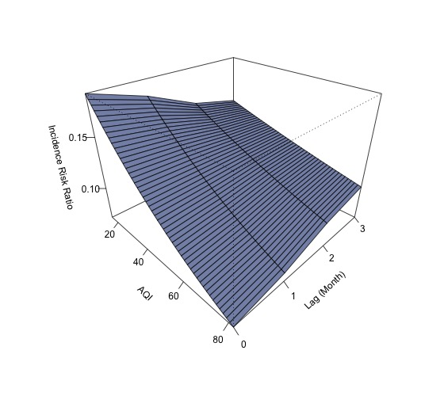
     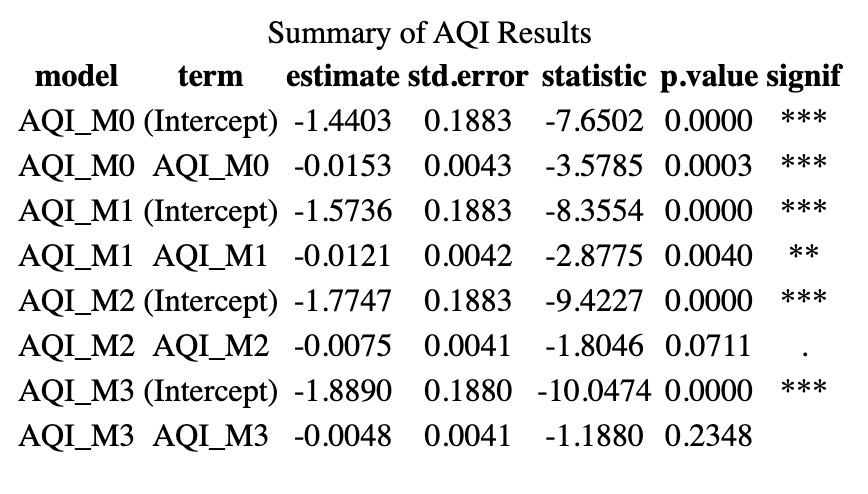
   
     - CO_24h， 当月至前三个月的水平均significant
    
     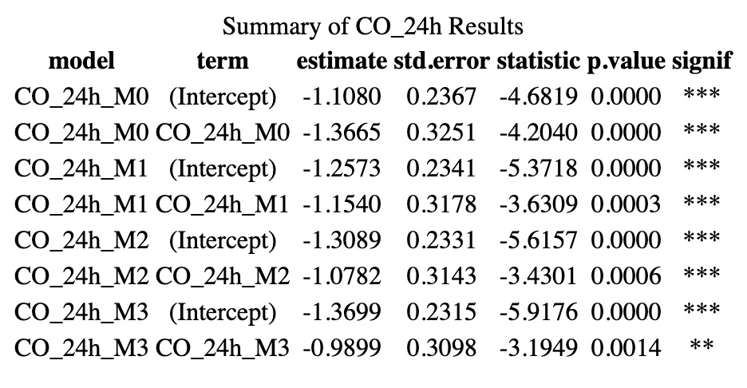
   
     - NO2_24H， 当月及前一个月的不significant，前两个月的10%-significant，前三个月significant
    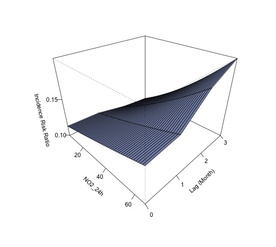
     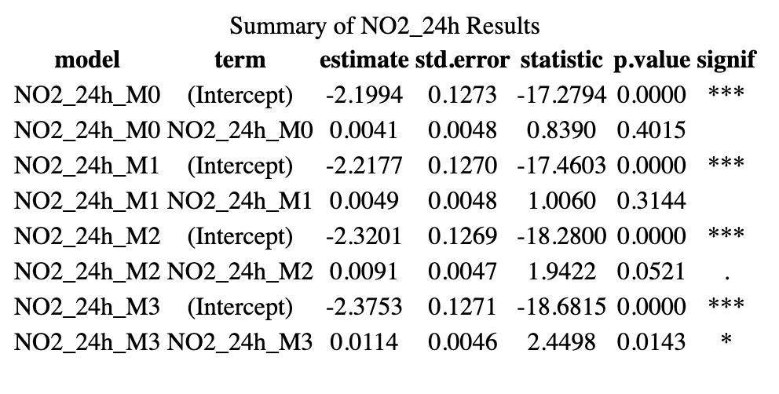

     - O3， 当月及前一个月的10%-significant，前两个月的不significant，前三个月significant
    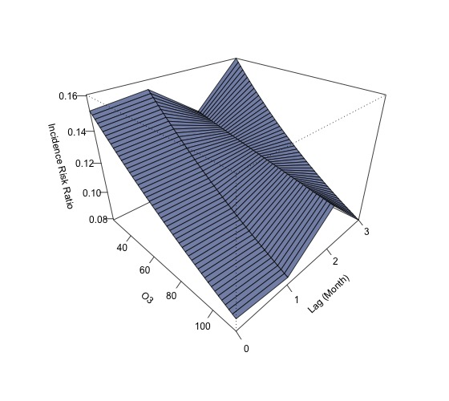
     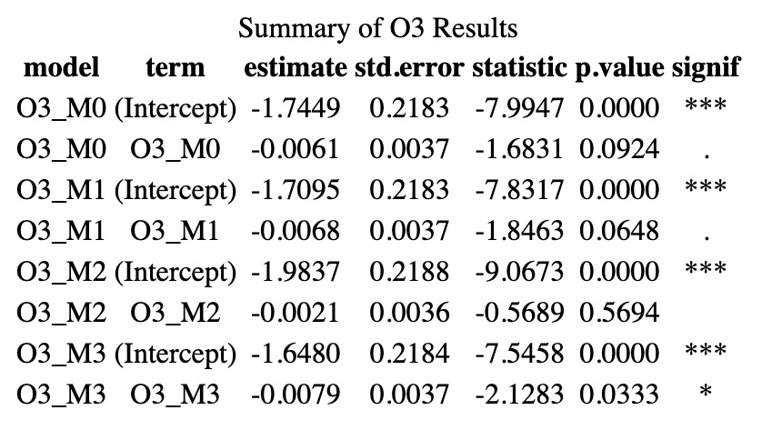
   
     - PM2.5_24h， 当月至前两个月的significant，前三个月不significant
    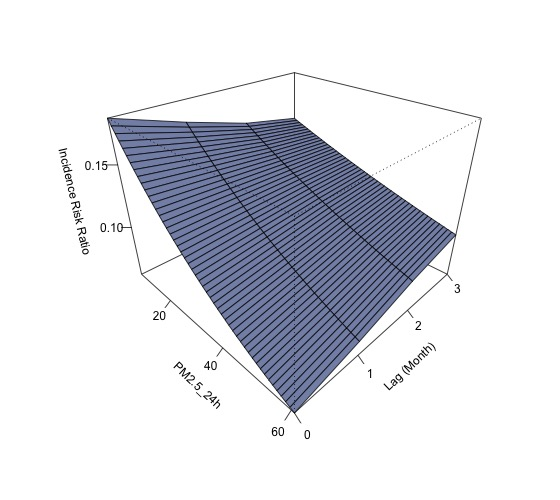
     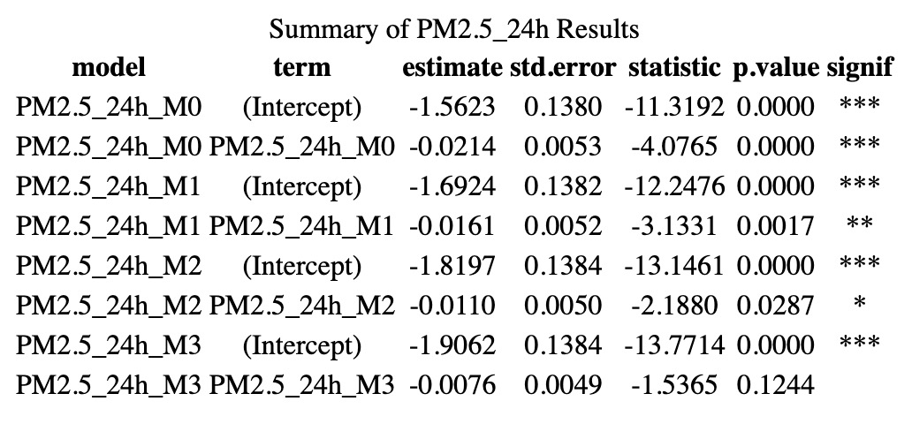
   
     - PM10_24h， 当月及前一个月的significant，前两个月的10%-significant，前三个月不significant
    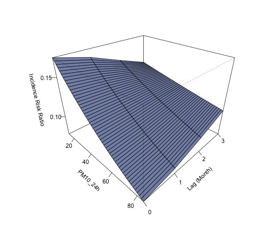
     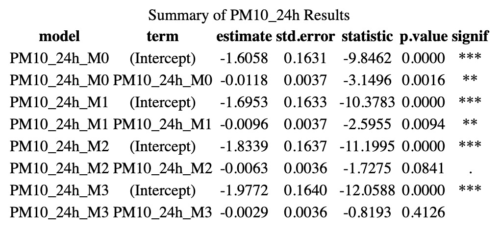
   
     - SO2_24h， 当月至前三个月的水平均significant
    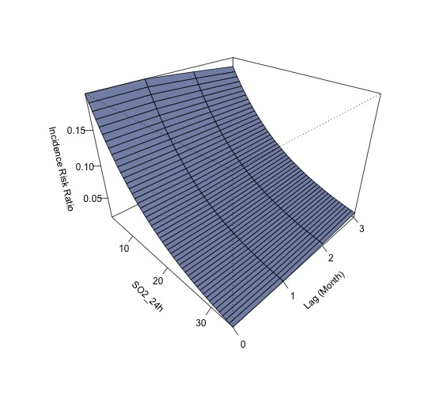
     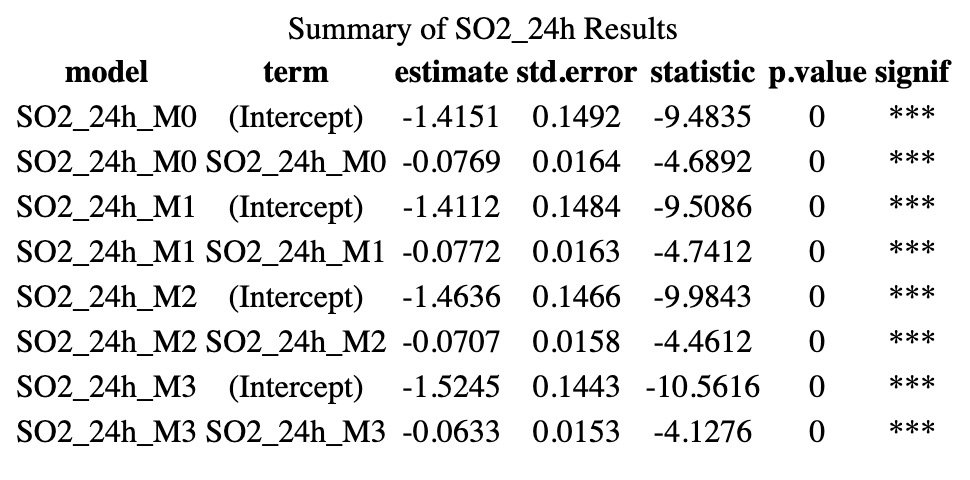
   
   - 当使用zero-truncated poisson model时，仅NO2_24h及O3是significant的
   
     - NO2_24H， 当月及前一个月的10%-significant，前两个月的significant，前三个月不significant
    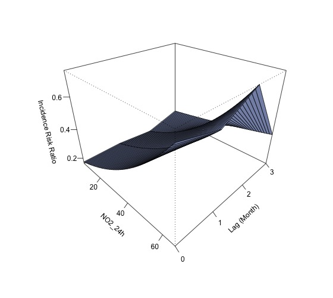
     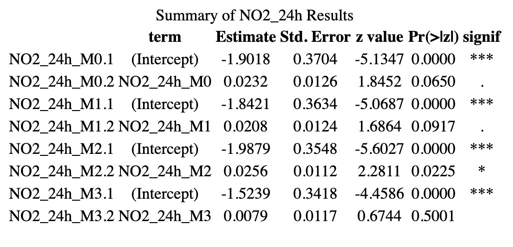
   
    - O3_24H， 当月及前一个月的不significant，前两个月和前三个月的significant
    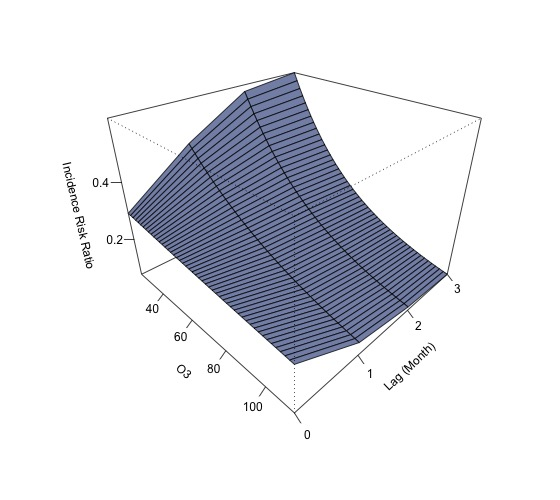
     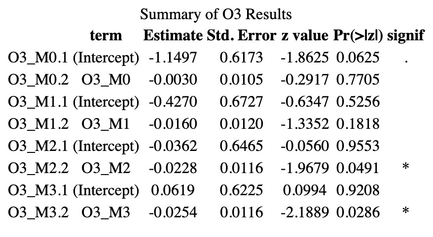
   
******************************************

- 高污染物浓度的暴露是否影响患者发病的严重程度？

Table: Summary of AQI Severity Results: 并无significant结果

|              |   term   | estimate | std.error | statistic | p.value | model  | signif |
|:-------------|:--------:|:--------:|:---------:|:---------:|:-------:|:------:|:------:|
|AQI_M0...1    |  AQI_M0  | -0.0039  |  0.0081   |  -0.4833  | 0.6289  | Model1 |        |
|1&#124;2...2  | 1&#124;2 | -1.8751  |  0.3752   |  -4.9983  | 0.0000  | Model1 |  ***   |
|2&#124;3...3  | 2&#124;3 | -0.9525  |  0.3604   |  -2.6428  | 0.0082  | Model1 |   **   |
|3&#124;4...4  | 3&#124;4 |  0.2546  |  0.3575   |  0.7123   | 0.4763  | Model1 |        |
|4&#124;5...5  | 4&#124;5 |  1.2619  |  0.3669   |  3.4392   | 0.0006  | Model1 |  ***   |
|AQI_M1...6    |  AQI_M1  | -0.0029  |  0.0077   |  -0.3721  | 0.7099  | Model2 |        |
|1&#124;2...7  | 1&#124;2 | -1.8316  |  0.3615   |  -5.0667  | 0.0000  | Model2 |  ***   |
|2&#124;3...8  | 2&#124;3 | -0.9092  |  0.3463   |  -2.6256  | 0.0086  | Model2 |   **   |
|3&#124;4...9  | 3&#124;4 |  0.2980  |  0.3431   |  0.8686   | 0.3851  | Model2 |        |
|4&#124;5...10 | 4&#124;5 |  1.3052  |  0.3533   |  3.6945   | 0.0002  | Model2 |  ***   |
|AQI_M2...11   |  AQI_M2  | -0.0054  |  0.0070   |  -0.7716  | 0.4403  | Model3 |        |
|1&#124;2...12 | 1&#124;2 | -1.9490  |  0.3467   |  -5.6208  | 0.0000  | Model3 |  ***   |
|2&#124;3...13 | 2&#124;3 | -1.0264  |  0.3315   |  -3.0964  | 0.0020  | Model3 |   **   |
|3&#124;4...14 | 3&#124;4 |  0.1824  |  0.3261   |  0.5593   | 0.5759  | Model3 |        |
|4&#124;5...15 | 4&#124;5 |  1.1912  |  0.3344   |  3.5626   | 0.0004  | Model3 |  ***   |
|AQI_M3...16   |  AQI_M3  | -0.0019  |  0.0067   |  -0.2859  | 0.7749  | Model4 |        |
|1&#124;2...17 | 1&#124;2 | -1.7951  |  0.3351   |  -5.3570  | 0.0000  | Model4 |  ***   |
|2&#124;3...18 | 2&#124;3 | -0.8732  |  0.3202   |  -2.7274  | 0.0064  | Model4 |   **   |
|3&#124;4...19 | 3&#124;4 |  0.3343  |  0.3156   |  1.0594   | 0.2894  | Model4 |        |
|4&#124;5...20 | 4&#124;5 |  1.3420  |  0.3252   |  4.1262   | 0.0000  | Model4 |  ***   |
|AQI_M0...21   |  AQI_M0  | -0.0036  |  0.0114   |  -0.3122  | 0.7549  | Model5 |        |
|AQI_M1...22   |  AQI_M1  | -0.0005  |  0.0108   |  -0.0464  | 0.9630  | Model5 |        |
|1&#124;2...23 | 1&#124;2 | -1.8808  |  0.3944   |  -4.7685  | 0.0000  | Model5 |  ***   |
|2&#124;3...24 | 2&#124;3 | -0.9581  |  0.3802   |  -2.5201  | 0.0117  | Model5 |   *    |
|3&#124;4...25 | 3&#124;4 |  0.2490  |  0.3772   |  0.6602   | 0.5091  | Model5 |        |
|4&#124;5...26 | 4&#124;5 |  1.2563  |  0.3863   |  3.2520   | 0.0011  | Model5 |   **   |
|AQI_M0...27   |  AQI_M0  | -0.0041  |  0.0114   |  -0.3642  | 0.7157  | Model6 |        |
|AQI_M1...28   |  AQI_M1  |  0.0078  |  0.0149   |  0.5211   | 0.6023  | Model6 |        |
|AQI_M2...29   |  AQI_M2  | -0.0092  |  0.0114   |  -0.7998  | 0.4238  | Model6 |        |
|1&#124;2...30 | 1&#124;2 | -1.9571  |  0.4059   |  -4.8211  | 0.0000  | Model6 |  ***   |
|2&#124;3...31 | 2&#124;3 | -1.0349  |  0.3922   |  -2.6388  | 0.0083  | Model6 |   **   |
|3&#124;4...32 | 3&#124;4 |  0.1749  |  0.3883   |  0.4503   | 0.6525  | Model6 |        |
|4&#124;5...33 | 4&#124;5 |  1.1851  |  0.3962   |  2.9912   | 0.0028  | Model6 |   **   |
|AQI_M0...34   |  AQI_M0  | -0.0029  |  0.0120   |  -0.2415  | 0.8092  | Model7 |        |
|AQI_M1...35   |  AQI_M1  |  0.0068  |  0.0152   |  0.4451   | 0.6562  | Model7 |        |
|AQI_M2...36   |  AQI_M2  | -0.0119  |  0.0139   |  -0.8522  | 0.3941  | Model7 |        |
|AQI_M3...37   |  AQI_M3  |  0.0037  |  0.0107   |  0.3428   | 0.7317  | Model7 |        |
|1&#124;2...38 | 1&#124;2 | -1.9051  |  0.4332   |  -4.3978  | 0.0000  | Model7 |  ***   |
|2&#124;3...39 | 2&#124;3 | -0.9828  |  0.4205   |  -2.3370  | 0.0194  | Model7 |   *    |
|3&#124;4...40 | 3&#124;4 |  0.2268  |  0.4169   |  0.5439   | 0.5865  | Model7 |        |
|4&#124;5...41 | 4&#124;5 |  1.2371  |  0.4245   |  2.9144   | 0.0036  | Model7 |   **   |

---

Table: Summary of CO_24h Severity Models: 并无significant结果

|                |   term    | estimate | std.error | statistic | p.value | model  | signif |
| :------------- | :-------: | :------: | :-------: | :-------: | :-----: | :----: | :----: |
| CO_24h_M0...1  | CO_24h_M0 | -0.1816  |  0.6406   |  -0.2835  | 0.7768  | Model1 |        |
| 1&#124;2...2   | 1&#124;2  | -1.8389  |  0.4797   |  -3.8336  | 0.0001  | Model1 |  ***   |
| 2&#124;3...3   | 2&#124;3  | -0.9172  |  0.4700   |  -1.9515  | 0.0510  | Model1 |   .    |
| 3&#124;4...4   | 3&#124;4  |  0.2900  |  0.4672   |  0.6207   | 0.5348  | Model1 |        |
| 4&#124;5...5   | 4&#124;5  |  1.2978  |  0.4730   |  2.7436   | 0.0061  | Model1 |   **   |
| CO_24h_M1...6  | CO_24h_M1 | -0.6427  |  0.5781   |  -1.1117  | 0.2663  | Model2 |        |
| 1&#124;2...7   | 1&#124;2  | -2.1738  |  0.4459   |  -4.8750  | 0.0000  | Model2 |  ***   |
| 2&#124;3...8   | 2&#124;3  | -1.2512  |  0.4339   |  -2.8837  | 0.0039  | Model2 |   **   |
| 3&#124;4...9   | 3&#124;4  | -0.0404  |  0.4277   |  -0.0944  | 0.9248  | Model2 |        |
| 4&#124;5...10  | 4&#124;5  |  0.9703  |  0.4324   |  2.2443   | 0.0248  | Model2 |   *    |
| CO_24h_M2...11 | CO_24h_M2 | -0.9656  |  0.5644   |  -1.7108  | 0.0871  | Model3 |   .    |
| 1&#124;2...12  | 1&#124;2  | -2.4195  |  0.4449   |  -5.4383  | 0.0000  | Model3 |  ***   |
| 2&#124;3...13  | 2&#124;3  | -1.4943  |  0.4311   |  -3.4662  | 0.0005  | Model3 |  ***   |
| 3&#124;4...14  | 3&#124;4  | -0.2763  |  0.4213   |  -0.6558  | 0.5119  | Model3 |        |
| 4&#124;5...15  | 4&#124;5  |  0.7389  |  0.4243   |  1.7414   | 0.0816  | Model3 |   .    |
| CO_24h_M3...16 | CO_24h_M3 | -0.7684  |  0.5537   |  -1.3879  | 0.1652  | Model4 |        |
| 1&#124;2...17  | 1&#124;2  | -2.2764  |  0.4384   |  -5.1931  | 0.0000  | Model4 |  ***   |
| 2&#124;3...18  | 2&#124;3  | -1.3519  |  0.4246   |  -3.1843  | 0.0015  | Model4 |   **   |
| 3&#124;4...19  | 3&#124;4  | -0.1379  |  0.4164   |  -0.3312  | 0.7405  | Model4 |        |
| 4&#124;5...20  | 4&#124;5  |  0.8743  |  0.4205   |  2.0789   | 0.0376  | Model4 |   *    |
| CO_24h_M0...21 | CO_24h_M0 |  1.1564  |  1.1008   |  1.0505   | 0.2935  | Model5 |        |
| CO_24h_M1...22 | CO_24h_M1 | -1.4876  |  0.9984   |  -1.4899  | 0.1362  | Model5 |        |
| 1&#124;2...23  | 1&#124;2  | -1.9649  |  0.4904   |  -4.0067  | 0.0001  | Model5 |  ***   |
| 2&#124;3...24  | 2&#124;3  | -1.0400  |  0.4803   |  -2.1654  | 0.0304  | Model5 |   *    |
| 3&#124;4...25  | 3&#124;4  |  0.1742  |  0.4766   |  0.3656   | 0.7147  | Model5 |        |
| 4&#124;5...26  | 4&#124;5  |  1.1866  |  0.4818   |  2.4629   | 0.0138  | Model5 |   *    |
| CO_24h_M0...27 | CO_24h_M0 |  1.2797  |  1.1027   |  1.1605   | 0.2459  | Model6 |        |
| CO_24h_M1...28 | CO_24h_M1 | -0.3572  |  1.2520   |  -0.2853  | 0.7754  | Model6 |        |
| CO_24h_M2...29 | CO_24h_M2 | -1.4536  |  0.9817   |  -1.4806  | 0.1387  | Model6 |        |
| 1&#124;2...30  | 1&#124;2  | -2.1298  |  0.5029   |  -4.2348  | 0.0000  | Model6 |  ***   |
| 2&#124;3...31  | 2&#124;3  | -1.2014  |  0.4919   |  -2.4421  | 0.0146  | Model6 |   *    |
| 3&#124;4...32  | 3&#124;4  |  0.0226  |  0.4864   |  0.0464   | 0.9630  | Model6 |        |
| 4&#124;5...33  | 4&#124;5  |  1.0405  |  0.4906   |  2.1210   | 0.0339  | Model6 |   *    |
| CO_24h_M0...34 | CO_24h_M0 |  1.3258  |  1.1099   |  1.1945   | 0.2323  | Model7 |        |
| CO_24h_M1...35 | CO_24h_M1 | -0.3817  |  1.2542   |  -0.3043  | 0.7609  | Model7 |        |
| CO_24h_M2...36 | CO_24h_M2 | -1.8456  |  1.4371   |  -1.2842  | 0.1991  | Model7 |        |
| CO_24h_M3...37 | CO_24h_M3 |  0.4294  |  1.1498   |  0.3735   | 0.7088  | Model7 |        |
| 1&#124;2...38  | 1&#124;2  | -2.0863  |  0.5161   |  -4.0424  | 0.0001  | Model7 |  ***   |
| 2&#124;3...39  | 2&#124;3  | -1.1581  |  0.5054   |  -2.2912  | 0.0220  | Model7 |   *    |
| 3&#124;4...40  | 3&#124;4  |  0.0665  |  0.5006   |  0.1329   | 0.8943  | Model7 |        |
| 4&#124;5...41  | 4&#124;5  |  1.0850  |  0.5050   |  2.1485   | 0.0317  | Model7 |   *    |

---

Table: Summary of CO Severity Models：并无Significant结果

|               |   term   | estimate | std.error | statistic | p.value | model  | signif |
| :------------ | :------: | :------: | :-------: | :-------: | :-----: | :----: | :----: |
| CO_M0...1     |  CO_M0   | -0.1660  |  0.6421   |  -0.2585  | 0.7960  | Model1 |        |
| 1&#124;2...2  | 1&#124;2 | -1.8278  |  0.4807   |  -3.8025  | 0.0001  | Model1 |  ***   |
| 2&#124;3...3  | 2&#124;3 | -0.9061  |  0.4711   |  -1.9235  | 0.0544  | Model1 |   .    |
| 3&#124;4...4  | 3&#124;4 |  0.3011  |  0.4684   |  0.6427   | 0.5204  | Model1 |        |
| 4&#124;5...5  | 4&#124;5 |  1.3088  |  0.4742   |  2.7598   | 0.0058  | Model1 |   **   |
| CO_M1...6     |  CO_M1   | -0.6259  |  0.5781   |  -1.0827  | 0.2790  | Model2 |        |
| 1&#124;2...7  | 1&#124;2 | -2.1619  |  0.4460   |  -4.8470  | 0.0000  | Model2 |  ***   |
| 2&#124;3...8  | 2&#124;3 | -1.2394  |  0.4341   |  -2.8550  | 0.0043  | Model2 |   **   |
| 3&#124;4...9  | 3&#124;4 | -0.0289  |  0.4282   |  -0.0675  | 0.9462  | Model2 |        |
| 4&#124;5...10 | 4&#124;5 |  0.9817  |  0.4329   |  2.2680   | 0.0233  | Model2 |   *    |
| CO_M2...11    |  CO_M2   | -0.9474  |  0.5646   |  -1.6781  | 0.0933  | Model3 |   .    |
| 1&#124;2...12 | 1&#124;2 | -2.4058  |  0.4448   |  -5.4091  | 0.0000  | Model3 |  ***   |
| 2&#124;3...13 | 2&#124;3 | -1.4808  |  0.4311   |  -3.4352  | 0.0006  | Model3 |  ***   |
| 3&#124;4...14 | 3&#124;4 | -0.2634  |  0.4215   |  -0.6248  | 0.5321  | Model3 |        |
| 4&#124;5...15 | 4&#124;5 |  0.7515  |  0.4246   |  1.7702   | 0.0767  | Model3 |   .    |
| CO_M3...16    |  CO_M3   | -0.7884  |  0.5527   |  -1.4266  | 0.1537  | Model4 |        |
| 1&#124;2...17 | 1&#124;2 | -2.2919  |  0.4382   |  -5.2300  | 0.0000  | Model4 |  ***   |
| 2&#124;3...18 | 2&#124;3 | -1.3671  |  0.4242   |  -3.2225  | 0.0013  | Model4 |   **   |
| 3&#124;4...19 | 3&#124;4 | -0.1527  |  0.4159   |  -0.3671  | 0.7136  | Model4 |        |
| 4&#124;5...20 | 4&#124;5 |  0.8596  |  0.4200   |  2.0468   | 0.0407  | Model4 |   *    |
| CO_M0...21    |  CO_M0   |  1.1696  |  1.1064   |  1.0571   | 0.2905  | Model5 |        |
| CO_M1...22    |  CO_M1   | -1.4795  |  1.0014   |  -1.4774  | 0.1396  | Model5 |        |
| 1&#124;2...23 | 1&#124;2 | -1.9503  |  0.4911   |  -3.9716  | 0.0001  | Model5 |  ***   |
| 2&#124;3...24 | 2&#124;3 | -1.0256  |  0.4811   |  -2.1319  | 0.0330  | Model5 |   *    |
| 3&#124;4...25 | 3&#124;4 |  0.1882  |  0.4775   |  0.3942   | 0.6934  | Model5 |        |
| 4&#124;5...26 | 4&#124;5 |  1.2005  |  0.4828   |  2.4867   | 0.0129  | Model5 |   *    |
| CO_M0...27    |  CO_M0   |  1.2888  |  1.1080   |  1.1631   | 0.2448  | Model6 |        |
| CO_M1...28    |  CO_M1   | -0.3548  |  1.2563   |  -0.2824  | 0.7776  | Model6 |        |
| CO_M2...29    |  CO_M2   | -1.4416  |  0.9838   |  -1.4653  | 0.1428  | Model6 |        |
| 1&#124;2...30 | 1&#124;2 | -2.1125  |  0.5034   |  -4.1963  | 0.0000  | Model6 |  ***   |
| 2&#124;3...31 | 2&#124;3 | -1.1843  |  0.4926   |  -2.4045  | 0.0162  | Model6 |   *    |
| 3&#124;4...32 | 3&#124;4 |  0.0390  |  0.4872   |  0.0800   | 0.9363  | Model6 |        |
| 4&#124;5...33 | 4&#124;5 |  1.0566  |  0.4914   |  2.1501   | 0.0315  | Model6 |   *    |
| CO_M0...34    |  CO_M0   |  1.3157  |  1.1137   |  1.1814   | 0.2375  | Model7 |        |
| CO_M1...35    |  CO_M1   | -0.3654  |  1.2573   |  -0.2906  | 0.7714  | Model7 |        |
| CO_M2...36    |  CO_M2   | -1.7006  |  1.4593   |  -1.1654  | 0.2439  | Model7 |        |
| CO_M3...37    |  CO_M3   |  0.2797  |  1.1613   |  0.2409   | 0.8097  | Model7 |        |
| 1&#124;2...38 | 1&#124;2 | -2.0849  |  0.5162   |  -4.0386  | 0.0001  | Model7 |  ***   |
| 2&#124;3...39 | 2&#124;3 | -1.1569  |  0.5055   |  -2.2884  | 0.0221  | Model7 |   *    |
| 3&#124;4...40 | 3&#124;4 |  0.0667  |  0.5006   |  0.1332   | 0.8941  | Model7 |        |
| 4&#124;5...41 | 4&#124;5 |  1.0846  |  0.5051   |  2.1475   | 0.0318  | Model7 |   *    |

---

Table: Summary of NO2_24h Severity Models：并无Significant结果

|                 |    term    | estimate | std.error | statistic | p.value | model  | signif |
| :-------------- | :--------: | :------: | :-------: | :-------: | :-----: | :----: | :----: |
| NO2_24h_M0...1  | NO2_24h_M0 | -0.0053  |  0.0089   |  -0.5970  | 0.5505  | Model1 |        |
| 1&#124;2...2    |  1&#124;2  | -1.8361  |  0.2623   |  -7.0008  | 0.0000  | Model1 |  ***   |
| 2&#124;3...3    |  2&#124;3  | -0.9134  |  0.2418   |  -3.7776  | 0.0002  | Model1 |  ***   |
| 3&#124;4...4    |  3&#124;4  |  0.2938  |  0.2378   |  1.2358   | 0.2165  | Model1 |        |
| 4&#124;5...5    |  4&#124;5  |  1.3013  |  0.2514   |  5.1766   | 0.0000  | Model1 |  ***   |
| NO2_24h_M1...6  | NO2_24h_M1 | -0.0054  |  0.0085   |  -0.6374  | 0.5239  | Model2 |        |
| 1&#124;2...7    |  1&#124;2  | -1.8388  |  0.2550   |  -7.2114  | 0.0000  | Model2 |  ***   |
| 2&#124;3...8    |  2&#124;3  | -0.9156  |  0.2334   |  -3.9227  | 0.0001  | Model2 |  ***   |
| 3&#124;4...9    |  3&#124;4  |  0.2925  |  0.2281   |  1.2821   | 0.1998  | Model2 |        |
| 4&#124;5...10   |  4&#124;5  |  1.2999  |  0.2423   |  5.3644   | 0.0000  | Model2 |  ***   |
| NO2_24h_M2...11 | NO2_24h_M2 | -0.0140  |  0.0081   |  -1.7232  | 0.0849  | Model3 |   .    |
| 1&#124;2...12   |  1&#124;2  | -2.0627  |  0.2586   |  -7.9757  | 0.0000  | Model3 |  ***   |
| 2&#124;3...13   |  2&#124;3  | -1.1356  |  0.2359   |  -4.8130  | 0.0000  | Model3 |  ***   |
| 3&#124;4...14   |  3&#124;4  |  0.0825  |  0.2254   |  0.3662   | 0.7142  | Model3 |        |
| 4&#124;5...15   |  4&#124;5  |  1.0961  |  0.2366   |  4.6337   | 0.0000  | Model3 |  ***   |
| NO2_24h_M3...16 | NO2_24h_M3 | -0.0092  |  0.0077   |  -1.1924  | 0.2331  | Model4 |        |
| 1&#124;2...17   |  1&#124;2  | -1.9431  |  0.2507   |  -7.7520  | 0.0000  | Model4 |  ***   |
| 2&#124;3...18   |  2&#124;3  | -1.0192  |  0.2288   |  -4.4547  | 0.0000  | Model4 |  ***   |
| 3&#124;4...19   |  3&#124;4  |  0.1946  |  0.2194   |  0.8870   | 0.3751  | Model4 |        |
| 4&#124;5...20   |  4&#124;5  |  1.2056  |  0.2317   |  5.2039   | 0.0000  | Model4 |  ***   |
| NO2_24h_M0...21 | NO2_24h_M0 | -0.0019  |  0.0163   |  -0.1167  | 0.9071  | Model5 |        |
| NO2_24h_M1...22 | NO2_24h_M1 | -0.0039  |  0.0156   |  -0.2513  | 0.8016  | Model5 |        |
| 1&#124;2...23   |  1&#124;2  | -1.8477  |  0.2663   |  -6.9383  | 0.0000  | Model5 |  ***   |
| 2&#124;3...24   |  2&#124;3  | -0.9246  |  0.2459   |  -3.7606  | 0.0002  | Model5 |  ***   |
| 3&#124;4...25   |  3&#124;4  |  0.2832  |  0.2414   |  1.1733   | 0.2407  | Model5 |        |
| 4&#124;5...26   |  4&#124;5  |  1.2907  |  0.2548   |  5.0656   | 0.0000  | Model5 |  ***   |
| NO2_24h_M0...27 | NO2_24h_M0 |  0.0041  |  0.0163   |  0.2499   | 0.8026  | Model6 |        |
| NO2_24h_M1...28 | NO2_24h_M1 |  0.0168  |  0.0183   |  0.9179   | 0.3587  | Model6 |        |
| NO2_24h_M2...29 | NO2_24h_M2 | -0.0298  |  0.0143   |  -2.0903  | 0.0366  | Model6 |   *    |
| 1&#124;2...30   |  1&#124;2  | -1.9664  |  0.2734   |  -7.1916  | 0.0000  | Model6 |  ***   |
| 2&#124;3...31   |  2&#124;3  | -1.0381  |  0.2525   |  -4.1114  | 0.0000  | Model6 |  ***   |
| 3&#124;4...32   |  3&#124;4  |  0.1891  |  0.2456   |  0.7701   | 0.4412  | Model6 |        |
| 4&#124;5...33   |  4&#124;5  |  1.2094  |  0.2579   |  4.6889   | 0.0000  | Model6 |  ***   |
| NO2_24h_M0...34 | NO2_24h_M0 |  0.0041  |  0.0163   |  0.2518   | 0.8012  | Model7 |        |
| NO2_24h_M1...35 | NO2_24h_M1 |  0.0166  |  0.0185   |  0.8982   | 0.3691  | Model7 |        |
| NO2_24h_M2...36 | NO2_24h_M2 | -0.0308  |  0.0169   |  -1.8261  | 0.0678  | Model7 |   .    |
| NO2_24h_M3...37 | NO2_24h_M3 |  0.0014  |  0.0126   |  0.1094   | 0.9129  | Model7 |        |
| 1&#124;2...38   |  1&#124;2  | -1.9612  |  0.2775   |  -7.0678  | 0.0000  | Model7 |  ***   |
| 2&#124;3...39   |  2&#124;3  | -1.0328  |  0.2571   |  -4.0178  | 0.0001  | Model7 |  ***   |
| 3&#124;4...40   |  3&#124;4  |  0.1942  |  0.2500   |  0.7770   | 0.4372  | Model7 |        |
| 4&#124;5...41   |  4&#124;5  |  1.2144  |  0.2620   |  4.6353   | 0.0000  | Model7 |  ***   |

---

Table: Summary of NO2 Severity Models：并无Significant结果

|               |   term   | estimate | std.error | statistic | p.value | model  | signif |
| :------------ | :------: | :------: | :-------: | :-------: | :-----: | :----: | :----: |
| NO2_M0...1    |  NO2_M0  | -0.0052  |  0.0089   |  -0.5838  | 0.5594  | Model1 |        |
| 1&#124;2...2  | 1&#124;2 | -1.8333  |  0.2621   |  -6.9934  | 0.0000  | Model1 |  ***   |
| 2&#124;3...3  | 2&#124;3 | -0.9105  |  0.2417   |  -3.7678  | 0.0002  | Model1 |  ***   |
| 3&#124;4...4  | 3&#124;4 |  0.2966  |  0.2377   |  1.2482   | 0.2120  | Model1 |        |
| 4&#124;5...5  | 4&#124;5 |  1.3041  |  0.2513   |  5.1889   | 0.0000  | Model1 |  ***   |
| NO2_M1...6    |  NO2_M1  | -0.0052  |  0.0085   |  -0.6110  | 0.5412  | Model2 |        |
| 1&#124;2...7  | 1&#124;2 | -1.8333  |  0.2548   |  -7.1942  | 0.0000  | Model2 |  ***   |
| 2&#124;3...8  | 2&#124;3 | -0.9103  |  0.2333   |  -3.9017  | 0.0001  | Model2 |  ***   |
| 3&#124;4...9  | 3&#124;4 |  0.2977  |  0.2281   |  1.3047   | 0.1920  | Model2 |        |
| 4&#124;5...10 | 4&#124;5 |  1.3050  |  0.2424   |  5.3831   | 0.0000  | Model2 |  ***   |
| NO2_M2...11   |  NO2_M2  | -0.0139  |  0.0081   |  -1.7145  | 0.0864  | Model3 |   .    |
| 1&#124;2...12 | 1&#124;2 | -2.0604  |  0.2584   |  -7.9732  | 0.0000  | Model3 |  ***   |
| 2&#124;3...13 | 2&#124;3 | -1.1334  |  0.2357   |  -4.8080  | 0.0000  | Model3 |  ***   |
| 3&#124;4...14 | 3&#124;4 |  0.0846  |  0.2253   |  0.3754   | 0.7073  | Model3 |        |
| 4&#124;5...15 | 4&#124;5 |  1.0981  |  0.2364   |  4.6442   | 0.0000  | Model3 |  ***   |
| NO2_M3...16   |  NO2_M3  | -0.0092  |  0.0077   |  -1.2019  | 0.2294  | Model4 |        |
| 1&#124;2...17 | 1&#124;2 | -1.9448  |  0.2505   |  -7.7621  | 0.0000  | Model4 |  ***   |
| 2&#124;3...18 | 2&#124;3 | -1.0208  |  0.2286   |  -4.4645  | 0.0000  | Model4 |  ***   |
| 3&#124;4...19 | 3&#124;4 |  0.1930  |  0.2193   |  0.8800   | 0.3788  | Model4 |        |
| 4&#124;5...20 | 4&#124;5 |  1.2040  |  0.2316   |  5.1994   | 0.0000  | Model4 |  ***   |
| NO2_M0...21   |  NO2_M0  | -0.0022  |  0.0163   |  -0.1322  | 0.8948  | Model5 |        |
| NO2_M1...22   |  NO2_M1  | -0.0035  |  0.0156   |  -0.2228  | 0.8237  | Model5 |        |
| 1&#124;2...23 | 1&#124;2 | -1.8434  |  0.2661   |  -6.9273  | 0.0000  | Model5 |  ***   |
| 2&#124;3...24 | 2&#124;3 | -0.9204  |  0.2457   |  -3.7463  | 0.0002  | Model5 |  ***   |
| 3&#124;4...25 | 3&#124;4 |  0.2873  |  0.2413   |  1.1905   | 0.2338  | Model5 |        |
| 4&#124;5...26 | 4&#124;5 |  1.2947  |  0.2548   |  5.0821   | 0.0000  | Model5 |  ***   |
| NO2_M0...27   |  NO2_M0  |  0.0038  |  0.0163   |  0.2351   | 0.8141  | Model6 |        |
| NO2_M1...28   |  NO2_M1  |  0.0172  |  0.0183   |  0.9397   | 0.3474  | Model6 |        |
| NO2_M2...29   |  NO2_M2  | -0.0298  |  0.0142   |  -2.1035  | 0.0354  | Model6 |   *    |
| 1&#124;2...30 | 1&#124;2 | -1.9632  |  0.2732   |  -7.1845  | 0.0000  | Model6 |  ***   |
| 2&#124;3...31 | 2&#124;3 | -1.0348  |  0.2523   |  -4.1016  | 0.0000  | Model6 |  ***   |
| 3&#124;4...32 | 3&#124;4 |  0.1925  |  0.2455   |  0.7841   | 0.4330  | Model6 |        |
| 4&#124;5...33 | 4&#124;5 |  1.2128  |  0.2578   |  4.7034   | 0.0000  | Model6 |  ***   |
| NO2_M0...34   |  NO2_M0  |  0.0038  |  0.0163   |  0.2353   | 0.8140  | Model7 |        |
| NO2_M1...35   |  NO2_M1  |  0.0170  |  0.0184   |  0.9254   | 0.3548  | Model7 |        |
| NO2_M2...36   |  NO2_M2  | -0.0306  |  0.0168   |  -1.8186  | 0.0690  | Model7 |   .    |
| NO2_M3...37   |  NO2_M3  |  0.0010  |  0.0126   |  0.0819   | 0.9348  | Model7 |        |
| 1&#124;2...38 | 1&#124;2 | -1.9593  |  0.2772   |  -7.0689  | 0.0000  | Model7 |  ***   |
| 2&#124;3...39 | 2&#124;3 | -1.0309  |  0.2567   |  -4.0158  | 0.0001  | Model7 |  ***   |
| 3&#124;4...40 | 3&#124;4 |  0.1962  |  0.2497   |  0.7858   | 0.4320  | Model7 |        |
| 4&#124;5...41 | 4&#124;5 |  1.2164  |  0.2617   |  4.6475   | 0.0000  | Model7 |  ***   |

---

Table: Summary of O3 Severity Models：并无Significant结果

|               |   term   | estimate | std.error | statistic | p.value | model  | signif |
| :------------ | :------: | :------: | :-------: | :-------: | :-----: | :----: | :----: |
| O3_M0...1     |  O3_M0   |  0.0001  |  0.0064   |  0.0164   | 0.9869  | Model1 |        |
| 1&#124;2...2  | 1&#124;2 | -1.7042  |  0.4000   |  -4.2603  | 0.0000  | Model1 |  ***   |
| 2&#124;3...3  | 2&#124;3 | -0.7824  |  0.3870   |  -2.0215  | 0.0432  | Model1 |   *    |
| 3&#124;4...4  | 3&#124;4 |  0.4245  |  0.3848   |  1.1033   | 0.2699  | Model1 |        |
| 4&#124;5...5  | 4&#124;5 |  1.4319  |  0.3946   |  3.6290   | 0.0003  | Model1 |  ***   |
| O3_M1...6     |  O3_M1   |  0.0008  |  0.0072   |  0.1101   | 0.9123  | Model2 |        |
| 1&#124;2...7  | 1&#124;2 | -1.6649  |  0.4405   |  -3.7793  | 0.0002  | Model2 |  ***   |
| 2&#124;3...8  | 2&#124;3 | -0.7430  |  0.4297   |  -1.7291  | 0.0838  | Model2 |   .    |
| 3&#124;4...9  | 3&#124;4 |  0.4639  |  0.4277   |  1.0845   | 0.2781  | Model2 |        |
| 4&#124;5...10 | 4&#124;5 |  1.4712  |  0.4359   |  3.3748   | 0.0007  | Model2 |  ***   |
| O3_M2...11    |  O3_M2   |  0.0042  |  0.0066   |  0.6268   | 0.5308  | Model3 |        |
| 1&#124;2...12 | 1&#124;2 | -1.4684  |  0.4152   |  -3.5361  | 0.0004  | Model3 |  ***   |
| 2&#124;3...13 | 2&#124;3 | -0.5454  |  0.4056   |  -1.3448  | 0.1787  | Model3 |        |
| 3&#124;4...14 | 3&#124;4 |  0.6634  |  0.4072   |  1.6292   | 0.1033  | Model3 |        |
| 4&#124;5...15 | 4&#124;5 |  1.6712  |  0.4167   |  4.0106   | 0.0001  | Model3 |  ***   |
| O3_M3...16    |  O3_M3   |  0.0051  |  0.0066   |  0.7730   | 0.4395  | Model4 |        |
| 1&#124;2...17 | 1&#124;2 | -1.4217  |  0.4031   |  -3.5265  | 0.0004  | Model4 |  ***   |
| 2&#124;3...18 | 2&#124;3 | -0.4980  |  0.3938   |  -1.2647  | 0.2060  | Model4 |        |
| 3&#124;4...19 | 3&#124;4 |  0.7105  |  0.3946   |  1.8003   | 0.0718  | Model4 |   .    |
| 4&#124;5...20 | 4&#124;5 |  1.7181  |  0.4041   |  4.2516   | 0.0000  | Model4 |  ***   |
| O3_M0...21    |  O3_M0   | -0.0004  |  0.0075   |  -0.0484  | 0.9614  | Model5 |        |
| O3_M1...22    |  O3_M1   |  0.0010  |  0.0084   |  0.1192   | 0.9051  | Model5 |        |
| 1&#124;2...23 | 1&#124;2 | -1.6736  |  0.4756   |  -3.5187  | 0.0004  | Model5 |  ***   |
| 2&#124;3...24 | 2&#124;3 | -0.7516  |  0.4652   |  -1.6158  | 0.1061  | Model5 |        |
| 3&#124;4...25 | 3&#124;4 |  0.4553  |  0.4633   |  0.9828   | 0.3257  | Model5 |        |
| 4&#124;5...26 | 4&#124;5 |  1.4626  |  0.4712   |  3.1039   | 0.0019  | Model5 |   **   |
| O3_M0...27    |  O3_M0   |  0.0001  |  0.0075   |  0.0153   | 0.9878  | Model6 |        |
| O3_M1...28    |  O3_M1   | -0.0016  |  0.0093   |  -0.1730  | 0.8627  | Model6 |        |
| O3_M2...29    |  O3_M2   |  0.0048  |  0.0075   |  0.6438   | 0.5197  | Model6 |        |
| 1&#124;2...30 | 1&#124;2 | -1.5164  |  0.5335   |  -2.8423  | 0.0045  | Model6 |   **   |
| 2&#124;3...31 | 2&#124;3 | -0.5933  |  0.5253   |  -1.1296  | 0.2586  | Model6 |        |
| 3&#124;4...32 | 3&#124;4 |  0.6158  |  0.5255   |  1.1718   | 0.2413  | Model6 |        |
| 4&#124;5...33 | 4&#124;5 |  1.6236  |  0.5332   |  3.0453   | 0.0023  | Model6 |   **   |
| O3_M0...34    |  O3_M0   |  0.0006  |  0.0076   |  0.0826   | 0.9342  | Model7 |        |
| O3_M1...35    |  O3_M1   | -0.0016  |  0.0093   |  -0.1710  | 0.8642  | Model7 |        |
| O3_M2...36    |  O3_M2   |  0.0027  |  0.0085   |  0.3223   | 0.7472  | Model7 |        |
| O3_M3...37    |  O3_M3   |  0.0040  |  0.0077   |  0.5280   | 0.5975  | Model7 |        |
| 1&#124;2...38 | 1&#124;2 | -1.3786  |  0.5935   |  -2.3229  | 0.0202  | Model7 |   *    |
| 2&#124;3...39 | 2&#124;3 | -0.4547  |  0.5870   |  -0.7747  | 0.4385  | Model7 |        |
| 3&#124;4...40 | 3&#124;4 |  0.7548  |  0.5877   |  1.2842   | 0.1991  | Model7 |        |
| 4&#124;5...41 | 4&#124;5 |  1.7626  |  0.5948   |  2.9636   | 0.0030  | Model7 |   **   |

---

Table: Summary of PM2.5_24h Severity Models：并无Significant结果

|                   |     term     | estimate | std.error | statistic | p.value | model  | signif |
| :---------------- | :----------: | :------: | :-------: | :-------: | :-----: | :----: | :----: |
| PM2.5_24h_M0...1  | PM2.5_24h_M0 | -0.0023  |  0.0101   |  -0.2225  | 0.8239  | Model1 |        |
| 1&#124;2...2      |   1&#124;2   | -1.7640  |  0.2872   |  -6.1420  | 0.0000  | Model1 |  ***   |
| 2&#124;3...3      |   2&#124;3   | -0.8420  |  0.2693   |  -3.1267  | 0.0018  | Model1 |   **   |
| 3&#124;4...4      |   3&#124;4   |  0.3648  |  0.2669   |  1.3667   | 0.1717  | Model1 |        |
| 4&#124;5...5      |   4&#124;5   |  1.3721  |  0.2797   |  4.9048   | 0.0000  | Model1 |  ***   |
| PM2.5_24h_M1...6  | PM2.5_24h_M1 | -0.0040  |  0.0095   |  -0.4159  | 0.6775  | Model2 |        |
| 1&#124;2...7      |   1&#124;2   | -1.8071  |  0.2802   |  -6.4504  | 0.0000  | Model2 |  ***   |
| 2&#124;3...8      |   2&#124;3   | -0.8847  |  0.2612   |  -3.3878  | 0.0007  | Model2 |  ***   |
| 3&#124;4...9      |   3&#124;4   |  0.3225  |  0.2574   |  1.2528   | 0.2103  | Model2 |        |
| 4&#124;5...10     |   4&#124;5   |  1.3298  |  0.2703   |  4.9195   | 0.0000  | Model2 |  ***   |
| PM2.5_24h_M2...11 | PM2.5_24h_M2 | -0.0060  |  0.0085   |  -0.7094  | 0.4781  | Model3 |        |
| 1&#124;2...12     |   1&#124;2   | -1.8639  |  0.2670   |  -6.9804  | 0.0000  | Model3 |  ***   |
| 2&#124;3...13     |   2&#124;3   | -0.9414  |  0.2474   |  -3.8054  | 0.0001  | Model3 |  ***   |
| 3&#124;4...14     |   3&#124;4   |  0.2670  |  0.2419   |  1.1037   | 0.2697  | Model3 |        |
| 4&#124;5...15     |   4&#124;5   |  1.2754  |  0.2541   |  5.0197   | 0.0000  | Model3 |  ***   |
| PM2.5_24h_M3...16 | PM2.5_24h_M3 | -0.0013  |  0.0082   |  -0.1602  | 0.8727  | Model4 |        |
| 1&#124;2...17     |   1&#124;2   | -1.7439  |  0.2612   |  -6.6769  | 0.0000  | Model4 |  ***   |
| 2&#124;3...18     |   2&#124;3   | -0.8221  |  0.2420   |  -3.3971  | 0.0007  | Model4 |  ***   |
| 3&#124;4...19     |   3&#124;4   |  0.3851  |  0.2377   |  1.6203   | 0.1052  | Model4 |        |
| 4&#124;5...20     |   4&#124;5   |  1.3925  |  0.2513   |  5.5416   | 0.0000  | Model4 |  ***   |
| PM2.5_24h_M0...21 | PM2.5_24h_M0 |  0.0018  |  0.0149   |  0.1201   | 0.9044  | Model5 |        |
| PM2.5_24h_M1...22 | PM2.5_24h_M1 | -0.0052  |  0.0140   |  -0.3714  | 0.7104  | Model5 |        |
| 1&#124;2...23     |   1&#124;2   | -1.7946  |  0.2988   |  -6.0053  | 0.0000  | Model5 |  ***   |
| 2&#124;3...24     |   2&#124;3   | -0.8722  |  0.2813   |  -3.1008  | 0.0019  | Model5 |   **   |
| 3&#124;4...25     |   3&#124;4   |  0.3352  |  0.2784   |  1.2039   | 0.2286  | Model5 |        |
| 4&#124;5...26     |   4&#124;5   |  1.3426  |  0.2906   |  4.6202   | 0.0000  | Model5 |  ***   |
| PM2.5_24h_M0...27 | PM2.5_24h_M0 |  0.0000  |  0.0151   |  -0.0030  | 0.9976  | Model6 |        |
| PM2.5_24h_M1...28 | PM2.5_24h_M1 |  0.0051  |  0.0213   |  0.2390   | 0.8111  | Model6 |        |
| PM2.5_24h_M2...29 | PM2.5_24h_M2 | -0.0098  |  0.0153   |  -0.6378  | 0.5236  | Model6 |        |
| 1&#124;2...30     |   1&#124;2   | -1.8355  |  0.3058   |  -6.0025  | 0.0000  | Model6 |  ***   |
| 2&#124;3...31     |   2&#124;3   | -0.9133  |  0.2887   |  -3.1639  | 0.0016  | Model6 |   **   |
| 3&#124;4...32     |   3&#124;4   |  0.2957  |  0.2852   |  1.0369   | 0.2998  | Model6 |        |
| 4&#124;5...33     |   4&#124;5   |  1.3049  |  0.2964   |  4.4021   | 0.0000  | Model6 |  ***   |
| PM2.5_24h_M0...34 | PM2.5_24h_M0 |  0.0038  |  0.0161   |  0.2382   | 0.8117  | Model7 |        |
| PM2.5_24h_M1...35 | PM2.5_24h_M1 |  0.0019  |  0.0218   |  0.0877   | 0.9301  | Model7 |        |
| PM2.5_24h_M2...36 | PM2.5_24h_M2 | -0.0173  |  0.0187   |  -0.9250  | 0.3550  | Model7 |        |
| PM2.5_24h_M3...37 | PM2.5_24h_M3 |  0.0099  |  0.0141   |  0.7015   | 0.4830  | Model7 |        |
| 1&#124;2...38     |   1&#124;2   | -1.7580  |  0.3249   |  -5.4106  | 0.0000  | Model7 |  ***   |
| 2&#124;3...39     |   2&#124;3   | -0.8352  |  0.3093   |  -2.7005  | 0.0069  | Model7 |   **   |
| 3&#124;4...40     |   3&#124;4   |  0.3746  |  0.3067   |  1.2213   | 0.2220  | Model7 |        |
| 4&#124;5...41     |   4&#124;5   |  1.3846  |  0.3178   |  4.3569   | 0.0000  | Model7 |  ***   |

---

Table: Summary of PM2.5 Severity Models：并无Significant结果

|               |   term   | estimate | std.error | statistic | p.value | model  | signif |
| :------------ | :------: | :------: | :-------: | :-------: | :-----: | :----: | :----: |
| PM2.5_M0...1  | PM2.5_M0 | -0.0028  |  0.0102   |  -0.2743  | 0.7838  | Model1 |        |
| 1&#124;2...2  | 1&#124;2 | -1.7768  |  0.2880   |  -6.1697  | 0.0000  | Model1 |  ***   |
| 2&#124;3...3  | 2&#124;3 | -0.8547  |  0.2700   |  -3.1653  | 0.0015  | Model1 |   **   |
| 3&#124;4...4  | 3&#124;4 |  0.3521  |  0.2674   |  1.3170   | 0.1878  | Model1 |        |
| 4&#124;5...5  | 4&#124;5 |  1.3594  |  0.2800   |  4.8543   | 0.0000  | Model1 |  ***   |
| PM2.5_M1...6  | PM2.5_M1 | -0.0035  |  0.0096   |  -0.3671  | 0.7136  | Model2 |        |
| 1&#124;2...7  | 1&#124;2 | -1.7959  |  0.2804   |  -6.4049  | 0.0000  | Model2 |  ***   |
| 2&#124;3...8  | 2&#124;3 | -0.8736  |  0.2615   |  -3.3410  | 0.0008  | Model2 |  ***   |
| 3&#124;4...9  | 3&#124;4 |  0.3335  |  0.2580   |  1.2927   | 0.1961  | Model2 |        |
| 4&#124;5...10 | 4&#124;5 |  1.3408  |  0.2710   |  4.9469   | 0.0000  | Model2 |  ***   |
| PM2.5_M2...11 | PM2.5_M2 | -0.0058  |  0.0085   |  -0.6747  | 0.4999  | Model3 |        |
| 1&#124;2...12 | 1&#124;2 | -1.8566  |  0.2672   |  -6.9489  | 0.0000  | Model3 |  ***   |
| 2&#124;3...13 | 2&#124;3 | -0.9341  |  0.2476   |  -3.7723  | 0.0002  | Model3 |  ***   |
| 3&#124;4...14 | 3&#124;4 |  0.2741  |  0.2423   |  1.1311   | 0.2580  | Model3 |        |
| 4&#124;5...15 | 4&#124;5 |  1.2824  |  0.2546   |  5.0380   | 0.0000  | Model3 |  ***   |
| PM2.5_M3...16 | PM2.5_M3 | -0.0014  |  0.0081   |  -0.1691  | 0.8657  | Model4 |        |
| 1&#124;2...17 | 1&#124;2 | -1.7458  |  0.2613   |  -6.6807  | 0.0000  | Model4 |  ***   |
| 2&#124;3...18 | 2&#124;3 | -0.8239  |  0.2420   |  -3.4041  | 0.0007  | Model4 |  ***   |
| 3&#124;4...19 | 3&#124;4 |  0.3832  |  0.2377   |  1.6121   | 0.1069  | Model4 |        |
| 4&#124;5...20 | 4&#124;5 |  1.3906  |  0.2514   |  5.5319   | 0.0000  | Model4 |  ***   |
| PM2.5_M0...21 | PM2.5_M0 | -0.0001  |  0.0150   |  -0.0067  | 0.9947  | Model5 |        |
| PM2.5_M1...22 | PM2.5_M1 | -0.0034  |  0.0141   |  -0.2442  | 0.8071  | Model5 |        |
| 1&#124;2...23 | 1&#124;2 | -1.7966  |  0.2992   |  -6.0039  | 0.0000  | Model5 |  ***   |
| 2&#124;3...24 | 2&#124;3 | -0.8743  |  0.2817   |  -3.1039  | 0.0019  | Model5 |   **   |
| 3&#124;4...25 | 3&#124;4 |  0.3328  |  0.2788   |  1.1937   | 0.2326  | Model5 |        |
| 4&#124;5...26 | 4&#124;5 |  1.3401  |  0.2909   |  4.6062   | 0.0000  | Model5 |  ***   |
| PM2.5_M0...27 | PM2.5_M0 | -0.0021  |  0.0152   |  -0.1356  | 0.8922  | Model6 |        |
| PM2.5_M1...28 | PM2.5_M1 |  0.0075  |  0.0215   |  0.3489   | 0.7272  | Model6 |        |
| PM2.5_M2...29 | PM2.5_M2 | -0.0103  |  0.0154   |  -0.6729  | 0.5010  | Model6 |        |
| 1&#124;2...30 | 1&#124;2 | -1.8398  |  0.3062   |  -6.0081  | 0.0000  | Model6 |  ***   |
| 2&#124;3...31 | 2&#124;3 | -0.9178  |  0.2891   |  -3.1746  | 0.0015  | Model6 |   **   |
| 3&#124;4...32 | 3&#124;4 |  0.2912  |  0.2855   |  1.0197   | 0.3079  | Model6 |        |
| 4&#124;5...33 | 4&#124;5 |  1.3005  |  0.2967   |  4.3829   | 0.0000  | Model6 |  ***   |
| PM2.5_M0...34 | PM2.5_M0 |  0.0014  |  0.0162   |  0.0872   | 0.9305  | Model7 |        |
| PM2.5_M1...35 | PM2.5_M1 |  0.0049  |  0.0219   |  0.2226   | 0.8239  | Model7 |        |
| PM2.5_M2...36 | PM2.5_M2 | -0.0175  |  0.0192   |  -0.9105  | 0.3626  | Model7 |        |
| PM2.5_M3...37 | PM2.5_M3 |  0.0090  |  0.0144   |  0.6213   | 0.5344  | Model7 |        |
| 1&#124;2...38 | 1&#124;2 | -1.7707  |  0.3256   |  -5.4386  | 0.0000  | Model7 |  ***   |
| 2&#124;3...39 | 2&#124;3 | -0.8483  |  0.3098   |  -2.7380  | 0.0062  | Model7 |   **   |
| 3&#124;4...40 | 3&#124;4 |  0.3611  |  0.3070   |  1.1760   | 0.2396  | Model7 |        |
| 4&#124;5...41 | 4&#124;5 |  1.3711  |  0.3180   |  4.3111   | 0.0000  | Model7 |  ***   |

---

Table: Summary of PM10_24h Severity Models：并无Significant结果

|                  |    term     | estimate | std.error | statistic | p.value | model  | signif |
| :--------------- | :---------: | :------: | :-------: | :-------: | :-----: | :----: | :----: |
| PM10_24h_M0...1  | PM10_24h_M0 | -0.0014  |  0.0068   |  -0.2022  | 0.8397  | Model1 |        |
| 1&#124;2...2     |  1&#124;2   | -1.7666  |  0.3187   |  -5.5422  | 0.0000  | Model1 |  ***   |
| 2&#124;3...3     |  2&#124;3   | -0.8446  |  0.3026   |  -2.7914  | 0.0052  | Model1 |   **   |
| 3&#124;4...4     |  3&#124;4   |  0.3623  |  0.3005   |  1.2057   | 0.2279  | Model1 |        |
| 4&#124;5...5     |  4&#124;5   |  1.3695  |  0.3121   |  4.3884   | 0.0000  | Model1 |  ***   |
| PM10_24h_M1...6  | PM10_24h_M1 | -0.0010  |  0.0064   |  -0.1599  | 0.8729  | Model2 |        |
| 1&#124;2...7     |  1&#124;2   | -1.7526  |  0.3067   |  -5.7134  | 0.0000  | Model2 |  ***   |
| 2&#124;3...8     |  2&#124;3   | -0.8306  |  0.2897   |  -2.8673  | 0.0041  | Model2 |   **   |
| 3&#124;4...9     |  3&#124;4   |  0.3764  |  0.2868   |  1.3122   | 0.1894  | Model2 |        |
| 4&#124;5...10    |  4&#124;5   |  1.3836  |  0.2992   |  4.6244   | 0.0000  | Model2 |  ***   |
| PM10_24h_M2...11 | PM10_24h_M2 | -0.0045  |  0.0062   |  -0.7386  | 0.4602  | Model3 |        |
| 1&#124;2...12    |  1&#124;2   | -1.9048  |  0.3063   |  -6.2188  | 0.0000  | Model3 |  ***   |
| 2&#124;3...13    |  2&#124;3   | -0.9823  |  0.2892   |  -3.3968  | 0.0007  | Model3 |  ***   |
| 3&#124;4...14    |  3&#124;4   |  0.2266  |  0.2835   |  0.7994   | 0.4241  | Model3 |        |
| 4&#124;5...15    |  4&#124;5   |  1.2354  |  0.2933   |  4.2119   | 0.0000  | Model3 |  ***   |
| PM10_24h_M3...16 | PM10_24h_M3 | -0.0032  |  0.0058   |  -0.5562  | 0.5781  | Model4 |        |
| 1&#124;2...17    |  1&#124;2   | -1.8515  |  0.2980   |  -6.2129  | 0.0000  | Model4 |  ***   |
| 2&#124;3...18    |  2&#124;3   | -0.9293  |  0.2808   |  -3.3095  | 0.0009  | Model4 |  ***   |
| 3&#124;4...19    |  3&#124;4   |  0.2795  |  0.2745   |  1.0182   | 0.3086  | Model4 |        |
| 4&#124;5...20    |  4&#124;5   |  1.2879  |  0.2849   |  4.5204   | 0.0000  | Model4 |  ***   |
| PM10_24h_M0...21 | PM10_24h_M0 | -0.0012  |  0.0096   |  -0.1263  | 0.8995  | Model5 |        |
| PM10_24h_M1...22 | PM10_24h_M1 | -0.0002  |  0.0090   |  -0.0247  | 0.9803  | Model5 |        |
| 1&#124;2...23    |  1&#124;2   | -1.7689  |  0.3331   |  -5.3112  | 0.0000  | Model5 |  ***   |
| 2&#124;3...24    |  2&#124;3   | -0.8469  |  0.3174   |  -2.6686  | 0.0076  | Model5 |   **   |
| 3&#124;4...25    |  3&#124;4   |  0.3599  |  0.3152   |  1.1421   | 0.2534  | Model5 |        |
| 4&#124;5...26    |  4&#124;5   |  1.3672  |  0.3264   |  4.1889   | 0.0000  | Model5 |  ***   |
| PM10_24h_M0...27 | PM10_24h_M0 | -0.0011  |  0.0096   |  -0.1143  | 0.9090  | Model6 |        |
| PM10_24h_M1...28 | PM10_24h_M1 |  0.0072  |  0.0118   |  0.6067   | 0.5441  | Model6 |        |
| PM10_24h_M2...29 | PM10_24h_M2 | -0.0093  |  0.0097   |  -0.9638  | 0.3352  | Model6 |        |
| 1&#124;2...30    |  1&#124;2   | -1.8574  |  0.3457   |  -5.3721  | 0.0000  | Model6 |  ***   |
| 2&#124;3...31    |  2&#124;3   | -0.9353  |  0.3305   |  -2.8299  | 0.0047  | Model6 |   **   |
| 3&#124;4...32    |  3&#124;4   |  0.2754  |  0.3270   |  0.8424   | 0.3996  | Model6 |        |
| 4&#124;5...33    |  4&#124;5   |  1.2864  |  0.3367   |  3.8204   | 0.0001  | Model6 |  ***   |
| PM10_24h_M0...34 | PM10_24h_M0 | -0.0013  |  0.0100   |  -0.1289  | 0.8974  | Model7 |        |
| PM10_24h_M1...35 | PM10_24h_M1 |  0.0073  |  0.0120   |  0.6097   | 0.5420  | Model7 |        |
| PM10_24h_M2...36 | PM10_24h_M2 | -0.0089  |  0.0118   |  -0.7503  | 0.4531  | Model7 |        |
| PM10_24h_M3...37 | PM10_24h_M3 | -0.0006  |  0.0088   |  -0.0667  | 0.9468  | Model7 |        |
| 1&#124;2...38    |  1&#124;2   | -1.8664  |  0.3715   |  -5.0239  | 0.0000  | Model7 |  ***   |
| 2&#124;3...39    |  2&#124;3   | -0.9444  |  0.3574   |  -2.6426  | 0.0082  | Model7 |   **   |
| 3&#124;4...40    |  3&#124;4   |  0.2665  |  0.3533   |  0.7541   | 0.4508  | Model7 |        |
| 4&#124;5...41    |  4&#124;5   |  1.2774  |  0.3621   |  3.5275   | 0.0004  | Model7 |  ***   |

---

Table: Summary of PM10 Severity Models：并无Significant结果

|               |   term   | estimate | std.error | statistic | p.value | model  | signif |
| :------------ | :------: | :------: | :-------: | :-------: | :-----: | :----: | :----: |
| PM10_M0...1   | PM10_M0  | -0.0018  |  0.0068   |  -0.2589  | 0.7957  | Model1 |        |
| 1&#124;2...2  | 1&#124;2 | -1.7829  |  0.3206   |  -5.5607  | 0.0000  | Model1 |  ***   |
| 2&#124;3...3  | 2&#124;3 | -0.8608  |  0.3044   |  -2.8279  | 0.0047  | Model1 |   **   |
| 3&#124;4...4  | 3&#124;4 |  0.3460  |  0.3022   |  1.1452   | 0.2521  | Model1 |        |
| 4&#124;5...5  | 4&#124;5 |  1.3533  |  0.3136   |  4.3155   | 0.0000  | Model1 |  ***   |
| PM10_M1...6   | PM10_M1  | -0.0009  |  0.0065   |  -0.1328  | 0.8944  | Model2 |        |
| 1&#124;2...7  | 1&#124;2 | -1.7457  |  0.3087   |  -5.6554  | 0.0000  | Model2 |  ***   |
| 2&#124;3...8  | 2&#124;3 | -0.8237  |  0.2917   |  -2.8237  | 0.0047  | Model2 |   **   |
| 3&#124;4...9  | 3&#124;4 |  0.3832  |  0.2892   |  1.3251   | 0.1851  | Model2 |        |
| 4&#124;5...10 | 4&#124;5 |  1.3904  |  0.3016   |  4.6099   | 0.0000  | Model2 |  ***   |
| PM10_M2...11  | PM10_M2  | -0.0045  |  0.0062   |  -0.7263  | 0.4676  | Model3 |        |
| 1&#124;2...12 | 1&#124;2 | -1.9031  |  0.3081   |  -6.1766  | 0.0000  | Model3 |  ***   |
| 2&#124;3...13 | 2&#124;3 | -0.9806  |  0.2911   |  -3.3686  | 0.0008  | Model3 |  ***   |
| 3&#124;4...14 | 3&#124;4 |  0.2282  |  0.2855   |  0.7991   | 0.4242  | Model3 |        |
| 4&#124;5...15 | 4&#124;5 |  1.2369  |  0.2953   |  4.1881   | 0.0000  | Model3 |  ***   |
| PM10_M3...16  | PM10_M3  | -0.0032  |  0.0058   |  -0.5518  | 0.5811  | Model4 |        |
| 1&#124;2...17 | 1&#124;2 | -1.8510  |  0.2991   |  -6.1891  | 0.0000  | Model4 |  ***   |
| 2&#124;3...18 | 2&#124;3 | -0.9289  |  0.2819   |  -3.2952  | 0.0010  | Model4 |  ***   |
| 3&#124;4...19 | 3&#124;4 |  0.2799  |  0.2757   |  1.0151   | 0.3100  | Model4 |        |
| 4&#124;5...20 | 4&#124;5 |  1.2882  |  0.2861   |  4.5019   | 0.0000  | Model4 |  ***   |
| PM10_M0...21  | PM10_M0  | -0.0023  |  0.0096   |  -0.2333  | 0.8155  | Model5 |        |
| PM10_M1...22  | PM10_M1  |  0.0006  |  0.0091   |  0.0705   | 0.9438  | Model5 |        |
| 1&#124;2...23 | 1&#124;2 | -1.7760  |  0.3350   |  -5.3011  | 0.0000  | Model5 |  ***   |
| 2&#124;3...24 | 2&#124;3 | -0.8540  |  0.3194   |  -2.6741  | 0.0075  | Model5 |   **   |
| 3&#124;4...25 | 3&#124;4 |  0.3528  |  0.3172   |  1.1124   | 0.2660  | Model5 |        |
| 4&#124;5...26 | 4&#124;5 |  1.3601  |  0.3283   |  4.1424   | 0.0000  | Model5 |  ***   |
| PM10_M0...27  | PM10_M0  | -0.0021  |  0.0096   |  -0.2204  | 0.8256  | Model6 |        |
| PM10_M1...28  | PM10_M1  |  0.0081  |  0.0119   |  0.6827   | 0.4948  | Model6 |        |
| PM10_M2...29  | PM10_M2  | -0.0094  |  0.0097   |  -0.9734  | 0.3303  | Model6 |        |
| 1&#124;2...30 | 1&#124;2 | -1.8661  |  0.3479   |  -5.3647  | 0.0000  | Model6 |  ***   |
| 2&#124;3...31 | 2&#124;3 | -0.9440  |  0.3326   |  -2.8381  | 0.0045  | Model6 |   **   |
| 3&#124;4...32 | 3&#124;4 |  0.2669  |  0.3291   |  0.8109   | 0.4174  | Model6 |        |
| 4&#124;5...33 | 4&#124;5 |  1.2780  |  0.3387   |  3.7727   | 0.0002  | Model6 |  ***   |
| PM10_M0...34  | PM10_M0  | -0.0024  |  0.0101   |  -0.2398  | 0.8105  | Model7 |        |
| PM10_M1...35  | PM10_M1  |  0.0083  |  0.0120   |  0.6897   | 0.4904  | Model7 |        |
| PM10_M2...36  | PM10_M2  | -0.0087  |  0.0119   |  -0.7320  | 0.4642  | Model7 |        |
| PM10_M3...37  | PM10_M3  | -0.0009  |  0.0089   |  -0.0987  | 0.9214  | Model7 |        |
| 1&#124;2...38 | 1&#124;2 | -1.8795  |  0.3735   |  -5.0322  | 0.0000  | Model7 |  ***   |
| 2&#124;3...39 | 2&#124;3 | -0.9574  |  0.3593   |  -2.6647  | 0.0077  | Model7 |   **   |
| 3&#124;4...40 | 3&#124;4 |  0.2536  |  0.3552   |  0.7140   | 0.4753  | Model7 |        |
| 4&#124;5...41 | 4&#124;5 |  1.2648  |  0.3640   |  3.4751   | 0.0005  | Model7 |  ***   |

---

Table: Summary of SO2_24h Severity Models：并无Significant结果

|                 |    term    | estimate | std.error | statistic | p.value | model  | signif |
| :-------------- | :--------: | :------: | :-------: | :-------: | :-----: | :----: | :----: |
| SO2_24h_M0...1  | SO2_24h_M0 |  0.0402  |  0.0299   |  1.3454   | 0.1785  | Model1 |        |
| 1&#124;2...2    |  1&#124;2  | -1.3787  |  0.2899   |  -4.7549  | 0.0000  | Model1 |  ***   |
| 2&#124;3...3    |  2&#124;3  | -0.4531  |  0.2759   |  -1.6423  | 0.1005  | Model1 |        |
| 3&#124;4...4    |  3&#124;4  |  0.7605  |  0.2788   |  2.7273   | 0.0064  | Model1 |   **   |
| 4&#124;5...5    |  4&#124;5  |  1.7707  |  0.2937   |  6.0281   | 0.0000  | Model1 |  ***   |
| SO2_24h_M1...6  | SO2_24h_M1 |  0.0370  |  0.0310   |  1.1958   | 0.2318  | Model2 |        |
| 1&#124;2...7    |  1&#124;2  | -1.4036  |  0.2988   |  -4.6965  | 0.0000  | Model2 |  ***   |
| 2&#124;3...8    |  2&#124;3  | -0.4792  |  0.2847   |  -1.6830  | 0.0924  | Model2 |   .    |
| 3&#124;4...9    |  3&#124;4  |  0.7322  |  0.2867   |  2.5542   | 0.0106  | Model2 |   *    |
| 4&#124;5...10   |  4&#124;5  |  1.7422  |  0.3013   |  5.7824   | 0.0000  | Model2 |  ***   |
| SO2_24h_M2...11 | SO2_24h_M2 |  0.0138  |  0.0290   |  0.4778   | 0.6328  | Model3 |        |
| 1&#124;2...12   |  1&#124;2  | -1.5927  |  0.2905   |  -5.4819  | 0.0000  | Model3 |  ***   |
| 2&#124;3...13   |  2&#124;3  | -0.6702  |  0.2750   |  -2.4374  | 0.0148  | Model3 |   *    |
| 3&#124;4...14   |  3&#124;4  |  0.5374  |  0.2740   |  1.9613   | 0.0498  | Model3 |   *    |
| 4&#124;5...15   |  4&#124;5  |  1.5449  |  0.2869   |  5.3840   | 0.0000  | Model3 |  ***   |
| SO2_24h_M3...16 | SO2_24h_M3 |  0.0108  |  0.0275   |  0.3924   | 0.6947  | Model4 |        |
| 1&#124;2...17   |  1&#124;2  | -1.6166  |  0.2844   |  -5.6834  | 0.0000  | Model4 |  ***   |
| 2&#124;3...18   |  2&#124;3  | -0.6941  |  0.2688   |  -2.5818  | 0.0098  | Model4 |   **   |
| 3&#124;4...19   |  3&#124;4  |  0.5129  |  0.2665   |  1.9247   | 0.0543  | Model4 |   .    |
| 4&#124;5...20   |  4&#124;5  |  1.5200  |  0.2789   |  5.4500   | 0.0000  | Model4 |  ***   |
| SO2_24h_M0...21 | SO2_24h_M0 |  0.0383  |  0.0591   |  0.6487   | 0.5165  | Model5 |        |
| SO2_24h_M1...22 | SO2_24h_M1 |  0.0023  |  0.0617   |  0.0375   | 0.9701  | Model5 |        |
| 1&#124;2...23   |  1&#124;2  | -1.3753  |  0.3038   |  -4.5273  | 0.0000  | Model5 |  ***   |
| 2&#124;3...24   |  2&#124;3  | -0.4497  |  0.2902   |  -1.5498  | 0.1212  | Model5 |        |
| 3&#124;4...25   |  3&#124;4  |  0.7638  |  0.2927   |  2.6096   | 0.0091  | Model5 |   **   |
| 4&#124;5...26   |  4&#124;5  |  1.7740  |  0.3072   |  5.7752   | 0.0000  | Model5 |  ***   |
| SO2_24h_M0...27 | SO2_24h_M0 |  0.0384  |  0.0588   |  0.6538   | 0.5133  | Model6 |        |
| SO2_24h_M1...28 | SO2_24h_M1 |  0.0416  |  0.0761   |  0.5465   | 0.5848  | Model6 |        |
| SO2_24h_M2...29 | SO2_24h_M2 | -0.0452  |  0.0512   |  -0.8841  | 0.3766  | Model6 |        |
| 1&#124;2...30   |  1&#124;2  | -1.4333  |  0.3101   |  -4.6229  | 0.0000  | Model6 |  ***   |
| 2&#124;3...31   |  2&#124;3  | -0.5072  |  0.2965   |  -1.7108  | 0.0871  | Model6 |   .    |
| 3&#124;4...32   |  3&#124;4  |  0.7089  |  0.2981   |  2.3782   | 0.0174  | Model6 |   *    |
| 4&#124;5...33   |  4&#124;5  |  1.7213  |  0.3117   |  5.5222   | 0.0000  | Model6 |  ***   |
| SO2_24h_M0...34 | SO2_24h_M0 |  0.0403  |  0.0595   |  0.6773   | 0.4982  | Model7 |        |
| SO2_24h_M1...35 | SO2_24h_M1 |  0.0410  |  0.0762   |  0.5386   | 0.5902  | Model7 |        |
| SO2_24h_M2...36 | SO2_24h_M2 | -0.0560  |  0.0723   |  -0.7750  | 0.4384  | Model7 |        |
| SO2_24h_M3...37 | SO2_24h_M3 |  0.0111  |  0.0524   |  0.2109   | 0.8330  | Model7 |        |
| 1&#124;2...38   |  1&#124;2  | -1.4181  |  0.3183   |  -4.4557  | 0.0000  | Model7 |  ***   |
| 2&#124;3...39   |  2&#124;3  | -0.4915  |  0.3056   |  -1.6086  | 0.1077  | Model7 |        |
| 3&#124;4...40   |  3&#124;4  |  0.7243  |  0.3069   |  2.3599   | 0.0183  | Model7 |   *    |
| 4&#124;5...41   |  4&#124;5  |  1.7365  |  0.3200   |  5.4271   | 0.0000  | Model7 |  ***   |

---

Table: Summary of SO2 Severity Models：并无Significant结果

|               |   term   | estimate | std.error | statistic | p.value | model  | signif |
| :------------ | :------: | :------: | :-------: | :-------: | :-----: | :----: | :----: |
| SO2_M0...1    |  SO2_M0  | -0.0014  |  0.0068   |  -0.2022  | 0.8397  | Model1 |        |
| 1&#124;2...2  | 1&#124;2 | -1.7666  |  0.3187   |  -5.5422  | 0.0000  | Model1 |  ***   |
| 2&#124;3...3  | 2&#124;3 | -0.8446  |  0.3026   |  -2.7914  | 0.0052  | Model1 |   **   |
| 3&#124;4...4  | 3&#124;4 |  0.3623  |  0.3005   |  1.2057   | 0.2279  | Model1 |        |
| 4&#124;5...5  | 4&#124;5 |  1.3695  |  0.3121   |  4.3884   | 0.0000  | Model1 |  ***   |
| SO2_M1...6    |  SO2_M1  | -0.0010  |  0.0064   |  -0.1599  | 0.8729  | Model2 |        |
| 1&#124;2...7  | 1&#124;2 | -1.7526  |  0.3067   |  -5.7134  | 0.0000  | Model2 |  ***   |
| 2&#124;3...8  | 2&#124;3 | -0.8306  |  0.2897   |  -2.8673  | 0.0041  | Model2 |   **   |
| 3&#124;4...9  | 3&#124;4 |  0.3764  |  0.2868   |  1.3122   | 0.1894  | Model2 |        |
| 4&#124;5...10 | 4&#124;5 |  1.3836  |  0.2992   |  4.6244   | 0.0000  | Model2 |  ***   |
| SO2_M2...11   |  SO2_M2  | -0.0045  |  0.0062   |  -0.7386  | 0.4602  | Model3 |        |
| 1&#124;2...12 | 1&#124;2 | -1.9048  |  0.3063   |  -6.2188  | 0.0000  | Model3 |  ***   |
| 2&#124;3...13 | 2&#124;3 | -0.9823  |  0.2892   |  -3.3968  | 0.0007  | Model3 |  ***   |
| 3&#124;4...14 | 3&#124;4 |  0.2266  |  0.2835   |  0.7994   | 0.4241  | Model3 |        |
| 4&#124;5...15 | 4&#124;5 |  1.2354  |  0.2933   |  4.2119   | 0.0000  | Model3 |  ***   |
| SO2_M3...16   |  SO2_M3  | -0.0032  |  0.0058   |  -0.5562  | 0.5781  | Model4 |        |
| 1&#124;2...17 | 1&#124;2 | -1.8515  |  0.2980   |  -6.2129  | 0.0000  | Model4 |  ***   |
| 2&#124;3...18 | 2&#124;3 | -0.9293  |  0.2808   |  -3.3095  | 0.0009  | Model4 |  ***   |
| 3&#124;4...19 | 3&#124;4 |  0.2795  |  0.2745   |  1.0182   | 0.3086  | Model4 |        |
| 4&#124;5...20 | 4&#124;5 |  1.2879  |  0.2849   |  4.5204   | 0.0000  | Model4 |  ***   |
| SO2_M0...21   |  SO2_M0  | -0.0012  |  0.0096   |  -0.1263  | 0.8995  | Model5 |        |
| SO2_M1...22   |  SO2_M1  | -0.0002  |  0.0090   |  -0.0247  | 0.9803  | Model5 |        |
| 1&#124;2...23 | 1&#124;2 | -1.7689  |  0.3331   |  -5.3112  | 0.0000  | Model5 |  ***   |
| 2&#124;3...24 | 2&#124;3 | -0.8469  |  0.3174   |  -2.6686  | 0.0076  | Model5 |   **   |
| 3&#124;4...25 | 3&#124;4 |  0.3599  |  0.3152   |  1.1421   | 0.2534  | Model5 |        |
| 4&#124;5...26 | 4&#124;5 |  1.3672  |  0.3264   |  4.1889   | 0.0000  | Model5 |  ***   |
| SO2_M0...27   |  SO2_M0  | -0.0011  |  0.0096   |  -0.1143  | 0.9090  | Model6 |        |
| SO2_M1...28   |  SO2_M1  |  0.0072  |  0.0118   |  0.6067   | 0.5441  | Model6 |        |
| SO2_M2...29   |  SO2_M2  | -0.0093  |  0.0097   |  -0.9638  | 0.3352  | Model6 |        |
| 1&#124;2...30 | 1&#124;2 | -1.8574  |  0.3457   |  -5.3721  | 0.0000  | Model6 |  ***   |
| 2&#124;3...31 | 2&#124;3 | -0.9353  |  0.3305   |  -2.8299  | 0.0047  | Model6 |   **   |
| 3&#124;4...32 | 3&#124;4 |  0.2754  |  0.3270   |  0.8424   | 0.3996  | Model6 |        |
| 4&#124;5...33 | 4&#124;5 |  1.2864  |  0.3367   |  3.8204   | 0.0001  | Model6 |  ***   |
| SO2_M0...34   |  SO2_M0  | -0.0013  |  0.0100   |  -0.1289  | 0.8974  | Model7 |        |
| SO2_M1...35   |  SO2_M1  |  0.0073  |  0.0120   |  0.6097   | 0.5420  | Model7 |        |
| SO2_M2...36   |  SO2_M2  | -0.0089  |  0.0118   |  -0.7503  | 0.4531  | Model7 |        |
| SO2_M3...37   |  SO2_M3  | -0.0006  |  0.0088   |  -0.0667  | 0.9468  | Model7 |        |
| 1&#124;2...38 | 1&#124;2 | -1.8664  |  0.3715   |  -5.0239  | 0.0000  | Model7 |  ***   |
| 2&#124;3...39 | 2&#124;3 | -0.9444  |  0.3574   |  -2.6426  | 0.0082  | Model7 |   **   |
| 3&#124;4...40 | 3&#124;4 |  0.2665  |  0.3533   |  0.7541   | 0.4508  | Model7 |        |
| 4&#124;5...41 | 4&#124;5 |  1.2774  |  0.3621   |  3.5275   | 0.0004  | Model7 |  ***   |

---

