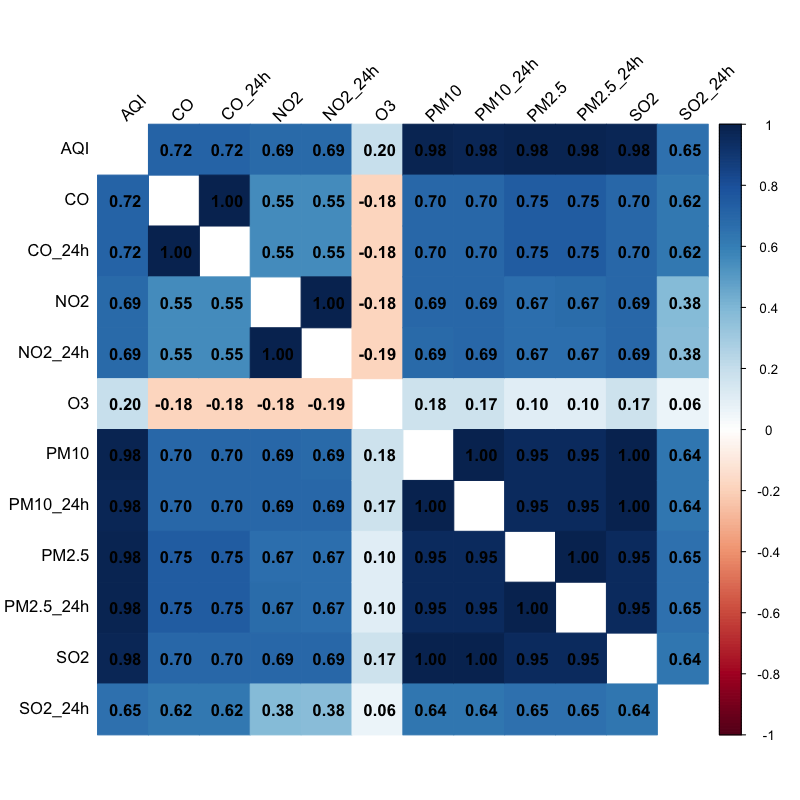

# Top 9 城市污染物间相关性分析报告

本报告旨在展示主要污染物在广东省发病数最高的9个城市中的月度平均浓度之间的相关性。
 ## 相关性可视化热图

 
## 相关系数矩阵
 Table: 污染物月均浓度相关系数 (Pearson's r)

|          |  AQI|    CO| CO_24h|   NO2| NO2_24h|    O3| PM10| PM10_24h| PM2.5| PM2.5_24h|  SO2| SO2_24h|
|:---------|----:|-----:|------:|-----:|-------:|-----:|----:|--------:|-----:|---------:|----:|-------:|
|AQI       | 1.00|  0.72|   0.72|  0.69|    0.69|  0.20| 0.98|     0.98|  0.98|      0.98| 0.98|    0.65|
|CO        | 0.72|  1.00|   1.00|  0.55|    0.55| -0.18| 0.70|     0.70|  0.75|      0.75| 0.70|    0.62|
|CO_24h    | 0.72|  1.00|   1.00|  0.55|    0.55| -0.18| 0.70|     0.70|  0.75|      0.75| 0.70|    0.62|
|NO2       | 0.69|  0.55|   0.55|  1.00|    1.00| -0.18| 0.69|     0.69|  0.67|      0.67| 0.69|    0.38|
|NO2_24h   | 0.69|  0.55|   0.55|  1.00|    1.00| -0.19| 0.69|     0.69|  0.67|      0.67| 0.69|    0.38|
|O3        | 0.20| -0.18|  -0.18| -0.18|   -0.19|  1.00| 0.18|     0.17|  0.10|      0.10| 0.17|    0.06|
|PM10      | 0.98|  0.70|   0.70|  0.69|    0.69|  0.18| 1.00|     1.00|  0.95|      0.95| 1.00|    0.64|
|PM10_24h  | 0.98|  0.70|   0.70|  0.69|    0.69|  0.17| 1.00|     1.00|  0.95|      0.95| 1.00|    0.64|
|PM2.5     | 0.98|  0.75|   0.75|  0.67|    0.67|  0.10| 0.95|     0.95|  1.00|      1.00| 0.95|    0.65|
|PM2.5_24h | 0.98|  0.75|   0.75|  0.67|    0.67|  0.10| 0.95|     0.95|  1.00|      1.00| 0.95|    0.65|
|SO2       | 0.98|  0.70|   0.70|  0.69|    0.69|  0.17| 1.00|     1.00|  0.95|      0.95| 1.00|    0.64|
|SO2_24h   | 0.65|  0.62|   0.62|  0.38|    0.38|  0.06| 0.64|     0.64|  0.65|      0.65| 0.64|    1.00|
