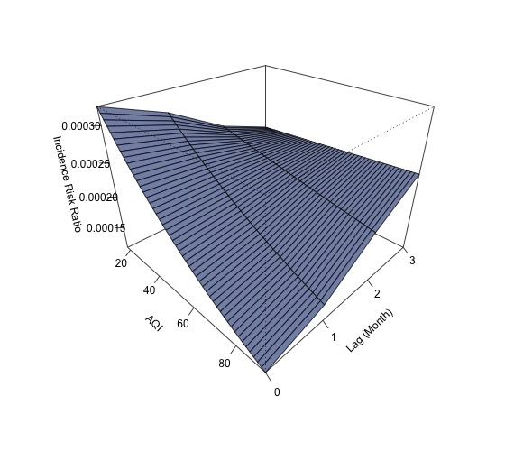
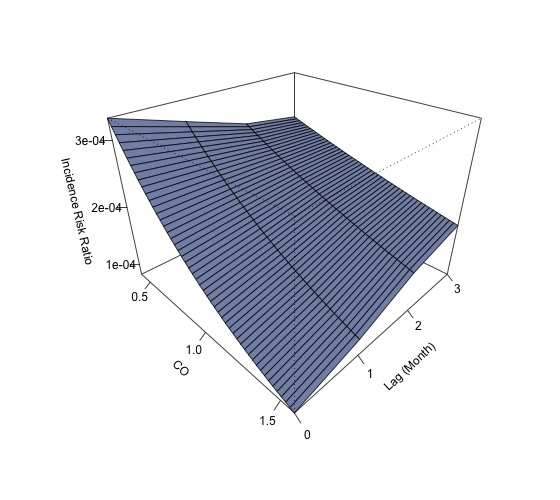
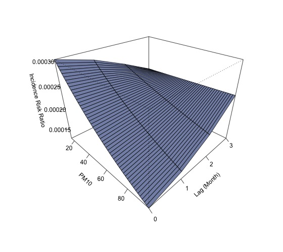
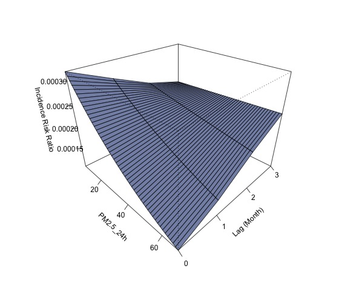
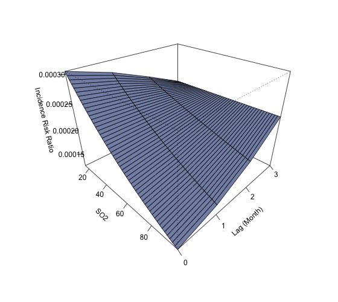

# Top 9 城市污染物暴露风险分析报告

## 2.1 AQI 分析 

#### 模型汇总表
 Table: 模型汇总: AQI

| model  |    term     | estimate | std.error | statistic | p.value | signif |
|:------:|:-----------:|:--------:|:---------:|:---------:|:-------:|:------:|
| AQI_M0 | (Intercept) | -7.7888  |  0.2334   | -33.3704  | 0.0000  |  ***   |
| AQI_M0 |   AQI_M0    | -0.0139  |  0.0052   |  -2.6623  | 0.0078  |   **   |
| AQI_M1 | (Intercept) | -7.9605  |  0.2333   | -34.1191  | 0.0000  |  ***   |
| AQI_M1 |   AQI_M1    | -0.0099  |  0.0051   |  -1.9306  | 0.0535  |   .    |
| AQI_M2 | (Intercept) | -8.2433  |  0.2341   | -35.2184  | 0.0000  |  ***   |
| AQI_M2 |   AQI_M2    | -0.0035  |  0.0050   |  -0.6959  | 0.4865  |        |
| AQI_M3 | (Intercept) | -8.4405  |  0.2345   | -35.9876  | 0.0000  |  ***   |
| AQI_M3 |   AQI_M3    |  0.0009  |  0.0049   |  0.1794   | 0.8576  |        | 

#### 3D 风险率图
 

---

## 2.2 CO 分析 
#### 模型汇总表
 Table: 模型汇总: CO

| model |    term     | estimate | std.error | statistic | p.value | signif |
|:-----:|:-----------:|:--------:|:---------:|:---------:|:-------:|:------:|
| CO_M0 | (Intercept) | -7.5284  |  0.3262   | -23.0785  | 0.0000  |  ***   |
| CO_M0 |    CO_M0    | -1.1956  |  0.4465   |  -2.6774  | 0.0074  |   **   |
| CO_M1 | (Intercept) | -7.7671  |  0.3199   | -24.2811  | 0.0000  |  ***   |
| CO_M1 |    CO_M1    | -0.8620  |  0.4321   |  -1.9950  | 0.0460  |   *    |
| CO_M2 | (Intercept) | -8.0221  |  0.3149   | -25.4786  | 0.0000  |  ***   |
| CO_M2 |    CO_M2    | -0.5100  |  0.4185   |  -1.2186  | 0.2230  |        |
| CO_M3 | (Intercept) | -8.1513  |  0.3120   | -26.1276  | 0.0000  |  ***   |
| CO_M3 |    CO_M3    | -0.3337  |  0.4108   |  -0.8124  | 0.4166  |        | 

#### 3D 风险率图
 

---

## 2.3 CO_24h 分析 
#### 模型汇总表
 Table: 模型汇总: CO_24h

|   model   |    term     | estimate | std.error | statistic | p.value | signif |
|:---------:|:-----------:|:--------:|:---------:|:---------:|:-------:|:------:|
| CO_24h_M0 | (Intercept) | -7.5405  |  0.3254   | -23.1721  | 0.0000  |  ***   |
| CO_24h_M0 |  CO_24h_M0  | -1.1796  |  0.4456   |  -2.6474  | 0.0081  |   **   |
| CO_24h_M1 | (Intercept) | -7.7773  |  0.3193   | -24.3543  | 0.0000  |  ***   |
| CO_24h_M1 |  CO_24h_M1  | -0.8485  |  0.4314   |  -1.9667  | 0.0492  |   *    |
| CO_24h_M2 | (Intercept) | -8.0396  |  0.3144   | -25.5726  | 0.0000  |  ***   |
| CO_24h_M2 |  CO_24h_M2  | -0.4865  |  0.4178   |  -1.1644  | 0.2443  |        |
| CO_24h_M3 | (Intercept) | -8.1345  |  0.3120   | -26.0720  | 0.0000  |  ***   |
| CO_24h_M3 |  CO_24h_M3  | -0.3567  |  0.4114   |  -0.8671  | 0.3859  |        | 

#### 3D 风险率图
 

---

## 2.4 NO2 分析 
#### 模型汇总表
 Table: 模型汇总: NO2

| model  |    term     | estimate | std.error | statistic | p.value | signif |
|:------:|:-----------:|:--------:|:---------:|:---------:|:-------:|:------:|
| NO2_M0 | (Intercept) | -7.9808  |  0.1731   | -46.1028  | 0.0000  |  ***   |
| NO2_M0 |   NO2_M0    | -0.0155  |  0.0061   |  -2.5367  | 0.0112  |   *    |
| NO2_M1 | (Intercept) | -7.9955  |  0.1727   | -46.2943  | 0.0000  |  ***   |
| NO2_M1 |   NO2_M1    | -0.0150  |  0.0061   |  -2.4575  | 0.0140  |   *    |
| NO2_M2 | (Intercept) | -8.1507  |  0.1728   | -47.1568  | 0.0000  |  ***   |
| NO2_M2 |   NO2_M2    | -0.0091  |  0.0059   |  -1.5353  | 0.1247  |        |
| NO2_M3 | (Intercept) | -8.2098  |  0.1736   | -47.2952  | 0.0000  |  ***   |
| NO2_M3 |   NO2_M3    | -0.0069  |  0.0058   |  -1.1726  | 0.2410  |        | 

#### 3D 风险率图
 

---

## 2.5 NO2_24h 分析 
#### 模型汇总表
 Table: 模型汇总: NO2_24h

|   model    |    term     | estimate | std.error | statistic | p.value | signif |
|:----------:|:-----------:|:--------:|:---------:|:---------:|:-------:|:------:|
| NO2_24h_M0 | (Intercept) | -7.9791  |  0.1732   | -46.0605  | 0.0000  |  ***   |
| NO2_24h_M0 | NO2_24h_M0  | -0.0156  |  0.0061   |  -2.5447  | 0.0109  |   *    |
| NO2_24h_M1 | (Intercept) | -7.9991  |  0.1728   | -46.2853  | 0.0000  |  ***   |
| NO2_24h_M1 | NO2_24h_M1  | -0.0148  |  0.0061   |  -2.4343  | 0.0149  |   *    |
| NO2_24h_M2 | (Intercept) | -8.1594  |  0.1730   | -47.1680  | 0.0000  |  ***   |
| NO2_24h_M2 | NO2_24h_M2  | -0.0088  |  0.0059   |  -1.4817  | 0.1384  |        |
| NO2_24h_M3 | (Intercept) | -8.2071  |  0.1737   | -47.2522  | 0.0000  |  ***   |
| NO2_24h_M3 | NO2_24h_M3  | -0.0070  |  0.0059   |  -1.1880  | 0.2348  |        | 

#### 3D 风险率图
 

---

## 2.6 O3 分析 
#### 模型汇总表
 Table: 模型汇总: O3

| model |    term     | estimate | std.error | statistic | p.value | signif |
|:-----:|:-----------:|:--------:|:---------:|:---------:|:-------:|:------:|
| O3_M0 | (Intercept) | -8.0600  |  0.2784   | -28.9533  | 0.0000  |  ***   |
| O3_M0 |    O3_M0    | -0.0060  |  0.0048   |  -1.2472  | 0.2123  |        |
| O3_M1 | (Intercept) | -8.1988  |  0.2788   | -29.4091  | 0.0000  |  ***   |
| O3_M1 |    O3_M1    | -0.0035  |  0.0048   |  -0.7403  | 0.4591  |        |
| O3_M2 | (Intercept) | -8.5510  |  0.2786   | -30.6942  | 0.0000  |  ***   |
| O3_M2 |    O3_M2    |  0.0026  |  0.0047   |  0.5608   | 0.5749  |        |
| O3_M3 | (Intercept) | -8.2573  |  0.2791   | -29.5832  | 0.0000  |  ***   |
| O3_M3 |    O3_M3    | -0.0025  |  0.0048   |  -0.5256  | 0.5991  |        | 

#### 3D 风险率图
 

---

## 2.7 PM10 分析 
#### 模型汇总表
 Table: 模型汇总: PM10

|  model  |    term     | estimate | std.error | statistic | p.value | signif |
|:-------:|:-----------:|:--------:|:---------:|:---------:|:-------:|:------:|
| PM10_M0 | (Intercept) | -7.9287  |  0.2004   | -39.5705  | 0.0000  |  ***   |
| PM10_M0 |   PM10_M0   | -0.0108  |  0.0045   |  -2.4268  | 0.0152  |   *    |
| PM10_M1 | (Intercept) | -8.0374  |  0.2006   | -40.0583  | 0.0000  |  ***   |
| PM10_M1 |   PM10_M1   | -0.0083  |  0.0044   |  -1.8778  | 0.0604  |   .    |
| PM10_M2 | (Intercept) | -8.2100  |  0.2015   | -40.7463  | 0.0000  |  ***   |
| PM10_M2 |   PM10_M2   | -0.0043  |  0.0043   |  -0.9911  | 0.3216  |        |
| PM10_M3 | (Intercept) | -8.4262  |  0.2026   | -41.5992  | 0.0000  |  ***   |
| PM10_M3 |   PM10_M3   |  0.0006  |  0.0042   |  0.1363   | 0.8916  |        | 

#### 3D 风险率图
 

---

## 2.8 PM10_24h 分析 
#### 模型汇总表
 Table: 模型汇总: PM10_24h

|    model    |    term     | estimate | std.error | statistic | p.value | signif |
|:-----------:|:-----------:|:--------:|:---------:|:---------:|:-------:|:------:|
| PM10_24h_M0 | (Intercept) | -7.9245  |  0.1998   | -39.6552  | 0.0000  |  ***   |
| PM10_24h_M0 | PM10_24h_M0 | -0.0109  |  0.0045   |  -2.4552  | 0.0141  |   *    |
| PM10_24h_M1 | (Intercept) | -8.0407  |  0.2001   | -40.1837  | 0.0000  |  ***   |
| PM10_24h_M1 | PM10_24h_M1 | -0.0082  |  0.0044   |  -1.8667  | 0.0619  |   .    |
| PM10_24h_M2 | (Intercept) | -8.2084  |  0.2010   | -40.8387  | 0.0000  |  ***   |
| PM10_24h_M2 | PM10_24h_M2 | -0.0043  |  0.0043   |  -1.0017  | 0.3165  |        |
| PM10_24h_M3 | (Intercept) | -8.4077  |  0.2020   | -41.6144  | 0.0000  |  ***   |
| PM10_24h_M3 | PM10_24h_M3 |  0.0002  |  0.0042   |  0.0392   | 0.9687  |        | 

#### 3D 风险率图
 

---

## 2.9 PM2.5 分析 
#### 模型汇总表
 Table: 模型汇总: PM2.5

|  model   |    term     | estimate | std.error | statistic | p.value | signif |
|:--------:|:-----------:|:--------:|:---------:|:---------:|:-------:|:------:|
| PM2.5_M0 | (Intercept) | -7.9352  |  0.1700   | -46.6797  | 0.0000  |  ***   |
| PM2.5_M0 |  PM2.5_M0   | -0.0183  |  0.0064   |  -2.8573  | 0.0043  |   **   |
| PM2.5_M1 | (Intercept) | -8.1010  |  0.1700   | -47.6394  | 0.0000  |  ***   |
| PM2.5_M1 |  PM2.5_M1   | -0.0116  |  0.0062   |  -1.8669  | 0.0619  |   .    |
| PM2.5_M2 | (Intercept) | -8.2904  |  0.1708   | -48.5484  | 0.0000  |  ***   |
| PM2.5_M2 |  PM2.5_M2   | -0.0042  |  0.0060   |  -0.6942  | 0.4876  |        |
| PM2.5_M3 | (Intercept) | -8.4305  |  0.1715   | -49.1717  | 0.0000  |  ***   |
| PM2.5_M3 |  PM2.5_M3   |  0.0011  |  0.0059   |  0.1929   | 0.8470  |        | 

#### 3D 风险率图
 

---

## 2.10 PM2.5_24h 分析 
#### 模型汇总表
 Table: 模型汇总: PM2.5_24h

|    model     |     term     | estimate | std.error | statistic | p.value | signif |
|:------------:|:------------:|:--------:|:---------:|:---------:|:-------:|:------:|
| PM2.5_24h_M0 | (Intercept)  | -7.9375  |  0.1697   | -46.7817  | 0.0000  |  ***   |
| PM2.5_24h_M0 | PM2.5_24h_M0 | -0.0182  |  0.0064   |  -2.8499  | 0.0044  |   **   |
| PM2.5_24h_M1 | (Intercept)  | -8.1101  |  0.1698   | -47.7754  | 0.0000  |  ***   |
| PM2.5_24h_M1 | PM2.5_24h_M1 | -0.0112  |  0.0062   |  -1.8151  | 0.0695  |   .    |
| PM2.5_24h_M2 | (Intercept)  | -8.2956  |  0.1705   | -48.6468  | 0.0000  |  ***   |
| PM2.5_24h_M2 | PM2.5_24h_M2 | -0.0040  |  0.0060   |  -0.6627  | 0.5075  |        |
| PM2.5_24h_M3 | (Intercept)  | -8.4235  |  0.1712   | -49.1977  | 0.0000  |  ***   |
| PM2.5_24h_M3 | PM2.5_24h_M3 |  0.0009  |  0.0059   |  0.1480   | 0.8824  |        | 

#### 3D 风险率图
 

---

## 2.11 SO2 分析 
#### 模型汇总表
 Table: 模型汇总: SO2

| model  |    term     | estimate | std.error | statistic | p.value | signif |
|:------:|:-----------:|:--------:|:---------:|:---------:|:-------:|:------:|
| SO2_M0 | (Intercept) | -7.9245  |  0.1998   | -39.6552  | 0.0000  |  ***   |
| SO2_M0 |   SO2_M0    | -0.0109  |  0.0045   |  -2.4552  | 0.0141  |   *    |
| SO2_M1 | (Intercept) | -8.0407  |  0.2001   | -40.1837  | 0.0000  |  ***   |
| SO2_M1 |   SO2_M1    | -0.0082  |  0.0044   |  -1.8667  | 0.0619  |   .    |
| SO2_M2 | (Intercept) | -8.2084  |  0.2010   | -40.8387  | 0.0000  |  ***   |
| SO2_M2 |   SO2_M2    | -0.0043  |  0.0043   |  -1.0017  | 0.3165  |        |
| SO2_M3 | (Intercept) | -8.4077  |  0.2020   | -41.6144  | 0.0000  |  ***   |
| SO2_M3 |   SO2_M3    |  0.0002  |  0.0042   |  0.0392   | 0.9687  |        | 

#### 3D 风险率图
 

---

## 2.12 SO2_24h 分析 
#### 模型汇总表
 Table: 模型汇总: SO2_24h

|   model    |    term     | estimate | std.error | statistic | p.value | signif |
|:----------:|:-----------:|:--------:|:---------:|:---------:|:-------:|:------:|
| SO2_24h_M0 | (Intercept) | -7.9784  |  0.1802   | -44.2762  | 0.0000  |  ***   |
| SO2_24h_M0 | SO2_24h_M0  | -0.0494  |  0.0203   |  -2.4359  | 0.0149  |   *    |
| SO2_24h_M1 | (Intercept) | -8.0411  |  0.1765   | -45.5479  | 0.0000  |  ***   |
| SO2_24h_M1 | SO2_24h_M1  | -0.0416  |  0.0195   |  -2.1331  | 0.0329  |   *    |
| SO2_24h_M2 | (Intercept) | -8.0743  |  0.1745   | -46.2741  | 0.0000  |  ***   |
| SO2_24h_M2 | SO2_24h_M2  | -0.0375  |  0.0190   |  -1.9678  | 0.0491  |   *    |
| SO2_24h_M3 | (Intercept) | -8.1679  |  0.1697   | -48.1314  | 0.0000  |  ***   |
| SO2_24h_M3 | SO2_24h_M3  | -0.0263  |  0.0180   |  -1.4604  | 0.1442  |        | 

#### 3D 风险率图
 
