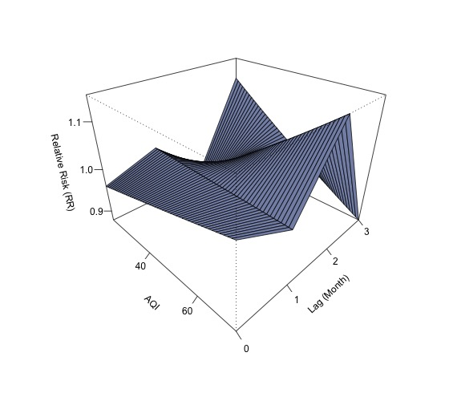
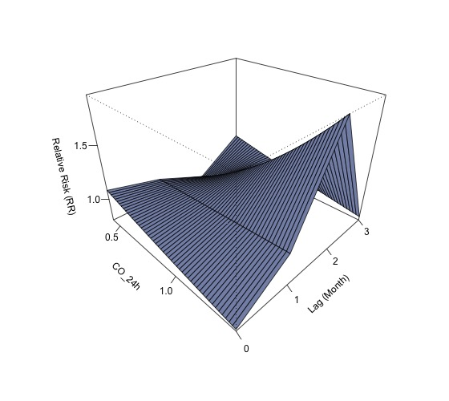
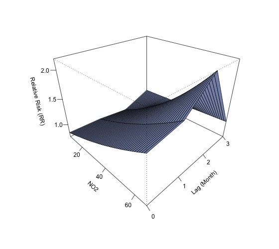
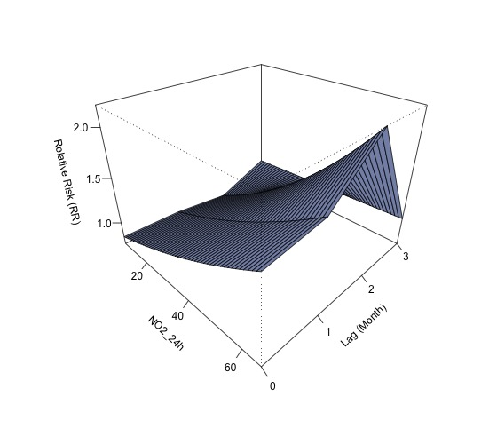
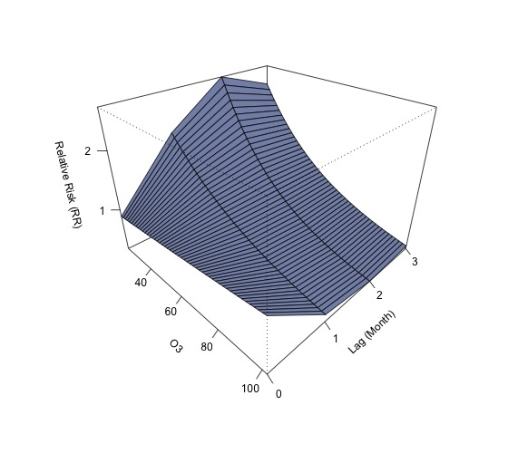
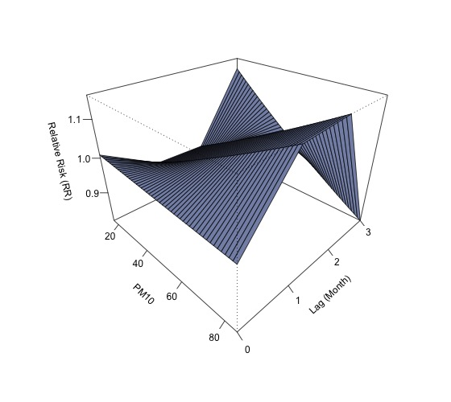
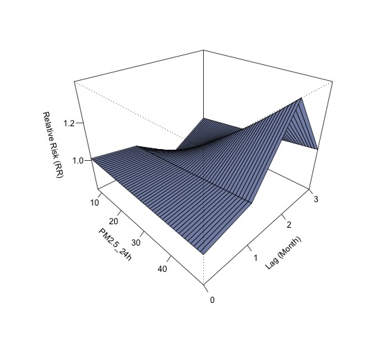
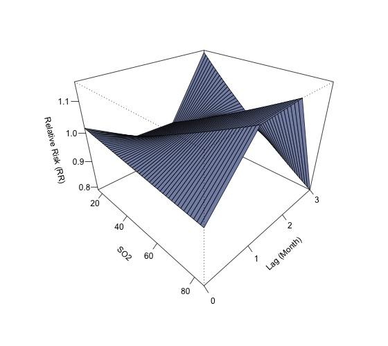
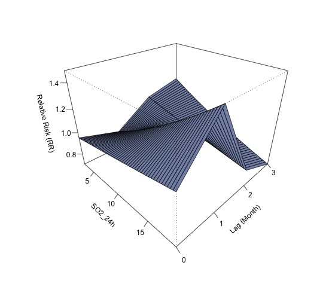

# Top 9 城市 VGLM 分析报告 

## VGLM 分析报告: AQI 

#### 模型汇总表
 Table: 模型汇总: AQI

|model  |term        | Estimate| Std. Error| z value| Pr(>&#124;z&#124;)|signif |
|:------|:-----------|--------:|----------:|-------:|------------------:|:------|
|AQI_M0 |(Intercept) |  -1.1169|     0.5825| -1.9175|             0.0552|.      |
|AQI_M0 |AQI_M0      |   0.0018|     0.0129|  0.1355|             0.8922|       |
|AQI_M1 |(Intercept) |  -1.0369|     0.5638| -1.8391|             0.0659|.      |
|AQI_M1 |AQI_M1      |  -0.0001|     0.0124| -0.0087|             0.9931|       |
|AQI_M2 |(Intercept) |  -1.2521|     0.5700| -2.1967|             0.0280|*      |
|AQI_M2 |AQI_M2      |   0.0047|     0.0119|  0.3906|             0.6961|       |
|AQI_M3 |(Intercept) |  -0.8425|     0.5504| -1.5306|             0.1259|       |
|AQI_M3 |AQI_M3      |  -0.0044|     0.0117| -0.3753|             0.7074|       | 

#### 3D 预测病例数图
 

---

## VGLM 分析报告: CO 
#### 模型汇总表
 Table: 模型汇总: CO

|model |term        | Estimate| Std. Error| z value| Pr(>&#124;z&#124;)|signif |
|:-----|:-----------|--------:|----------:|-------:|------------------:|:------|
|CO_M0 |(Intercept) |  -0.7705|     0.8417| -0.9154|             0.3600|       |
|CO_M0 |CO_M0       |  -0.3810|     1.1670| -0.3265|             0.7440|       |
|CO_M1 |(Intercept) |  -1.1387|     0.7980| -1.4269|             0.1536|       |
|CO_M1 |CO_M1       |   0.1341|     1.0743|  0.1249|             0.9006|       |
|CO_M2 |(Intercept) |  -1.7341|     0.7634| -2.2717|             0.0231|*      |
|CO_M2 |CO_M2       |   0.9311|     0.9826|  0.9476|             0.3434|       |
|CO_M3 |(Intercept) |  -0.8831|     0.7851| -1.1248|             0.2607|       |
|CO_M3 |CO_M3       |  -0.2144|     1.0423| -0.2057|             0.8370|       | 

#### 3D 预测病例数图
 

---

## VGLM 分析报告: CO_24h 
#### 模型汇总表
 Table: 模型汇总: CO_24h

|model     |term        | Estimate| Std. Error| z value| Pr(>&#124;z&#124;)|signif |
|:---------|:-----------|--------:|----------:|-------:|------------------:|:------|
|CO_24h_M0 |(Intercept) |  -0.8128|     0.8366| -0.9716|             0.3313|       |
|CO_24h_M0 |CO_24h_M0   |  -0.3214|     1.1582| -0.2775|             0.7814|       |
|CO_24h_M1 |(Intercept) |  -1.1159|     0.7965| -1.4011|             0.1612|       |
|CO_24h_M1 |CO_24h_M1   |   0.1028|     1.0734|  0.0957|             0.9237|       |
|CO_24h_M2 |(Intercept) |  -1.7265|     0.7639| -2.2601|             0.0238|*      |
|CO_24h_M2 |CO_24h_M2   |   0.9209|     0.9836|  0.9363|             0.3491|       |
|CO_24h_M3 |(Intercept) |  -0.8304|     0.7878| -1.0541|             0.2918|       |
|CO_24h_M3 |CO_24h_M3   |  -0.2863|     1.0500| -0.2727|             0.7851|       | 

#### 3D 预测病例数图
 

---

## VGLM 分析报告: NO2 
#### 模型汇总表
 Table: 模型汇总: NO2

|model  |term        | Estimate| Std. Error| z value| Pr(>&#124;z&#124;)|signif |
|:------|:-----------|--------:|----------:|-------:|------------------:|:------|
|NO2_M0 |(Intercept) |  -1.3418|     0.4065| -3.3008|             0.0010|***    |
|NO2_M0 |NO2_M0      |   0.0113|     0.0134|  0.8386|             0.4017|       |
|NO2_M1 |(Intercept) |  -1.3814|     0.4018| -3.4379|             0.0006|***    |
|NO2_M1 |NO2_M1      |   0.0127|     0.0131|  0.9683|             0.3329|       |
|NO2_M2 |(Intercept) |  -1.5546|     0.3963| -3.9227|             0.0001|***    |
|NO2_M2 |NO2_M2      |   0.0183|     0.0120|  1.5212|             0.1282|       |
|NO2_M3 |(Intercept) |  -1.0843|     0.3820| -2.8387|             0.0045|**     |
|NO2_M3 |NO2_M3      |   0.0016|     0.0125|  0.1251|             0.9005|       | 

#### 3D 预测病例数图
 

---

## VGLM 分析报告: NO2_24h 
#### 模型汇总表
 Table: 模型汇总: NO2_24h

|model      |term        | Estimate| Std. Error| z value| Pr(>&#124;z&#124;)|signif |
|:----------|:-----------|--------:|----------:|-------:|------------------:|:------|
|NO2_24h_M0 |(Intercept) |  -1.3546|     0.4075| -3.3245|             0.0009|***    |
|NO2_24h_M0 |NO2_24h_M0  |   0.0117|     0.0135|  0.8730|             0.3827|       |
|NO2_24h_M1 |(Intercept) |  -1.3849|     0.4026| -3.4402|             0.0006|***    |
|NO2_24h_M1 |NO2_24h_M1  |   0.0128|     0.0131|  0.9763|             0.3289|       |
|NO2_24h_M2 |(Intercept) |  -1.5667|     0.3973| -3.9432|             0.0001|***    |
|NO2_24h_M2 |NO2_24h_M2  |   0.0187|     0.0120|  1.5540|             0.1202|       |
|NO2_24h_M3 |(Intercept) |  -1.0734|     0.3816| -2.8129|             0.0049|**     |
|NO2_24h_M3 |NO2_24h_M3  |   0.0012|     0.0125|  0.0931|             0.9258|       | 

#### 3D 预测病例数图
 

---

## VGLM 分析报告: O3 
#### 模型汇总表
 Table: 模型汇总: O3

|model |term        | Estimate| Std. Error| z value| Pr(>&#124;z&#124;)|signif |
|:-----|:-----------|--------:|----------:|-------:|------------------:|:------|
|O3_M0 |(Intercept) |  -1.2626|     0.6786| -1.8606|             0.0628|.      |
|O3_M0 |O3_M0       |   0.0039|     0.0115|  0.3387|             0.7348|       |
|O3_M1 |(Intercept) |   0.0971|     0.7057|  0.1376|             0.8906|       |
|O3_M1 |O3_M1       |  -0.0206|     0.0129| -1.6012|             0.1093|       |
|O3_M2 |(Intercept) |   0.6164|     0.6851|  0.8997|             0.3683|       |
|O3_M2 |O3_M2       |  -0.0298|     0.0126| -2.3590|             0.0183|*      |
|O3_M3 |(Intercept) |   0.3578|     0.6579|  0.5439|             0.5865|       |
|O3_M3 |O3_M3       |  -0.0257|     0.0123| -2.0882|             0.0368|*      | 

#### 3D 预测病例数图
 

---

## VGLM 分析报告: PM10 
#### 模型汇总表
 Table: 模型汇总: PM10

|model   |term        | Estimate| Std. Error| z value| Pr(>&#124;z&#124;)|signif |
|:-------|:-----------|--------:|----------:|-------:|------------------:|:------|
|PM10_M0 |(Intercept) |  -1.0267|     0.4868| -2.1092|             0.0349|*      |
|PM10_M0 |PM10_M0     |  -0.0004|     0.0108| -0.0324|             0.9742|       |
|PM10_M1 |(Intercept) |  -1.1778|     0.4845| -2.4312|             0.0150|*      |
|PM10_M1 |PM10_M1     |   0.0032|     0.0104|  0.3027|             0.7621|       |
|PM10_M2 |(Intercept) |  -1.1892|     0.4850| -2.4521|             0.0142|*      |
|PM10_M2 |PM10_M2     |   0.0033|     0.0102|  0.3279|             0.7430|       |
|PM10_M3 |(Intercept) |  -0.8271|     0.4752| -1.7405|             0.0818|.      |
|PM10_M3 |PM10_M3     |  -0.0048|     0.0101| -0.4740|             0.6355|       | 

#### 3D 预测病例数图
 

---

## VGLM 分析报告: PM10_24h 
#### 模型汇总表
 Table: 模型汇总: PM10_24h

|model       |term        | Estimate| Std. Error| z value| Pr(>&#124;z&#124;)|signif |
|:-----------|:-----------|--------:|----------:|-------:|------------------:|:------|
|PM10_24h_M0 |(Intercept) |  -1.0145|     0.4837| -2.0972|             0.0360|*      |
|PM10_24h_M0 |PM10_24h_M0 |  -0.0006|     0.0108| -0.0594|             0.9526|       |
|PM10_24h_M1 |(Intercept) |  -1.1769|     0.4831| -2.4361|             0.0148|*      |
|PM10_24h_M1 |PM10_24h_M1 |   0.0031|     0.0104|  0.3016|             0.7630|       |
|PM10_24h_M2 |(Intercept) |  -1.1909|     0.4831| -2.4650|             0.0137|*      |
|PM10_24h_M2 |PM10_24h_M2 |   0.0034|     0.0101|  0.3331|             0.7391|       |
|PM10_24h_M3 |(Intercept) |  -0.7961|     0.4734| -1.6814|             0.0927|.      |
|PM10_24h_M3 |PM10_24h_M3 |  -0.0055|     0.0101| -0.5436|             0.5867|       | 

#### 3D 预测病例数图
 

---

## VGLM 分析报告: PM2.5 
#### 模型汇总表
 Table: 模型汇总: PM2.5

|model    |term        | Estimate| Std. Error| z value| Pr(>&#124;z&#124;)|signif |
|:--------|:-----------|--------:|----------:|-------:|------------------:|:------|
|PM2.5_M0 |(Intercept) |  -1.0378|     0.4290| -2.4190|             0.0156|*      |
|PM2.5_M0 |PM2.5_M0    |  -0.0002|     0.0162| -0.0095|             0.9925|       |
|PM2.5_M1 |(Intercept) |  -1.0731|     0.4157| -2.5814|             0.0098|**     |
|PM2.5_M1 |PM2.5_M1    |   0.0013|     0.0151|  0.0831|             0.9338|       |
|PM2.5_M2 |(Intercept) |  -1.3743|     0.4183| -3.2852|             0.0010|**     |
|PM2.5_M2 |PM2.5_M2    |   0.0124|     0.0138|  0.8989|             0.3687|       |
|PM2.5_M3 |(Intercept) |  -1.1258|     0.4087| -2.7546|             0.0059|**     |
|PM2.5_M3 |PM2.5_M3    |   0.0031|     0.0137|  0.2280|             0.8196|       | 

#### 3D 预测病例数图
 

---

## VGLM 分析报告: PM2.5_24h 
#### 模型汇总表
 Table: 模型汇总: PM2.5_24h

|model        |term         | Estimate| Std. Error| z value| Pr(>&#124;z&#124;)|signif |
|:------------|:------------|--------:|----------:|-------:|------------------:|:------|
|PM2.5_24h_M0 |(Intercept)  |  -1.0256|     0.4270| -2.4017|             0.0163|*      |
|PM2.5_24h_M0 |PM2.5_24h_M0 |  -0.0007|     0.0162| -0.0404|             0.9678|       |
|PM2.5_24h_M1 |(Intercept)  |  -1.0852|     0.4159| -2.6089|             0.0091|**     |
|PM2.5_24h_M1 |PM2.5_24h_M1 |   0.0017|     0.0151|  0.1150|             0.9084|       |
|PM2.5_24h_M2 |(Intercept)  |  -1.3736|     0.4168| -3.2957|             0.0010|***    |
|PM2.5_24h_M2 |PM2.5_24h_M2 |   0.0124|     0.0138|  0.9010|             0.3676|       |
|PM2.5_24h_M3 |(Intercept)  |  -1.1014|     0.4077| -2.7013|             0.0069|**     |
|PM2.5_24h_M3 |PM2.5_24h_M3 |   0.0022|     0.0137|  0.1620|             0.8713|       | 

#### 3D 预测病例数图
 

---

## VGLM 分析报告: SO2 
#### 模型汇总表
 Table: 模型汇总: SO2

|model  |term        | Estimate| Std. Error| z value| Pr(>&#124;z&#124;)|signif |
|:------|:-----------|--------:|----------:|-------:|------------------:|:------|
|SO2_M0 |(Intercept) |  -1.0145|     0.4837| -2.0972|             0.0360|*      |
|SO2_M0 |SO2_M0      |  -0.0006|     0.0108| -0.0594|             0.9526|       |
|SO2_M1 |(Intercept) |  -1.1769|     0.4831| -2.4361|             0.0148|*      |
|SO2_M1 |SO2_M1      |   0.0031|     0.0104|  0.3016|             0.7630|       |
|SO2_M2 |(Intercept) |  -1.1909|     0.4831| -2.4650|             0.0137|*      |
|SO2_M2 |SO2_M2      |   0.0034|     0.0101|  0.3331|             0.7391|       |
|SO2_M3 |(Intercept) |  -0.7961|     0.4734| -1.6814|             0.0927|.      |
|SO2_M3 |SO2_M3      |  -0.0055|     0.0101| -0.5436|             0.5867|       | 

#### 3D 预测病例数图
 

---

## VGLM 分析报告: SO2_24h 
#### 模型汇总表
 Table: 模型汇总: SO2_24h

|model      |term        | Estimate| Std. Error| z value| Pr(>&#124;z&#124;)|signif |
|:----------|:-----------|--------:|----------:|-------:|------------------:|:------|
|SO2_24h_M0 |(Intercept) |  -1.1279|     0.4906| -2.2990|             0.0215|*      |
|SO2_24h_M0 |SO2_24h_M0  |   0.0105|     0.0555|  0.1885|             0.8505|       |
|SO2_24h_M1 |(Intercept) |  -1.3345|     0.4858| -2.7468|             0.0060|**     |
|SO2_24h_M1 |SO2_24h_M1  |   0.0346|     0.0527|  0.6561|             0.5118|       |
|SO2_24h_M2 |(Intercept) |  -0.9185|     0.4680| -1.9625|             0.0497|*      |
|SO2_24h_M2 |SO2_24h_M2  |  -0.0147|     0.0527| -0.2787|             0.7805|       |
|SO2_24h_M3 |(Intercept) |  -0.7784|     0.4497| -1.7310|             0.0835|.      |
|SO2_24h_M3 |SO2_24h_M3  |  -0.0310|     0.0504| -0.6155|             0.5382|       | 

#### 3D 预测病例数图
 
